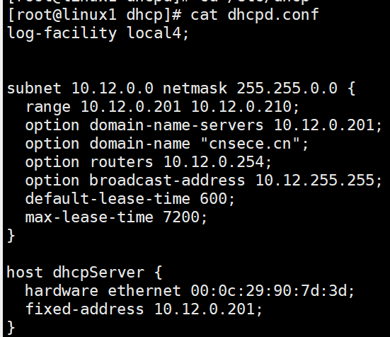
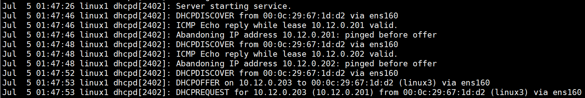
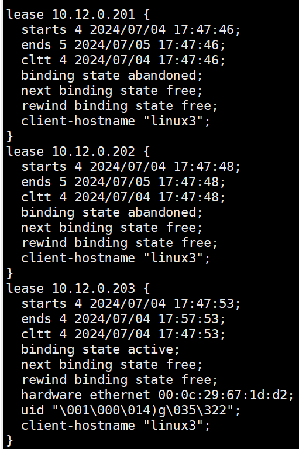

# DHCP

安装DHCP：`dnf -y install dhcp-server`

```
subnet [网络号] netmask [子网掩码] {
  range [起始IP] [结束IP];
  option domain-name-servers [域名IP];
  option routers [网关IP];
  option broadcast-address [广播IP];
  default-lease-time 600;
  max-lease-time 7200;
}

```

保留IP地址：

```
host [标识符] {
  hardware ethernet [MAC地址];
  fixed-address [保留的IP地址];
}
```


---

```
subnet 192.168.27.0 netmask 255.255.255.0 {
  range 192.168.27.100 192.168.27.120;
  range 192.168.27.200 192.168.27.220;
  option domain-name-servers 192.168.27.254;
  option routers 192.168.27.254;
  option broadcast-address 192.168.27.255;
  default-lease-time 600;
  max-lease-time 7200;
}
```

```
host fantasia {
  hardware ethernet 00:0c:29:90:7d:47;
  fixed-address 192.168.27.110;
}
```


---

注意：不知到为什么，即使你将一个地址设置为保留地址。只要这个地址现在没有被使用，当一个新主机请求DHCP分配IP地址时，还是会将这个IP地址分配给新的主机。

假设有一个IP地址没有被设置为保留地址，但是已经在被某台主机使用中了（手动设置的IP地址）。当新主机请求DHCP分配IP地址时，也会跳过这个IP地址。

如果一个IP地址被设置为保留地址，并且这个保留地址还在地址池里面。当一台普通主机先申请DHCP时会获取到这个IP地址。当这个保留地址所有者的主机申请DHCP时也会获取到这个IP地址。这样就会造成IP地址重复分配的问题。







