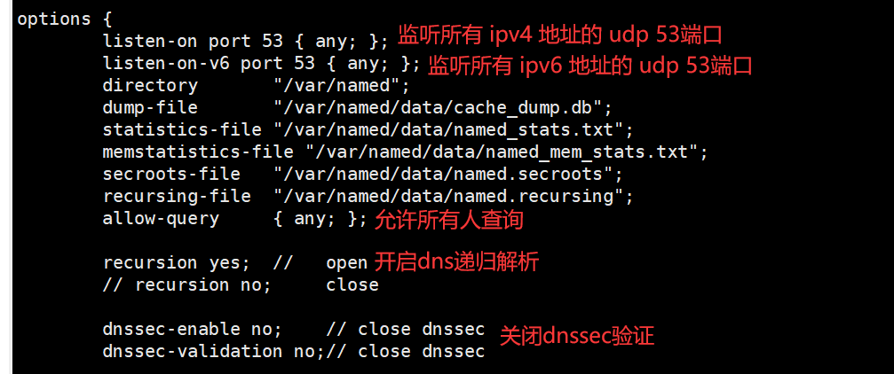
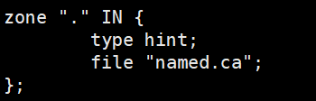
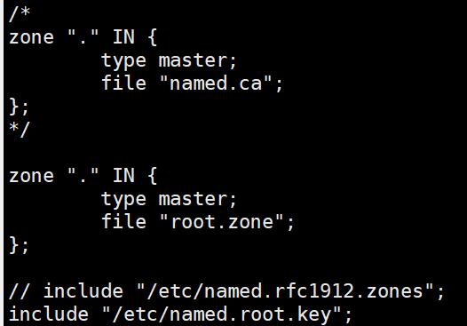
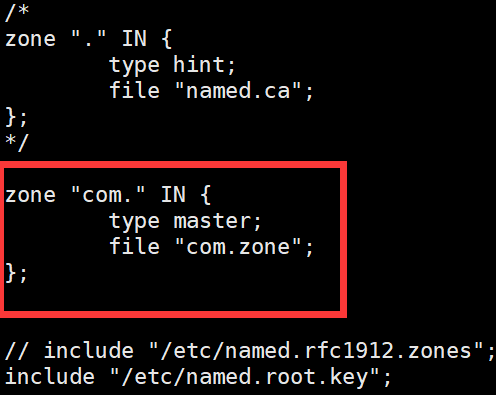
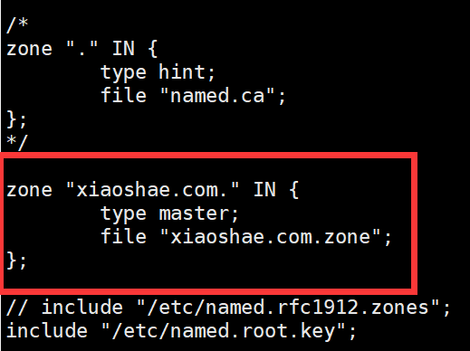

# DNS

**声明：**该文档依据网上已经存在的书籍、文档、教程等内容进行整合修改，并根据编者自身知识储备**额外增减内容**而成，可能存在错误，欢迎批评指正。


**参考链接：**

1. [【红帽 设置和配置 BIND DNS 服务器】](	https://docs.redhat.com/zh_hans/documentation/red_hat_enterprise_linux/9/html/managing_networking_infrastructure_services/assembly_setting-up-and-configuring-a-bind-dns-server_networking-infrastructure-services)

2. [【Cloudflare 什么是 DNS？】](https://www.cloudflare.com/zh-cn/learning/dns/what-is-dns/)

3. [【Cloudflare 什么是 DNS 记录？】](https://www.cloudflare.com/zh-cn/learning/dns/dns-records/)

4. [【Cloudflare 什么是 DNS 根服务器？】](https://www.cloudflare.com/zh-cn/learning/dns/glossary/dns-root-server/)
5. [【域名系统 | Domain Name System 】](https://en.wikipedia.org/wiki/Domain_Name_System)
6. [【根服务器列表 | List of Root Servers】](https://www.iana.org/domains/root/servers)
7. [【为什么 DNS 根服务器的数量限制为 13 个？】](https://unix.stackexchange.com/questions/557612/why-is-the-number-of-dns-root-servers-restricted-to-13)
8. [【根服务器技术运营协会 | Root Server Technical Operations Association | 根服务器地图】](https://root-servers.org/)
9. [【 Cloudflare 什么是 DNS 递归？ 】](https://www.cloudflare.com/zh-cn/learning/dns/what-is-recursive-dns/)
10. [【 Oracle | 关于 /etc/named.conf 配置文件】](https://docs.oracle.com/en/operating-systems/oracle-linux/6/admin/about-etc-named.html)


**其他链接：**

1.[【流程图绘图工具 | diagrams 】](https://app.diagrams.net/)


***注意：网站的具体信息可能会有所变化，请以实际访问网站时的信息为准。***


## 基础知识

**域名系统( DNS )** 是一种分层**分布式**名称服务，最突出的是，**它将**易于记忆的**域名转换为**使用底层网络协议定位和识别计算机服务和设备所需的数字**IP地址**。


###  4 个 DNS 服务器

- **DNS 解析器** - DNS 解析器接收客户端计算机的查询，然后解析器负责发出请求。
- **根域名服务器** - 根区域位于该层次结构的最顶部。
- **TLD 名称服务器** - 顶级域名服务器（TLD）是 DNS 层次结构中比根服务器低一级的 DNS 服务器组。
- **权威性域名服务器** - 权威服务器是查询中的末尾。权威性域名服务器存在请求的记录，则会将记录结果返回到发出初始请求的 DNS 解析器。


在下图中，最顶层的 **Root** 则是**根域名服务器**，下一层的``.ORG`、`.com`、`.net`是**TLD名称服务器**，最底层的`mail.google.com`则是**权威性域名服务器**。


### 根服务器

#### 为什么只有 13 个 DNS 根服务器地址？

一个普遍的误解是，世界上只有 13 台根服务器。实际上根服务器有许多，但只有 13 个 IP 地址用于查询不同的根服务器网络。DNS 原始架构的限制要求根区域中最多只能有 13 个服务器地址。在 Internet 面世之初，这 13 个 IP 地址的每一个都只有一台服务器，其中大多数位于美国。

如今，这 13 个 IP 地址中的每一个都有多个服务器，这些服务器使用 **Anycast 路由**基于负荷和距离分发请求。目前，地球上每座有人生活的大陆上都分布着 600 多台 DNS 根服务器。


#### 根服务器列表

| Hostname           | IP Addresses                      | Operator                                                     |
| ------------------ | --------------------------------- | ------------------------------------------------------------ |
| a.root-servers.net | 198.41.0.4, 2001:503:ba3e::2:30   | Verisign, Inc.                                               |
| b.root-servers.net | 170.247.170.2, 2801:1b8:10::b     | University of Southern California, Information Sciences Institute |
| c.root-servers.net | 192.33.4.12, 2001:500:2::c        | Cogent Communications                                        |
| d.root-servers.net | 199.7.91.13, 2001:500:2d::d       | University of Maryland                                       |
| e.root-servers.net | 192.203.230.10, 2001:500:a8::e    | NASA (Ames Research Center)                                  |
| f.root-servers.net | 192.5.5.241, 2001:500:2f::f       | Internet Systems Consortium, Inc.                            |
| g.root-servers.net | 192.112.36.4, 2001:500:12::d0d    | US Department of Defense (NIC)                               |
| h.root-servers.net | 198.97.190.53, 2001:500:1::53     | US Army (Research Lab)                                       |
| i.root-servers.net | 192.36.148.17, 2001:7fe::53       | Netnod                                                       |
| j.root-servers.net | 192.58.128.30, 2001:503:c27::2:30 | Verisign, Inc.                                               |
| k.root-servers.net | 193.0.14.129, 2001:7fd::1         | RIPE NCC                                                     |
| l.root-servers.net | 199.7.83.42, 2001:500:9f::42      | ICANN                                                        |
| m.root-servers.net | 202.12.27.33, 2001:dc3::35        | WIDE Project                                                 |


### DNS 查询

#### 迭代 DNS 查询（iterative DNS query）

1. **客户端**发送**DNS查询**给根**DNS服务器**（k.root-servers.net 193.0.14.129）
2. **根DNS服务器**返回**`com.`TLD DNS服务器**地址。
3. **客户端**发送**DNS查询**给根**`com.`TLD DNS服务器**（f.gtld-servers.net 192.35.51.30）。
4. **`com.`TLD DNS服务器**返回**`xiaoshae.com`权威DNS服务器**地址.
5. **客户端**发送DNS查询给**`xiaoshae.com`权威DNS服务器**（ns1.alidns.com 139.224.142.115）。
6. **权威DNS服务器**中存在**记录**，记录结果返回给**客户端**。（47.238.6.27）


当域名解析器查询诸如 foo.example.com 或 blog.cloudflare.com 这样的子域时，它会首先向该子域的**父域权威域名服务器**发起迭代查询。在此过程中，父域权威服务器会根据其配置提供两种响应：

如果父域权威服务器直接托管并存储了该子域的所有资源记录 (RR)，它将直接返回这些记录。

如果父域已将该子域的解析权限委派给其他域名服务器，它会返回一个包含委派信息的**名称服务器 (NS) 记录集**，并可能包含可选的粘附记录 (A/AAAA 记录)。这些 NS 记录明确指向了负责该子域的权威域名服务器。

随后，解析器将继续向这些被委派的权威域名服务器发送递归查询，以最终获取子域的目标资源记录。


**Glue Record**

Glue Record（粘连记录）是 DNS 系统中用于解决循环依赖问题的一种特殊 **A 记录（或 AAAA 记录）**。它由 **上级 DNS 服务器**（如 .com TLD 服务器）提供，直接包含权威服务器主机名（如 ns1.example.com）的 **IP 地址**。Glue Record **不是存储在域名自身的权威服务器中**，而是存储在 **上级服务器**（如 TLD 服务器或父域服务器）的区域文件中。

当递归解析器查询 example.com 的 NS 记录时，.com TLD 服务器不仅返回 NS 记录（如 ns1.example.com），还会附带相关的 Glue Record，提供该主机名（如 ns1.example.com）对应的 **IP 地址**（如 192.0.2.1）。

Glue Record 通常由 **域名注册商或 DNS 托管服务商** 在注册或管理域名时配置。当你在注册商（如 GoDaddy、Namecheap）注册域名（例如 example.com）时，需要指定权威服务器（如 ns1.example.com 和 ns2.example.com），并**提供这些服务器的 IP 地址**。注册商会将这些 **IP 地址** 提交给相应的 **TLD 服务器**（如 .com TLD 服务器），作为 Glue Record 存储在 **上级 DNS 服务器** 的区域文件中。


**Linux 中使用 dig 进行 试验**

跟踪（+trace）域名`xiaoshae.cn`的A记录（IPv4地址记录）的解析过程。

```
dig xiaoshae.cn a +trace
```


1. **根服务器查询** - 查询开始于本地DNS服务器，它返回了根DNS服务器的地址列表。

```
.			5	IN	NS	d.root-servers.net.
.			5	IN	NS	k.root-servers.net.
.			5	IN	NS	c.root-servers.net.
.			5	IN	NS	j.root-servers.net.
.			5	IN	NS	i.root-servers.net.
...
;; Received 525 bytes from 192.168.200.2#53(192.168.200.2) in 32 ms
```


2. 查询得到 **TLD 服务器** - `dig`选择了其中一个根服务器（`c.root-servers.net`）查询 `xiaoshae.cn` 得到 **`.com` TLD 服务器**

```
cn.			172800	IN	NS	a.dns.cn.
cn.			172800	IN	NS	b.dns.cn.
cn.			172800	IN	NS	c.dns.cn.
cn.			172800	IN	NS	d.dns.cn.
cn.			172800	IN	NS	e.dns.cn.
cn.			172800	IN	NS	ns.cernet.net.
...
;; Received 775 bytes from 198.97.190.53#53(h.root-servers.net) in 129 ms
```


3. 查询得到**权威服务器** - `dig`选择了其中一个`.com`的 TLD 服务器（例如 `a.gtld-servers.net.`）查询`xiaoshae.cn`得到`xiaoshae.cn.`权威服务器

```
xiaoshae.cn.		86400	IN	NS	dns30.hichina.com.
xiaoshae.cn.		86400	IN	NS	dns29.hichina.com.
..
;; Received 621 bytes from 203.119.25.1#53(a.dns.cn) in 24 ms
```


4. 通过权威服务器得到记录**结果** - `dig`选择了其中一个`xiaoshae.cn.`的权威服务器，获得具体的A记录。

```
xiaoshae.cn.	600	IN	A	47.121.135.145
;; Received 61 bytes from 47.118.199.219#53(dns29.hichina.com) in 20 ms
```


**完整 dig 输出结果**

```
[root@Server1 ~]# dig +trace a xiaoshae.cn 

; <<>> DiG 9.16.23 <<>> +trace a xiaoshae.cn
;; global options: +cmd
.			5	IN	NS	d.root-servers.net.
.			5	IN	NS	k.root-servers.net.
.			5	IN	NS	c.root-servers.net.
.			5	IN	NS	j.root-servers.net.
.			5	IN	NS	i.root-servers.net.
.			5	IN	NS	g.root-servers.net.
.			5	IN	NS	f.root-servers.net.
.			5	IN	NS	h.root-servers.net.
.			5	IN	NS	m.root-servers.net.
.			5	IN	NS	a.root-servers.net.
.			5	IN	NS	l.root-servers.net.
.			5	IN	NS	e.root-servers.net.
.			5	IN	NS	b.root-servers.net.
.			5	IN	RRSIG	NS 8 0 518400 20250627170000 20250614160000 53148 . EDJWOX8IkT/bwlkF8XyX7zDfseKT0ZwAAAAF3xgCAu+lq40bd0DqTvl8 MVqQrj8KXT5W2wvmsRk2btDIdr4yuLs+KIWPhxMW1ls5OHwbmCc2jKIS c7lj09cub4fFyHucZRmgtTnv6uYdcQeAF6uRSnjHptvtpJe0/mCbrqjK D7x76nnX/t+r+GZ2o3/B8T6KT4uLXXNQKAKtUpHUMmYJSzxNH+CowYrI ngG/Z3m0sCVDsjpnqZsOyNH0CMZ52/C0v2exGE85MUlEfzbLEI09F6M0 rI0wlT/xYFRQiRYqLG7SmurGSkDNwQ+tiCW5rBuLh3BL5GrianToIyLt Lvapeg==
;; Received 525 bytes from 192.168.200.2#53(192.168.200.2) in 32 ms

cn.			172800	IN	NS	a.dns.cn.
cn.			172800	IN	NS	b.dns.cn.
cn.			172800	IN	NS	c.dns.cn.
cn.			172800	IN	NS	d.dns.cn.
cn.			172800	IN	NS	e.dns.cn.
cn.			172800	IN	NS	ns.cernet.net.
cn.			86400	IN	DS	33094 8 2 CCCF13ED73A83244F7D2936F0B6C3507D85C3EBC5E1BE4FB644064BC 5B5FE3B2
cn.			86400	IN	DS	57724 8 2 5D0423633EB24A499BE78AA22D1C0C9BA36218FF49FD95A4CDF1A4AD 97C67044
cn.			86400	IN	RRSIG	DS 8 1 86400 20250627170000 20250614160000 53148 . lfjG08gS+Pz/UWX90pgWP4y8xg2tkZw/qMTTftIHp7YyKuoptby/R0An v25CNzKUi1hG3imbYCpXSNWOsucT5dWZH60Saa8BCbFzyqQEg6d7o0OQ 0t/L3M0lhZmBoBUZGHKt+sFw+AINJBtowxYIE3Yw655l1G/GR/hnXscT jwOStdXSl3ahMr4wLtuA0ZArgXG1J5+diZO6qZ3bXXb8ueolKSHTUpN2 xcSEyecHOhFBfPfSNve0necADy4KubvqrZSJUhXPLYiZ3I4pBgOdgqir BfflGVf/XusX8gSAqubzyyuF+vJtxtG9/ptvUzFoA+gPXXBi8XVRvDBY Xand5g==
;; Received 775 bytes from 198.97.190.53#53(h.root-servers.net) in 129 ms

xiaoshae.cn.		86400	IN	NS	dns30.hichina.com.
xiaoshae.cn.		86400	IN	NS	dns29.hichina.com.
3QDAQA092EE5BELP64A74EBNB8J53D7E.cn. 21600 IN NSEC3 1 1 10 AEF123AB 3QM14FQ32F1CJFTP8D3J5BCTNP5BIELO NS SOA RRSIG DNSKEY NSEC3PARAM TYPE65534
3QDAQA092EE5BELP64A74EBNB8J53D7E.cn. 21600 IN RRSIG NSEC3 8 2 21600 20250704141021 20250604131214 38388 cn. TtEkWrP60icuDH+stkcNzpfdAw45NxCk6JI7UmskKCYU6MbkkduQ9bRG wBbRKBDnCcAY3B+gUwLSoVS7OJJ2aXgQHh1Kp9LMbFOn+mC9aaMmrQD2 FgVF6zXX7Brmx3pf+rhT4ZR8V9vLayWrqUnWZ8RltjbnlOCVAy0SsNMp rAM=
LNBLH5TMC0ANJ5K9MB3I76K65L35C1GO.cn. 21600 IN NSEC3 1 1 10 AEF123AB LNKL4TN4JS6T6MRIH5RCQK6SM69G18VR NS DS RRSIG
LNBLH5TMC0ANJ5K9MB3I76K65L35C1GO.cn. 21600 IN RRSIG NSEC3 8 2 21600 20250710102649 20250610094109 38388 cn. VPATh8HCJyxOzyLniUg/AM4iHqCDAV4284+BhGbOcWASraH6zd4UWtqa JY6k6H7rYhttHyfboW2P5zn/pI+l8IiGsgk/1OcNS2K3zYxnqRcjdGs/ fRNgfsW7GcOoj2Kjo1u8B5zvGJr37PqgEXrZ/TEoojIxv0xJvPs/EK0I 89Q=
;; Received 621 bytes from 203.119.25.1#53(a.dns.cn) in 24 ms

xiaoshae.cn.	600	IN	A	47.121.135.145
;; Received 61 bytes from 47.118.199.219#53(dns29.hichina.com) in 20 ms

```


#### 递归 DNS 查询（recursive DNS query）

递归 **DNS** 查找是一个 **DNS 服务器**与其他几个 DNS 服务器进行通信以搜寻 **IP 地址**并将其返回给客户端的地方。这与迭代 DNS 查询相反，在迭代 DNS 查询中，客户端直接与查找中涉及的每个 DNS 服务器进行通信。


### DNS 记录类型

#### A

A 记录 - 保存域的 IP 地址的记录。

| 域名 | 记录类型 | 值        | TTL   |
| ---- | -------- | --------- | ----- |
| @    | A        | 192.0.2.1 | 14400 |


#### AAAA

AAAA 记录 - 包含域的 IPv6 地址的记录。

| 域名 | 记录类型 | 值                                      | TTL   |
| ---- | -------- | --------------------------------------- | ----- |
| @    | AAAA     | 2001:0db8:85a3:0000:0000:8a2e:0370:7334 | 14400 |


#### CNAME

CNAME 记录 - 将一个域或子域指向到另一个域，不提供 IP 地址。

| 域名             | 记录类型 | 值                         | TTL   |
| ---------------- | -------- | -------------------------- | ----- |
| blog.example.com | CNAME    | is an alias of example.com | 32600 |


#### MX

MX 记录 - 将邮件定向到电子邮件服务器。

| 域名 | 记录类型 | 优先级 | 值                    | TTL   |
| ---- | -------- | ------ | --------------------- | ----- |
| @    | MX       | 10     | mailhost1.example.com | 45000 |
| @    | MX       | 20     | mailhost2.example.com | 45000 |


#### TXT

TXT 记录 - 可让管理员在记录中存储文本注释。

| 域名 | 记录类型 | 值                                                | TTL   |
| ---- | -------- | ------------------------------------------------- | ----- |
| @    | TXT      | This is an awesome domain! Definitely not spammy. | 32600 |


#### NS

NS 代表“域名服务器”，域名服务器（**NS**）记录指示哪个 **DNS** 服务器对该**域**具有权威性（即，哪个服务器包含实际 DNS 记录）。

NS 记录告诉互联网可从哪里找到域的 IP 地址，一个**域**通常会**有多个 NS 记录**，指示该域的**主要**和**辅助**域名服务器。

| 域名 | 记录类型 | 值                    | TTL   |
| ---- | -------- | --------------------- | ----- |
| @    | NS       | ns1.exampleserver.com | 21600 |


#### SOA

**DNS** “授权机构起始”(SOA)  记录存储有关**域**或区域的重要信息，如管理员的电子邮件地址、域上次更新的时间，以及服务器在刷新之间应等待的时间。

所有 DNS 区域都需要一个 SOA 记录，以符合 IETF 标准。SOA 记录对区域传输也很重要。

| 字段             | 描述                                                         | 示例值                  |
| ---------------- | ------------------------------------------------------------ | ----------------------- |
| **域名**         | 区域的名称。                                                 | `@` (或 `example.com.`) |
| **记录类型**     | 记录的类型标识。                                             | `SOA`                   |
| **主名称服务器** | 负责此 DNS 区域的主要名称服务器的域名。                      | `ns1.exp.com.`          |
| **管理员邮箱**   | 负责此 DNS 区域的管理员的邮件地址（`@` 替换为 `.`）。        | `admin.exp.com.`        |
| **序列号**       | DNS 区域文件的版本或修订次数。                               | `0`                     |
| **刷新间隔**     | 辅助名称服务器检查主服务器是否有更新的频率（秒）。           | `86400`                 |
| **重试间隔**     | 如果辅助服务器未能成功从主服务器获取更新，再次尝试的时间（秒）。 | `3600`                  |
| **过期时间**     | 如果在指定时间内辅助服务器仍未能从主服务器获得更新，认为主服务器失效的时间（秒）。 | `604800`                |
| **最小TTL**      | 如果某条记录没有自己的 TTL 值，则使用的默认 TTL 值（秒）。   | `10800`                 |


#### SRV

DNS“服务” (SRV) 记录为特定的服务（如 IP语音 (VoIP)）、即时通讯等）指定主机和端口。

大多数其他 DNS 记录只指定一个服务器或一个 IP 地址，但 SRV 记录还包括该 IP 地址的一个端口。


某些互联网协议，如 IMAP、SIP 和 XMPP，除了与特定的服务器连接外，还需要连接到一个特定的端口。SRV 记录是在 DNS 中指定端口的方式。

| 字段         | 描述                                                         | 示例值                 |
| ------------ | ------------------------------------------------------------ | ---------------------- |
| **服务名称** | 服务名称（例如：`_xmpp-client`）。                           | `_xmpp-client`         |
| **协议类型** | 服务使用的传输协议（例如：`_tcp`, `_udp`）。                 | `_tcp`                 |
| **域名**     | 关联此记录的域名或子域名。                                   | `@` (或 `example.com`) |
| **TTL**      | 记录在缓存中保留的秒数（生存时间）。                         | `86400`                |
| **类别**     | 记录类别，通常为 `IN` (Internet)。                           | `IN`                   |
| **记录类型** | 记录的类型标识。                                             | `SRV`                  |
| **优先级**   | 目标主机的优先级（值越小优先级越高）。                       | `10`                   |
| **权重**     | 在优先级相同的情况下，负载均衡的权重（值越大被选中的概率越高）。 | `5`                    |
| **端口**     | 服务运行的端口号。                                           | `5223`                 |
| **目标主机** | 提供服务的主机名。                                           | `server.example.com`   |


#### RTP

DNS 指针记录（简称 PTR）提供与 IP 地址关联的域名，DNS PTR 记录用于反向 DNS 查找，以 IP 地址开始并查找域名的查询。

| 字段         | 描述                                 | 示例值                         |
| ------------ | ------------------------------------ | ------------------------------ |
| **域名**     | 反向解析的 IP 地址对应的反转域名。   | `255.2.0.192.in-addr.arpa`     |
| **记录类型** | 记录的类型标识。                     | `PTR`                          |
| **值**       | 与 IP 地址关联的域名。               | `example.com`                  |
| **TTL**      | 记录在缓存中保留的秒数（生存时间）。 | `86400` (示例，实际值可能不同) |


**DNS 的 PTR 记录是如何存储的？**

*.arpa 是一个主要用于管理网络基础设施的顶级域，是为互联网定义的**第一个**顶级域名。（“arpa”这个名字可以追溯到互联网的早期：它的名字来源于高级研究计划署 (ARPA)，它创建了互联网的重要前身 ARPANET。）*

*DNS PTR 记录存储在 DNS 的 .arpa 顶级域中。*


*在 IPv4 中：*

*DNS PTR IPv4 记录存储在 “.in-addr.arpa” 中，在记录中需要对IP地址进行反转，例如IP 地址 192.0.2.255 的 PTR 记录将存储在“255.2.0.192.in-addr.arpa”下。*


*在 IPv6 中：*

*DNS PTR IPv4 记录存储在 “.ipv6.arpa” 中。*

*IPv6 反转并转换为 4 位部分。*

*`2001:0db8:85a3:0000:0000:8a2e:0370:7334`，反转后的段落序列为 `7334 0370 8a2e 0000 0000 85a3 0db8 2001`。*

*每个段拆分为两个4位的部分，并且反转每个段内的顺序，`7334` 拆分并反转为 `34.73` ，`0370` 拆分并反转为 `70.03`。*

*最终的PTR记录名称将会是：`34.73.70.03.2e.8a.00.00.00.00.a3.85.b8.0d.01.20.ip6.arpa.`。*


## BIND9

BIND 9 是 DNS 协议的完整实现的服务器软件。


### 安装

CentOS 中安装BIND9

```
sudo yum/dnf install bind bind-utils # -y
```

```
sudo dnf -y install bind bind-utils
```

```
sudo yum -y install bind bind-utils
```


### 主配置文件

named的主要配置文件是/etc/named.conf ，其中包含named的设置和区域的顶级定义。

随 bind 软件包安装的默认的 /etc/named.conf 文件，该文件配置了一个仅用于缓存的域名服务器。


#### options

```
options {
    listen-on port 53 { 127.0.0.1; };
    listen-on-v6 port 53 { ::1; };
    directory       "/var/named";
    dump-file       "/var/named/data/cache_dump.db";
    statistics-file "/var/named/data/named_stats.txt";
    memstatistics-file "/var/named/data/named_mem_stats.txt";
    allow-query { localnets; };
    recursion yes;

    dnssec-enable yes;
    dnssec-validation yes;
    dnssec-lookaside auto;

    /* Path to ISC DLV key */
    bindkeys-file "/etc/named.iscdlv.key";

    managed-keys-directory "/var/named/dynamic";
};

logging {
    channel default_debug {
        file "data/named.run";
        severity dynamic;
    };
};

zone "." IN {
    type hint;
    file "named.ca";
};

include "/etc/named.rfc1912.zones";
include "/etc/named.root.key";
```

options 语句定义了全局服务器配置选项，并为其他语句设置默认值。

listen-on

​	指定 named 监听查询请求的端口。

directory

​	如果指定了相对路径名，则此选项指定了区域文件的默认目录。

dump-file

​	指定在 named 崩溃时转储其缓存的位置。

statistics-file

​	指定了 rndc stats 命令的输出文件。

memstatistics-file

​	指定了 named 内存使用统计信息的输出文件。

allow-query

​	指定哪些 IP 地址可以向服务器发送查询。localnets 指定了所有本地连接的网络。

recursion

​	指定名称服务器是否执行递归查询。

dnssec-enable

​	指定是否使用安全 DNS（DNSSEC）。

dnssec-validation

​	指定名称服务器是否应该验证来自启用 DNSSEC 区域的回复。

dnssec-lookaside

​	指定是否启用使用由 bindkeys-file 定义的 /etc/named.iscdlv.key 中密钥的 DNSSEC 查看一旁验证（DLV）。


#### zone

zone 语句定义服务器在不同区域中的角色。

```
zone "xiaoshae.com" IN {
	type master;
	file "xiaoshae.com.zone";
	allow-update { none; };
	notify yes;
	// masters { 192.168.0.1; };
}
```

type

​	指定区域的类型：

​		**master**：表示该区域是主区域，即该 DNS 服务器是该区域的主要权威源。

​		**slave**：表示该区域是从属区域，该 DNS 服务器将从其他服务器同步区域数据。

​		**hint**：用于指定根提示（root hints），即根服务器的列表。

​		**forward**：用于配置转发区域，即将请求转发到其他 DNS 服务器进行解析。

​		**stub**：用于配置轻量级的区域，只保存部分记录，如 NS 记录。

allow-update

​	指定哪些主机可以更新区域数据

notify

​	控制主区域在更新之后是否通知其他 DNS 服务器，默认为yes

masters

​	用于从属区域（slave zones），它指定了从哪里同步区域数据。


### 区域配置文件

```
$TTL 1D
@	IN SOA	@ rname.invalid. (
					0	; serial
					1D	; refresh
					1H	; retry
					1W	; expire
					3H )	; minimum
	NS	@
	A	127.0.0.1
	AAAA	::1
```


#### TTL

```
$TTL default-ttl [comment]
```

`default-ttl`：这是一个整数值，表示默认的生存时间，单位是秒。

- 有效 TTL 值的范围：0 - 2147483647 秒。
- **默认时间单位是秒**，可手动指定其他时间单位：
  - `s` 或**不带后缀**：秒 (seconds)
  - `m`: 分钟 (minutes)
  - `h`: 小时 (hours)
  - `d`: 天 (days)
  - `w`: 周 (weeks)
- 示例：`$TTL 2d` 表示默认 TTL 为 2 天。`$TTL 1h30m` 表示默认 TTL 为 1 小时 30 分钟。

`[comment]`: 这是可选的注释，以分号（`;`）开头，直到行尾。


#### ORIGIN

```
$ORIGIN domain-name [comment]
```

`domain-name`: 这是一个域名，可以是完全限定域名（以点结尾），也可以是非完全限定域名。

`comment`: 可选，用于添加注释，通常会被忽略。


**默认值**：当 `named`（BIND 服务器进程）加载区域文件时，会**自动设置隐式 `$ORIGIN`**，其值为该区域的名称（以点 `.` 结尾）。例如，若区域定义为 `zone "example.com"`，则默认 `$ORIGIN` 为 `example.com.`。

**作用域**：可在区域文件中**多次使用 `$ORIGIN`**，每次使用后，后续记录的默认基准域名会更新，直到遇到下一个 `$ORIGIN` 或文件结束。

**RR 简写**：在区域文件中，若资源记录的**所有者名称 (owner name)** 和**记录值(record)**不以点 `.` 结尾，`named` 会**自动附加当前 `$ORIGIN`**，使其成为完全限定域名。这一机制避免了重复书写完整域名，提升文件可读性。

**@ 符号**：代表当前 `$ORIGIN` 值，**可用于所有者名称(owner name) 和记录值(record)**，常用于 **SOA 记录** 和 **NS 记录**，因其通常针对整个区域。


以下命令等价：

```
$ORIGIN lab.org.
lab.org.	IN SOA	ns1.lab.org. admin.email.lab.org ( 
					0	; serial
					1D	; refresh
					1H	; retry
					1W	; expire
					3H )	; minimum

@	IN SOA	ns1 admin.email ( ;简写版本
					0	; serial
					1D	; refresh
					1H	; retry
					1W	; expire
					3H )	; minimum
```

```
$ORIGIN lab.org.
lab.org.	IN	NS	ns1.lab.org.
lab.org.	IN	NS	ns2.lab.org.

@	IN	NS	ns1 ;简写版本
@	IN	NS	ns2 ;简写版本
```

```
$ORIGIN lab.org.
ns1.lab.org.	IN	A	10.0.0.101
ns2.lab.org.	IN	A	10.0.0.102

ns1	IN	A	10.0.0.101 ;简写版本
ns2	IN	A	10.0.0.102 ;简写版本
```


**资源记录格式**：

```
[name] [TTL] [class] [type] [rdata] [comment]
```

**name (所有者名称)**：资源记录所属的域名。

- **省略**：如果一行以空白开头，则表示该记录的所有者与上一条记录相同。
- **@ 符号**：表示当前区域的 `$ORIGIN`，通常是区域的根域名。
- **非完全限定名**：如果名称不以 `.` 结尾，它将被 `$ORIGIN` 指令定义的前缀所追加。

**TTL (生存时间)**：资源记录在缓存中可以保留的时间（秒）。这是一个 32 位整数。

- **省略**：如果未指定，将使用 `$TTL` 指令定义的默认值。
- **单位**：可以显式指定单位，与  `$TTL` 指令格式相同。

**class (类别)**：资源记录所属的协议族或实例。

- 最常用的是 `IN` (Internet)，其他包括 `CH` (Chaosnet) 和 `HS` (Hesiod)，但现在很少用于其原始目的。
- **省略**：如果不指定 class，默认值为 **IN（Internet）**

**type (类型)**：资源记录的类型，指定了 `RDATA` 字段的格式和含义。

**rdata (资源数据)**：资源记录的具体数据。其格式取决于 `type`。

**comment (注释)**：以 `;` 开头，直到行尾。用于解释记录或提供额外信息。


示例 1 ： SOA

```
example.com.	3600	IN      SOA     ns1.example.com. admin.mail.example.com. (
                                        0      		; serial
                                        86400  		; refresh
                                        3600        ; retry
                                        604800      ; expire
                                        10800 )		; minimum

example.com.	3600	IN SOA	ns1.example.com. admin.mail.example.com. (
								0		; serial
								1D		; refresh
								1H		; retry
								1W		; expire
								3H )	; minimum

```


示例 2 ： NS

```
example.com.           3600      IN      NS      ns1.example.com.
example.com.           3600      IN      NS      ns2.example.com.
```


示例 3 ： A

```
www.example.com.       3600      IN      A       192.0.2.1
```


## 部署实验

1. DNS 递归 解析服务器（1台）
2. DNS 根 服务器（1台）
3. DNS TLD 服务器（1台 .com）

3. DNS 权威 服务器（1台 xiaoshae.com）

**注：此为实验环境，暂不考虑DNSSEC等安全部署，为了实验顺利，全部关闭。**


配置文件：**/etc/named.conf**

DNS服务监听所有ipv4和ipv6地址的udp 53端口。

DNS服务**允许所有查询**。

DNS服务**递归服务器**开启递归解析，其他服务器关闭递归解析。

DNS服务**关闭dnssec验证**。



在 **/etc/named.conf** 中注释 **include "/etc/named.rfc1912.zones";**


### 1. 递归服务器

**基础配置**

IP 地址：**10.12.0.201**

**递归解析：开启**


**递归解析服务器**需要从**根服务器**开始查询，所以必须**配置**递归解析服务器的**根服务器列表**。

BIND9 安装后在配置文件 **/etc/named.conf** 中存在一个根区域配置。

`"."` 表示这是根区域配置，**type** 设置为 **hint** 表示这个区域配置类型为**根提示**（root hints）。

**file** 为 **named.ca** 表明 zone 配置文件位置在 **/var/named/named.ca**



查看 **/var/named/named.ca** 文件其内容存储了**13根服务器地址**

```
; <<>> DiG 9.11.3-RedHat-9.11.3-3.fc27 <<>> +bufsize=1200 +norec @a.root-servers.net
; (2 servers found)
;; global options: +cmd
;; Got answer:
;; ->>HEADER<<- opcode: QUERY, status: NOERROR, id: 46900
;; flags: qr aa; QUERY: 1, ANSWER: 13, AUTHORITY: 0, ADDITIONAL: 27

;; OPT PSEUDOSECTION:
; EDNS: version: 0, flags:; udp: 1472
;; QUESTION SECTION:
;.				IN	NS

;; ANSWER SECTION:
.			518400	IN	NS	a.root-servers.net.
.			518400	IN	NS	b.root-servers.net.
; ...

;; ADDITIONAL SECTION:
a.root-servers.net.	518400	IN	A	198.41.0.4
b.root-servers.net.	518400	IN	A	199.9.14.201
; ...
a.root-servers.net.	518400	IN	AAAA	2001:503:ba3e::2:30
b.root-servers.net.	518400	IN	AAAA	2001:500:200::b
; ...

;; Query time: 24 msec
;; SERVER: 198.41.0.4#53(198.41.0.4)
;; WHEN: Thu Apr 05 15:57:34 CEST 2018
;; MSG SIZE  rcvd: 811

```


当前要使用**本地DNS根服务器**，且只有一台，所以更改 **/var/named/named.ca** 配置文件的位置。

只保留一台 **a.root-servers.net.** 根服务器，并将其默认的 **ipv4** 地址从 **198.41.0.4** 修改为本地根服务器地址 **10.12.0.202**，不保留默认的 **ipv6** 地址。

注意：所有 **DNS** 的 **TTL** 全部设置为 **1 秒**。

```
.					1	IN	NS	a.root-servers.net.
a.root-servers.net.	1	IN	A	198.41.0.4
```


使用命令 **systemctl restart named** 重新启动 **named** 服务，并在客户端通过 **dig** 命令进行测试，由于此时**根服务器还没有配置**，所以**无响应结果**。

```
root@xiashae:/docker# dig @10.12.0.201 . 

; <<>> DiG 9.18.28-0ubuntu0.22.04.1-Ubuntu <<>> @10.12.0.201 .
; (1 server found)
;; global options: +cmd
;; Got answer:
;; ->>HEADER<<- opcode: QUERY, status: SERVFAIL, id: 38035
;; flags: qr rd ra; QUERY: 1, ANSWER: 0, AUTHORITY: 0, ADDITIONAL: 1

;; OPT PSEUDOSECTION:
; EDNS: version: 0, flags:; udp: 1232
; COOKIE: 296010fdaf0f9bba5c5c33a066f27199def21e096d6d2b83 (good)
;; QUESTION SECTION:
;.				IN	A

;; Query time: 0 msec
;; SERVER: 10.12.0.201#53(10.12.0.201) (UDP)
;; WHEN: Tue Sep 24 16:00:25 CST 2024
;; MSG SIZE  rcvd: 56
```


### 2. 根服务器

**基础配置**

IP 地址：**10.12.0.202**

**递归解析：关闭**


本服务器为一台根服务器，需要配置 **"."** 区域，注释 **/etc/named.conf** 中的 **include "/etc/named.rfc1912.zones"** 和 **"." 区域**，并重新添加 **"."** 区域。




配置 **"."** 区域配置文件  **/var/named/root.zone**，配置 **"."** 区域的 **SOA** 和 **NS**，以及 **com** 区域的 **NS** 和 **NS 对应的 A 记录**。

```
.						1	IN 	SOA	a.root-servers.net. nstld.verisign-grs.com. (
									0	; serial
									1D	; refresh
									1H	; retry
									1W	; expire
									3H )	; minimum

.						1	IN	NS	a.root-servers.net.
a.root-servers.net.		1	IN	NS	10.12.0.202

com.					1	IN	NS	a.gtld-servers.net.
a.gtld-servers.net.		1	IN	A	10.12.0.203
```


重新启动 **named** 服务，在客户机上使用 **dig** 命令进行测试**根服务器**，此时**根服务器**可以正常获取到 **SOA**。

```
root@xiashae:/docker# dig @10.12.0.201 . 

; <<>> DiG 9.18.28-0ubuntu0.22.04.1-Ubuntu <<>> @10.12.0.201 .
; (1 server found)
;; global options: +cmd
;; Got answer:
;; ->>HEADER<<- opcode: QUERY, status: NOERROR, id: 38233
;; flags: qr rd ra; QUERY: 1, ANSWER: 0, AUTHORITY: 1, ADDITIONAL: 1

;; OPT PSEUDOSECTION:
; EDNS: version: 0, flags:; udp: 1232
; COOKIE: 36b76e95436e2467cd5ecfcd66f2725948de229772203ee5 (good)
;; QUESTION SECTION:
;.				IN	A

;; AUTHORITY SECTION:
.			1	IN	SOA	a.root-servers.net. nstld.verisign-grs.com. 0 86400 3600 604800 10800

;; Query time: 0 msec
;; SERVER: 10.12.0.201#53(10.12.0.201) (UDP)
;; WHEN: Tue Sep 24 16:03:38 CST 2024
;; MSG SIZE  rcvd: 131
```


测试获取 **com** 的 **NS** 记录，由于此时 **com TLD 服务器并未配置**，所以无结果。

```
root@xiashae:/docker# dig @10.12.0.201 com ns

; <<>> DiG 9.18.28-0ubuntu0.22.04.1-Ubuntu <<>> @10.12.0.201 com ns
; (1 server found)
;; global options: +cmd
;; Got answer:
;; ->>HEADER<<- opcode: QUERY, status: SERVFAIL, id: 45011
;; flags: qr rd ra; QUERY: 1, ANSWER: 0, AUTHORITY: 0, ADDITIONAL: 1

;; OPT PSEUDOSECTION:
; EDNS: version: 0, flags:; udp: 1232
; COOKIE: 1520b048341e335004bf5c6d66f272b9eae4d1c22a81a638 (good)
;; QUESTION SECTION:
;com.				IN	NS

;; Query time: 0 msec
;; SERVER: 10.12.0.201#53(10.12.0.201) (UDP)
;; WHEN: Tue Sep 24 16:05:14 CST 2024
;; MSG SIZE  rcvd: 60
```


### 3. TLD 服务器

**基础配置**

IP 地址：**10.12.0.203**

**递归解析：关闭**


本服务器设置为 **com** 顶级域的 TLD 服务器，不需要根服务器列表，所以注释 **/etc/named.conf** 文件中的 **"." 根区域**和 **include "/etc/named.rfc1912.zones"**，并添加 **com** 区域。




编辑 **/var/named/com.zone** 配置文件，设置 **com** 的 **SOA** 、 **NS** 和 **NS 对应的 A 记录**，以及 **xiaoshae.com** 的 **NS** 和 **NS 对应的 A 记录**。

```
com.				1	IN	 SOA	a.gtld-servers.net. nstld.verisign-grs.com. (
									0	; serial
									1D	; refresh
									1H	; retry
									1W	; expire
									3H )	; minimum

com.				1	IN	NS	a.gtld-servers.net.
a.gtld-servers.net.	1	IN	A	10.12.0.203

xiaoshae.com.		1	IN	NS	ns1.xiaoshae.com.
ns1.xiaoshae.com.	1	IN	A	10.12.0.204
```


重新启动 **named** 服务，测试 **com** 记录正常获取到 **SOA** 记录。

```
root@xiashae:/docker# dig @10.12.0.201 com 

; <<>> DiG 9.18.28-0ubuntu0.22.04.1-Ubuntu <<>> @10.12.0.201 com
; (1 server found)
;; global options: +cmd
;; Got answer:
;; ->>HEADER<<- opcode: QUERY, status: NOERROR, id: 3680
;; flags: qr rd ra; QUERY: 1, ANSWER: 0, AUTHORITY: 1, ADDITIONAL: 1

;; OPT PSEUDOSECTION:
; EDNS: version: 0, flags:; udp: 1232
; COOKIE: 18133cf5c78cd1cbfbad334866f27309edf6b9b07a637a4e (good)
;; QUESTION SECTION:
;com.				IN	A

;; AUTHORITY SECTION:
com.			1	IN	SOA	a.gtld-servers.net. nstld.verisign-grs.com. 0 86400 3600 604800 10800

;; Query time: 0 msec
;; SERVER: 10.12.0.201#53(10.12.0.201) (UDP)
;; WHEN: Tue Sep 24 16:06:33 CST 2024
;; MSG SIZE  rcvd: 133
```


测试 **xiaoshae.com** 的 **NS 记录**，由于此时 **xiaoshae.com 权威服务器未配置**，所以无法获取到结果。

```
root@xiashae:/docker# dig @10.12.0.201 xiaoshae.com

; <<>> DiG 9.18.28-0ubuntu0.22.04.1-Ubuntu <<>> @10.12.0.201 xiaoshae.com
; (1 server found)
;; global options: +cmd
;; Got answer:
;; ->>HEADER<<- opcode: QUERY, status: SERVFAIL, id: 48880
;; flags: qr rd ra; QUERY: 1, ANSWER: 0, AUTHORITY: 0, ADDITIONAL: 1

;; OPT PSEUDOSECTION:
; EDNS: version: 0, flags:; udp: 1232
; COOKIE: 206e056055d1a940b10386c566f2734a6069ee9870378a7b (good)
;; QUESTION SECTION:
;xiaoshae.com.			IN	A

;; Query time: 0 msec
;; SERVER: 10.12.0.201#53(10.12.0.201) (UDP)
;; WHEN: Tue Sep 24 16:07:38 CST 2024
;; MSG SIZE  rcvd: 69
```


### 4. 权威服务器

**基础配置**

IP 地址：**10.12.0.204**

**递归解析：关闭**


本服务器设置为 **xiaoshae.com** 权威服务器，不需要根服务器列表，所以注释 **/etc/named.conf** 文件中的 **"." 根区域**和 **include "/etc/named.rfc1912.zones"**，并添加 **xiaoshae.com** 区域。




编辑 **/var/named/xiaoshae.com.zone** 配置文件，设置 **xiaoshae.com** 的 **SOA** 、 **NS** 和 **NS 对应的 A 记录**，以及 **xiaoshae.com** 子域名的 **A 记录**。

```
xiaoshae.com.		1	IN	SOA	ns1.xiaoshae.com. admin.xiaoshae.com. (
						0	; serial
						1D	; refresh
						1H	; retry
						1W	; expire
						3H )	; minimum

xiaoshae.com.		1	IN	NS	ns1.xiaoshae.com.

ns1.xiaoshae.com.	1	IN	A	10.12.0.204

xiaoshae.com.		1	IN	A	10.12.0.204
www.xiaoshae.com.	1	IN	A	10.12.0.204
```


重新启动 **named** 服务，测试 **www.xiaoshae.com** 记录正常获取到 **A** 记录。

```
root@xiashae:/docker# dig @10.12.0.201 www.xiaoshae.com a

; <<>> DiG 9.18.28-0ubuntu0.22.04.1-Ubuntu <<>> @10.12.0.201 www.xiaoshae.com a
; (1 server found)
;; global options: +cmd
;; Got answer:
;; ->>HEADER<<- opcode: QUERY, status: NOERROR, id: 27867
;; flags: qr rd ra; QUERY: 1, ANSWER: 1, AUTHORITY: 1, ADDITIONAL: 2

;; OPT PSEUDOSECTION:
; EDNS: version: 0, flags:; udp: 1232
; COOKIE: e1a4b96fe23888810d0fcf5866f276999921190902aa85a8 (good)
;; QUESTION SECTION:
;www.xiaoshae.com.		IN	A

;; ANSWER SECTION:
www.xiaoshae.com.	1	IN	A	10.12.0.204

;; AUTHORITY SECTION:
xiaoshae.com.		1	IN	NS	ns1.xiaoshae.com.

;; ADDITIONAL SECTION:
ns1.xiaoshae.com.	1	IN	A	10.12.0.204

;; Query time: 0 msec
;; SERVER: 10.12.0.201#53(10.12.0.201) (UDP)
;; WHEN: Tue Sep 24 16:21:46 CST 2024
;; MSG SIZE  rcvd: 123
```

