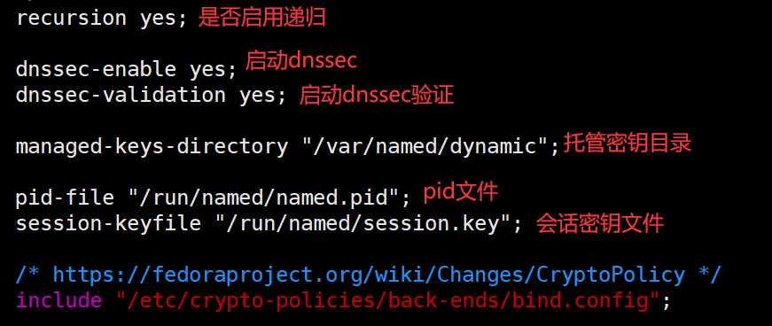
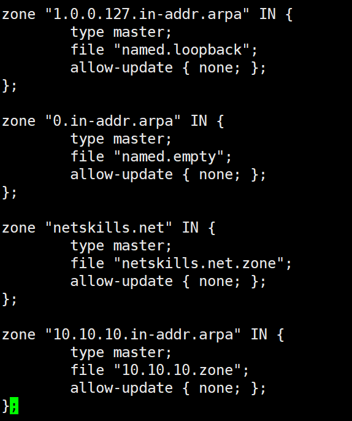
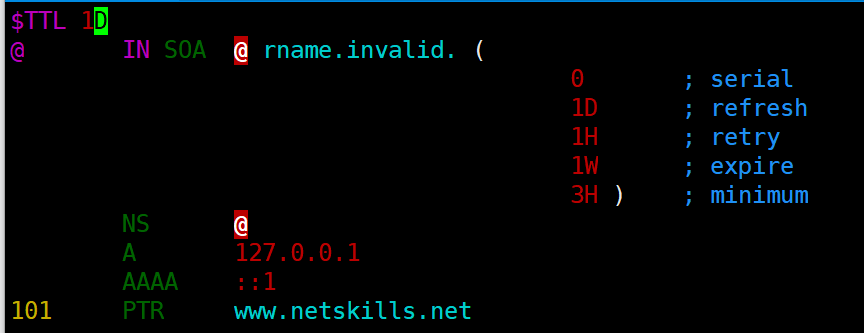

# DNS

**声明：**该文档依据网上已经存在的书籍、文档、教程等内容进行整合修改，并根据编者自身知识储备**额外增减内容**而成，可能存在错误，欢迎批评指正。


**参考链接：**

1. [【红帽 设置和配置 BIND DNS 服务器】](	https://docs.redhat.com/zh_hans/documentation/red_hat_enterprise_linux/9/html/managing_networking_infrastructure_services/assembly_setting-up-and-configuring-a-bind-dns-server_networking-infrastructure-services)

2. [【Cloudflare 什么是 DNS？】](https://www.cloudflare.com/zh-cn/learning/dns/what-is-dns/)

3. [【Cloudflare 什么是 DNS 记录？】](https://www.cloudflare.com/zh-cn/learning/dns/dns-records/)

4. [【Cloudflare 什么是 DNS 根服务器？】](https://www.cloudflare.com/zh-cn/learning/dns/glossary/dns-root-server/)
5. [【域名系统 | Domain Name System 】](https://en.wikipedia.org/wiki/Domain_Name_System)
6. [【根服务器列表 | List of Root Servers】](https://www.iana.org/domains/root/servers)
7. [【为什么 DNS 根服务器的数量限制为 13 个？】](https://unix.stackexchange.com/questions/557612/why-is-the-number-of-dns-root-servers-restricted-to-13)
8. [【根服务器技术运营协会 | Root Server Technical Operations Association | 根服务器地图】](https://root-servers.org/)
9. [【 Cloudflare 什么是 DNS 递归？ 】](https://www.cloudflare.com/zh-cn/learning/dns/what-is-recursive-dns/)
10. [【 Oracle | 关于 /etc/named.conf 配置文件】](https://docs.oracle.com/en/operating-systems/oracle-linux/6/admin/about-etc-named.html)


**其他链接：**

1.[【流程图绘图工具 | diagrams 】](https://app.diagrams.net/)


***注意：网站的具体信息可能会有所变化，请以实际访问网站时的信息为准。***


## DNS 基础知识

**域名系统( DNS )** 是一种分层**分布式**名称服务，最突出的是，**它将**易于记忆的**域名转换为**使用底层网络协议定位和识别计算机服务和设备所需的数字**IP地址**。


###  4 个 DNS 服务器

- **DNS 解析器** - DNS 解析器接收客户端计算机的查询，然后解析器负责发出请求。
- **根域名服务器** - 根区域位于该层次结构的最顶部。
- **TLD 名称服务器** - 顶级域名服务器（TLD）是 DNS 层次结构中比根服务器低一级的 DNS 服务器组。
- **权威性域名服务器** - 权威服务器是查询中的末尾。权威性域名服务器存在请求的记录，则会将记录结果返回到发出初始请求的 DNS 解析器。


在下图中，最顶层的 **Root** 则是**根域名服务器**，下一层的``.ORG`、`.com`、`.net`是**TLD名称服务器**，最底层的`mail.google.com`则是**权威性域名服务器**。


### 根服务器知识扩展

#### 为什么只有 13 个 DNS 根服务器地址？

一个普遍的误解是，世界上只有 13 台根服务器。实际上根服务器有许多，但只有 13 个 IP 地址用于查询不同的根服务器网络。DNS 原始架构的限制要求根区域中最多只能有 13 个服务器地址。在 Internet 面世之初，这 13 个 IP 地址的每一个都只有一台服务器，其中大多数位于美国。

如今，这 13 个 IP 地址中的每一个都有多个服务器，这些服务器使用 **Anycast 路由**基于负荷和距离分发请求。目前，地球上每座有人生活的大陆上都分布着 600 多台 DNS 根服务器。


#### 根服务器列表

| Hostname           | IP Addresses                      | Operator                                                     |
| ------------------ | --------------------------------- | ------------------------------------------------------------ |
| a.root-servers.net | 198.41.0.4, 2001:503:ba3e::2:30   | Verisign, Inc.                                               |
| b.root-servers.net | 170.247.170.2, 2801:1b8:10::b     | University of Southern California, Information Sciences Institute |
| c.root-servers.net | 192.33.4.12, 2001:500:2::c        | Cogent Communications                                        |
| d.root-servers.net | 199.7.91.13, 2001:500:2d::d       | University of Maryland                                       |
| e.root-servers.net | 192.203.230.10, 2001:500:a8::e    | NASA (Ames Research Center)                                  |
| f.root-servers.net | 192.5.5.241, 2001:500:2f::f       | Internet Systems Consortium, Inc.                            |
| g.root-servers.net | 192.112.36.4, 2001:500:12::d0d    | US Department of Defense (NIC)                               |
| h.root-servers.net | 198.97.190.53, 2001:500:1::53     | US Army (Research Lab)                                       |
| i.root-servers.net | 192.36.148.17, 2001:7fe::53       | Netnod                                                       |
| j.root-servers.net | 192.58.128.30, 2001:503:c27::2:30 | Verisign, Inc.                                               |
| k.root-servers.net | 193.0.14.129, 2001:7fd::1         | RIPE NCC                                                     |
| l.root-servers.net | 199.7.83.42, 2001:500:9f::42      | ICANN                                                        |
| m.root-servers.net | 202.12.27.33, 2001:dc3::35        | WIDE Project                                                 |


### DNS 查询

#### 迭代 DNS 查询（iterative DNS query）

1. **客户端**发送**DNS查询**给根**DNS服务器**（k.root-servers.net 193.0.14.129）
2. **根DNS服务器**返回**`com.`TLD DNS服务器**地址。
3. **客户端**发送**DNS查询**给根**`com.`TLD DNS服务器**（f.gtld-servers.net 192.35.51.30）。
4. **`com.`TLD DNS服务器**返回**`xiaoshae.com`权威DNS服务器**地址.
5. **客户端**发送DNS查询给**`xiaoshae.com`权威DNS服务器**（ns1.alidns.com 139.224.142.115）。
6. **权威DNS服务器**中存在**记录**，记录结果返回给**客户端**。（47.238.6.27）


值得一提的是，在查询对象为子域（例如 foo.example.com 或 blog.cloudflare.com）的情况下，将向权威性域名服务器之后的序列添加一个附加域名服务器（添加ns），其负责存储该子域的记录。


**Linux 中使用 dig 进行 试验**

跟踪（+trace）域名`xiaoshae.com`的A记录（IPv4地址记录）的解析过程。

```
dig xiaoshae.com a +trace
```


1. **根服务器查询** - 查询开始于本地DNS服务器，它返回了根DNS服务器的地址列表。

```
.            3500    IN      NS      m.root-servers.net.
.            3500    IN      NS      i.root-servers.net.
.            3500    IN      NS      d.root-servers.net.
...
```


2. 查询得到 **TLD 服务器** - `dig`选择了其中一个根服务器（例如 `d.root-servers.net.`）查询 `xiaoshae.com` 得到 **`.com` TLD 服务器**

```
com.            172800  IN      NS      a.gtld-servers.net.
com.            172800  IN      NS      b.gtld-servers.net.
com.            172800  IN      NS      c.gtld-servers.net.
...
```


3. 查询得到**权威服务器** - `dig`选择了其中一个`.com`的 TLD 服务器（例如 `a.gtld-servers.net.`）查询`xiaoshae.com`得到`xiaoshae.com.`权威服务器

```
xiaoshae.com.        172800  IN      NS      ns1.alidns.com.
xiaoshae.com.        172800  IN      NS      ns2.alidns.com.
```


4. 通过权威服务器得到记录**结果** - `dig`选择了其中一个`xiaoshae.com.`的权威服务器，获得具体的A记录。

```
xiaoshae.com.        600     IN      A       47.238.6.27
;; Received 57 bytes from 120.76.107.45#53(ns1.alidns.com) in 23 ms
```


**完整 dig 输出结果**

```
; <<>> DiG 9.18.28-0ubuntu0.22.04.1-Ubuntu <<>> 193.0.14.129 xiaoshae.com a +trace
;; global options: +cmd
;; Got answer:
;; ->>HEADER<<- opcode: QUERY, status: NXDOMAIN, id: 59606
;; flags: qr rd ra; QUERY: 1, ANSWER: 0, AUTHORITY: 1, ADDITIONAL: 1

;; OPT PSEUDOSECTION:
; EDNS: version: 0, flags:; udp: 65494
;; QUESTION SECTION:
;193.0.14.129.			IN	A

;; AUTHORITY SECTION:
.			600	IN	SOA	a.root-servers.net. nstld.verisign-grs.com. 2024092101 1800 900 604800 86400

;; Query time: 187 msec
;; SERVER: 127.0.0.53#53(127.0.0.53) (UDP)
;; WHEN: Sun Sep 22 13:06:46 CST 2024
;; MSG SIZE  rcvd: 116

.			3525	IN	NS	g.root-servers.net.
.			3525	IN	NS	j.root-servers.net.
.			3525	IN	NS	f.root-servers.net.
.			3525	IN	NS	a.root-servers.net.
.			3525	IN	NS	c.root-servers.net.
.			3525	IN	NS	h.root-servers.net.
.			3525	IN	NS	m.root-servers.net.
.			3525	IN	NS	k.root-servers.net.
.			3525	IN	NS	e.root-servers.net.
.			3525	IN	NS	b.root-servers.net.
.			3525	IN	NS	i.root-servers.net.
.			3525	IN	NS	l.root-servers.net.
.			3525	IN	NS	d.root-servers.net.
;; Received 239 bytes from 127.0.0.53#53(127.0.0.53) in 0 ms

com.			172800	IN	NS	f.gtld-servers.net.
com.			172800	IN	NS	i.gtld-servers.net.
com.			172800	IN	NS	c.gtld-servers.net.
com.			172800	IN	NS	e.gtld-servers.net.
com.			172800	IN	NS	a.gtld-servers.net.
com.			172800	IN	NS	m.gtld-servers.net.
com.			172800	IN	NS	d.gtld-servers.net.
com.			172800	IN	NS	b.gtld-servers.net.
com.			172800	IN	NS	j.gtld-servers.net.
com.			172800	IN	NS	g.gtld-servers.net.
com.			172800	IN	NS	l.gtld-servers.net.
com.			172800	IN	NS	h.gtld-servers.net.
com.			172800	IN	NS	k.gtld-servers.net.
com.			86400	IN	DS	19718 13 2 8ACBB0CD28F41250A80A491389424D341522D946B0DA0C0291F2D3D7 71D7805A
com.			86400	IN	RRSIG	DS 8 1 86400 20241004170000 20240921160000 20038 . sIbpCIWhO3z46OUuBYczDw90DDN0NU3pZWif8yAUTVt11XJHlMJs+pge BO9mgaUFrTm2B/QcT+rOou9t9lhqmSt/KCmUvAy39a9kGjH4WabruyTu APCAfvWD48ng72sHfvYz1cwLQJrf6fPftDI/+S+EEGgwx67PKtAPVtvA o/KmNiO7dDbybI5smB3aGPD2+/wh+5Lh1ul/VAF1dN4pVCJQuTOQYNrh UxG48ucyKjqYnpZXcknAnpoSLxW9ZqIouuf1z2KJoxH6kYXjpnytoIVS dlAQq/n5RYgT7eIEzT7167jbRzMVRUMxq3S+RlgIIocI06AdG9YaT7ko l2HlUg==
;; Received 1200 bytes from 192.33.4.12#53(c.root-servers.net) in 191 ms

;; UDP setup with 2001:503:d414::30#53(2001:503:d414::30) for xiaoshae.com failed: network unreachable.
;; no servers could be reached

;; UDP setup with 2001:503:d414::30#53(2001:503:d414::30) for xiaoshae.com failed: network unreachable.
;; no servers could be reached

;; UDP setup with 2001:503:d414::30#53(2001:503:d414::30) for xiaoshae.com failed: network unreachable.
xiaoshae.com.		172800	IN	NS	ns1.alidns.com.
xiaoshae.com.		172800	IN	NS	ns2.alidns.com.
CK0POJMG874LJREF7EFN8430QVIT8BSM.com. 86400 IN NSEC3 1 1 0 - CK0Q3UDG8CEKKAE7RUKPGCT1DVSSH8LL NS SOA RRSIG DNSKEY NSEC3PARAM
CK0POJMG874LJREF7EFN8430QVIT8BSM.com. 86400 IN RRSIG NSEC3 13 2 86400 20240929021348 20240922010348 59354 com. 1gUdp/I6vwqqKKIouY8vu5OwX/W2x7CPvEYYeoCtfI+JmRvp1yOKZfZz gtyZHq5PLjRdOwLvy6S/zrIWoA/MZw==
VJHLB8PF91J106E901DM8NENLCOJA07O.com. 86400 IN NSEC3 1 1 0 - VJHLG0TBRFNV8IST04JN8CEUE191ESAP NS DS RRSIG
VJHLB8PF91J106E901DM8NENLCOJA07O.com. 86400 IN RRSIG NSEC3 13 2 86400 20240926021357 20240919010357 59354 com. 8sV/BOrftHVnNMo/rJ/dCgF+Yml/wfObFffaMS4dMSFpdZTVK0dJ9KYs F9oxWtq36ZtosiiEWjvy9/EkEPpHAA==
;; Received 753 bytes from 192.52.178.30#53(k.gtld-servers.net) in 187 ms

xiaoshae.com.		600	IN	A	47.238.6.27
;; Received 57 bytes from 120.76.107.55#53(ns1.alidns.com) in 27 ms

root@Xiaoshae:~# dig xiaoshae.com a +trace

; <<>> DiG 9.18.28-0ubuntu0.22.04.1-Ubuntu <<>> xiaoshae.com a +trace
;; global options: +cmd
.			3500	IN	NS	m.root-servers.net.
.			3500	IN	NS	i.root-servers.net.
.			3500	IN	NS	d.root-servers.net.
.			3500	IN	NS	h.root-servers.net.
.			3500	IN	NS	k.root-servers.net.
.			3500	IN	NS	a.root-servers.net.
.			3500	IN	NS	b.root-servers.net.
.			3500	IN	NS	j.root-servers.net.
.			3500	IN	NS	c.root-servers.net.
.			3500	IN	NS	g.root-servers.net.
.			3500	IN	NS	e.root-servers.net.
.			3500	IN	NS	f.root-servers.net.
.			3500	IN	NS	l.root-servers.net.
;; Received 239 bytes from 127.0.0.53#53(127.0.0.53) in 3 ms

com.			172800	IN	NS	a.gtld-servers.net.
com.			172800	IN	NS	b.gtld-servers.net.
com.			172800	IN	NS	c.gtld-servers.net.
com.			172800	IN	NS	d.gtld-servers.net.
com.			172800	IN	NS	e.gtld-servers.net.
com.			172800	IN	NS	f.gtld-servers.net.
com.			172800	IN	NS	g.gtld-servers.net.
com.			172800	IN	NS	h.gtld-servers.net.
com.			172800	IN	NS	i.gtld-servers.net.
com.			172800	IN	NS	j.gtld-servers.net.
com.			172800	IN	NS	k.gtld-servers.net.
com.			172800	IN	NS	l.gtld-servers.net.
com.			172800	IN	NS	m.gtld-servers.net.
com.			86400	IN	DS	19718 13 2 8ACBB0CD28F41250A80A491389424D341522D946B0DA0C0291F2D3D7 71D7805A
com.			86400	IN	RRSIG	DS 8 1 86400 20241004170000 20240921160000 20038 . sIbpCIWhO3z46OUuBYczDw90DDN0NU3pZWif8yAUTVt11XJHlMJs+pge BO9mgaUFrTm2B/QcT+rOou9t9lhqmSt/KCmUvAy39a9kGjH4WabruyTu APCAfvWD48ng72sHfvYz1cwLQJrf6fPftDI/+S+EEGgwx67PKtAPVtvA o/KmNiO7dDbybI5smB3aGPD2+/wh+5Lh1ul/VAF1dN4pVCJQuTOQYNrh UxG48ucyKjqYnpZXcknAnpoSLxW9ZqIouuf1z2KJoxH6kYXjpnytoIVS dlAQq/n5RYgT7eIEzT7167jbRzMVRUMxq3S+RlgIIocI06AdG9YaT7ko l2HlUg==
;; Received 1172 bytes from 199.7.91.13#53(d.root-servers.net) in 243 ms

;; UDP setup with 2001:503:eea3::30#53(2001:503:eea3::30) for xiaoshae.com failed: network unreachable.
;; no servers could be reached

;; UDP setup with 2001:503:eea3::30#53(2001:503:eea3::30) for xiaoshae.com failed: network unreachable.
;; no servers could be reached

;; UDP setup with 2001:503:eea3::30#53(2001:503:eea3::30) for xiaoshae.com failed: network unreachable.
xiaoshae.com.		172800	IN	NS	ns1.alidns.com.
xiaoshae.com.		172800	IN	NS	ns2.alidns.com.
CK0POJMG874LJREF7EFN8430QVIT8BSM.com. 86400 IN NSEC3 1 1 0 - CK0Q3UDG8CEKKAE7RUKPGCT1DVSSH8LL NS SOA RRSIG DNSKEY NSEC3PARAM
CK0POJMG874LJREF7EFN8430QVIT8BSM.com. 86400 IN RRSIG NSEC3 13 2 86400 20240929021348 20240922010348 59354 com. 1gUdp/I6vwqqKKIouY8vu5OwX/W2x7CPvEYYeoCtfI+JmRvp1yOKZfZz gtyZHq5PLjRdOwLvy6S/zrIWoA/MZw==
VJHLB8PF91J106E901DM8NENLCOJA07O.com. 86400 IN NSEC3 1 1 0 - VJHLG0TBRFNV8IST04JN8CEUE191ESAP NS DS RRSIG
VJHLB8PF91J106E901DM8NENLCOJA07O.com. 86400 IN RRSIG NSEC3 13 2 86400 20240926021357 20240919010357 59354 com. 8sV/BOrftHVnNMo/rJ/dCgF+Yml/wfObFffaMS4dMSFpdZTVK0dJ9KYs F9oxWtq36ZtosiiEWjvy9/EkEPpHAA==
;; Received 753 bytes from 192.5.6.30#53(a.gtld-servers.net) in 27 ms

xiaoshae.com.		600	IN	A	47.238.6.27
;; Received 57 bytes from 120.76.107.45#53(ns1.alidns.com) in 23 ms
```


#### 递归 DNS 查询（recursive DNS query）

递归 **DNS** 查找是一个 **DNS 服务器**与其他几个 DNS 服务器进行通信以搜寻 **IP 地址**并将其返回给客户端的地方。这与迭代 DNS 查询相反，在迭代 DNS 查询中，客户端直接与查找中涉及的每个 DNS 服务器进行通信。


### DNS 记录类型

#### A

A 记录 - 保存域的 IP 地址的记录。

| 域名 | 记录类型 | 值        | TTL   |
| ---- | -------- | --------- | ----- |
| @    | A        | 192.0.2.1 | 14400 |


#### AAAA

AAAA 记录 - 包含域的 IPv6 地址的记录。

| 域名 | 记录类型 | 值                                      | TTL   |
| ---- | -------- | --------------------------------------- | ----- |
| @    | AAAA     | 2001:0db8:85a3:0000:0000:8a2e:0370:7334 | 14400 |


#### CNAME

CNAME 记录 - 将一个域或子域指向到另一个域，不提供 IP 地址。

| 域名             | 记录类型 | 值                         | TTL   |
| ---------------- | -------- | -------------------------- | ----- |
| blog.example.com | CNAME    | is an alias of example.com | 32600 |


#### MX

MX 记录 - 将邮件定向到电子邮件服务器。

| 域名 | 记录类型 | 优先级 | 值                    | TTL   |
| ---- | -------- | ------ | --------------------- | ----- |
| @    | MX       | 10     | mailhost1.example.com | 45000 |
| @    | MX       | 20     | mailhost2.example.com | 45000 |


#### TXT

TXT 记录 - 可让管理员在记录中存储文本注释。

| 域名 | 记录类型 | 值                                                | TTL   |
| ---- | -------- | ------------------------------------------------- | ----- |
| @    | TXT      | This is an awesome domain! Definitely not spammy. | 32600 |


#### NS

NS 代表“域名服务器”，域名服务器（**NS**）记录指示哪个 **DNS** 服务器对该**域**具有权威性（即，哪个服务器包含实际 DNS 记录）。

NS 记录告诉互联网可从哪里找到域的 IP 地址，一个**域**通常会**有多个 NS 记录**，指示该域的**主要**和**辅助**域名服务器。

| 域名 | 记录类型 | 值                    | TTL   |
| ---- | -------- | --------------------- | ----- |
| @    | NS       | ns1.exampleserver.com | 21600 |


#### SOA

**DNS** “授权机构起始”(SOA)  记录存储有关**域**或区域的重要信息，如管理员的电子邮件地址、域上次更新的时间，以及服务器在刷新之间应等待的时间。

所有 DNS 区域都需要一个 SOA 记录，以符合 IETF 标准。SOA 记录对区域传输也很重要。

| Name        | TYPE | MNAME     | RNAME        | 序列 | 刷新  | RETRY | EXPIRE  | TTL   |
| ----------- | ---- | --------- | ------------ | ---- | ----- | ----- | ------- | ----- |
| example.com | SOA  | ns.py.com | admin.ex.com | 111  | 86400 | 7200  | 4000000 | 11200 |

**RNAME**：管理员的电子邮件地址，在 SOA 记录中，admin.ex.com 等效于 admin@ex.com。

**区域序列号**：SOA 记录的版本号，序列号发生更改时，这会提醒辅助名称服务器更新。

**MNAME**：负责该域的主要名字服务器。

**REFRESH**：辅助服务器在向主要服务器询问 SOA 记录以查看其是否已更新之前应等待的时间长度（秒）。

**RETRY**：服务器再次向无响应的主要名称服务器请求更新前应等待的时间长度。

**EXPIRE**：如果辅助服务器在该时间段内没有得到主要服务器的响应，则应该停止响应对该区域的查询。


#### SRV

DNS“服务” (SRV) 记录为特定的服务（如 IP语音 (VoIP)）、即时通讯等）指定主机和端口。

大多数其他 DNS 记录只指定一个服务器或一个 IP 地址，但 SRV 记录还包括该 IP 地址的一个端口。


某些互联网协议，如 IMAP、SIP 和 XMPP，除了与特定的服务器连接外，还需要连接到一个特定的端口。SRV 记录是在 DNS 中指定端口的方式。

| 服务         | XMPP               |
| ------------ | ------------------ |
| 原型*        | TCP                |
| 名称**       | example.com        |
| TTL          | 86400              |
| class        | IN                 |
| 在提示下键入 | SRV                |
| 优先级       | 10                 |
| 权重         | 5                  |
| 端口         | 5223               |
| 目标         | server.example.com |


#### RTP

DNS 指针记录（简称 PTR）提供与 IP 地址关联的域名，DNS PTR 记录用于反向 DNS 查找，以 IP 地址开始并查找域名的查询。


**DNS 的 PTR 记录是如何存储的？**

*.arpa 是一个主要用于管理网络基础设施的顶级域，是为互联网定义的**第一个**顶级域名。（“arpa”这个名字可以追溯到互联网的早期：它的名字来源于高级研究计划署 (ARPA)，它创建了互联网的重要前身 ARPANET。）*

*DNS PTR 记录存储在 DNS 的 .arpa 顶级域中。*


*在 IPv4 中：*

*DNS PTR IPv4 记录存储在 “.in-addr.arpa” 中，在记录中需要对IP地址进行反转，例如IP 地址 192.0.2.255 的 PTR 记录将存储在“255.2.0.192.in-addr.arpa”下。*


*在 IPv6 中：*

*DNS PTR IPv4 记录存储在 “.ipv6.arpa” 中。*

*IPv6 反转并转换为 4 位部分。*

*`2001:0db8:85a3:0000:0000:8a2e:0370:7334`，反转后的段落序列为 `7334 0370 8a2e 0000 0000 85a3 0db8 2001`。*

*每个段拆分为两个4位的部分，并且反转每个段内的顺序，`7334` 拆分并反转为 `34.73` ，`0370` 拆分并反转为 `70.03`。*

*最终的PTR记录名称将会是：`34.73.70.03.2e.8a.00.00.00.00.a3.85.b8.0d.01.20.ip6.arpa.`。*


## DNS 部署与配置

### BIND9 安装

BIND 9 是 DNS 协议的完整实现的服务器软件。

CentOS 中安装BIND9

```
sudo yum/dnf install bind bind-utils # -y
sudo yum -y install bind bind-utils
sudo dnf -y install bind bind-utils
```


### BIND9 配置文件

named的主要配置文件是/etc/named.conf ，其中包含named的设置和区域的顶级定义。

随 bind 软件包安装的默认的 /etc/named.conf 文件，该文件配置了一个仅用于缓存的域名服务器。


#### options

```
options {
    listen-on port 53 { 127.0.0.1; };
    listen-on-v6 port 53 { ::1; };
    directory       "/var/named";
    dump-file       "/var/named/data/cache_dump.db";
    statistics-file "/var/named/data/named_stats.txt";
    memstatistics-file "/var/named/data/named_mem_stats.txt";
    allow-query { localnets; };
    recursion yes;

    dnssec-enable yes;
    dnssec-validation yes;
    dnssec-lookaside auto;

    /* Path to ISC DLV key */
    bindkeys-file "/etc/named.iscdlv.key";

    managed-keys-directory "/var/named/dynamic";
};

logging {
    channel default_debug {
        file "data/named.run";
        severity dynamic;
    };
};

zone "." IN {
    type hint;
    file "named.ca";
};

include "/etc/named.rfc1912.zones";
include "/etc/named.root.key";
```

options 语句定义了全局服务器配置选项，并为其他语句设置默认值。

listen-on

​	指定 named 监听查询请求的端口。

directory

​	如果指定了相对路径名，则此选项指定了区域文件的默认目录。

dump-file

​	指定在 named 崩溃时转储其缓存的位置。

statistics-file

​	指定了 rndc stats 命令的输出文件。

memstatistics-file

​	指定了 named 内存使用统计信息的输出文件。

allow-query

​	指定哪些 IP 地址可以向服务器发送查询。localnets 指定了所有本地连接的网络。

recursion

​	指定名称服务器是否执行递归查询。

dnssec-enable

​	指定是否使用安全 DNS（DNSSEC）。

dnssec-validation

​	指定名称服务器是否应该验证来自启用 DNSSEC 区域的回复。

dnssec-lookaside

​	指定是否启用使用由 bindkeys-file 定义的 /etc/named.iscdlv.key 中密钥的 DNSSEC 查看一旁验证（DLV）。


#### zone

zone 语句定义服务器在不同区域中的角色。

```
zone "xiaoshae.com" IN {
	type master;
	file "xiaoshae.com.zone";
	allow-update { none; };
	notify yes;
	// masters { 192.168.0.1; };
}
```

type

​	指定区域的类型：

​		**master**：表示该区域是主区域，即该 DNS 服务器是该区域的主要权威源。

​		**slave**：表示该区域是从属区域，该 DNS 服务器将从其他服务器同步区域数据。

​		**hint**：用于指定根提示（root hints），即根服务器的列表。

​		**forward**：用于配置转发区域，即将请求转发到其他 DNS 服务器进行解析。

​		**stub**：用于配置轻量级的区域，只保存部分记录，如 NS 记录。

allow-update

​	指定哪些主机可以更新区域数据

notify

​	控制主区域在更新之后是否通知其他 DNS 服务器，默认为yes

masters

​	用于从属区域（slave zones），它指定了从哪里同步区域数据。


#### zone 区域文件

基本格式：

```
<host name> <TTL> <class> <record type> <record data>
```

- `<host name>` 是记录的名字，可以是完全限定的域名（FQDN），也可以相对区域的名称。
- `<TTL>` 是生存时间，表示该记录可以被缓存多久。
- `<class>` 通常是 `IN` 表示 Internet。
- `<record type>` 是记录的类型。
- `<record data>` 是记录的数据，根据记录类型的不同而变化。


### 部署实验

1. DNS 递归解析服务器（1台）
2. DNS 根服务器（1台）
3. DNS TLD 服务器（1台 .com）

3. DNS 权威服务器（2台 xiaoshae.com 和 crocodile.com）


## DNS服务器及CADNS器的部署

### DNS服务器

#### １、安装DNS服务所需的软件包

软件包：**bind**

```
dnf -y install bind*    #安装DNS服务所需的软件包，自动解决依赖关系
```

#### ２、配置前检测

```
#selinux是否关闭或者正确配置
#firewalld(防火墙)是否开放端口/关闭
#bind是否正确安装    开启bind服务，将bind服务加入开机自启动
systemctl start named #启动bind服务 systemctl enable named   #添加到开机自启动
```

#### 3、配置主配置文件

```
#主配置文件位置   /etc/named.conf
[root@xiaoshae etc]# ls -la | grep "named" 
drwxr-x---   2 root named       6 11月  8 08:17 named
-rw-r-----   1 root named    1705 8月  24 2020 named.conf
-rw-r-----   1 root named    1029 8月  24 2020 named.rfc1912.zones
-rw-r--r--   1 root named    1070 8月  24 2020 named.root.key
-rw-r-----   1 root named     100 11月  8 08:27 rndc.key
options {
        listen-on port 53 { any; };    //开启监听端口53，接受任意IP连接
        listen-on-v6 port 53 { ::1; };    //支持IP V6
        directory       "/var/named";    //所有的正向反向区域文件都在这个目录下创建
        dump-file       "/var/named/data/cache_dump.db";
        statistics-file "/var/named/data/named_stats.txt";
        memstatistics-file "/var/named/data/named_mem_stats.txt";
        allow-query     { 0.0.0.0/0; };    //允许任意IP查询
#如无特殊需求，可以将三个花括号里面都改成  any;
```


```
#以下如无特殊要求，默认即可
```



```
#配置区域文件   /etc/named.rfc1912.zones
#也可以在named.conf中直接配置
#因为主文件中使用include包含了named.rfc1912.zones文件
[root@xiaoshae /]# cat /etc/named.conf | grep "include"
    include "/etc/crypto-policies/back-ends/bind.config";
include "/etc/named.rfc1912.zones";
include "/etc/named.root.key";
#建议在rfc1912中配置，因为里面有配置模板
```



```
#第一二个是模板，三四个是新建的
#因为IP是反向查询，要求IP要反过来写
#例如192.168.10.0  写成  10.168.192.in-addr.arpa
#file为改区域的文件位置   /var/named/（缺省不用写）  可在主配置文件中，修改该路径
——————
#编辑区域文件
#进入到/var/named/目录，创建两个文件
#10.10.10.zone和netskills.net.zone
#该目录下有一个模板，可直接复制。
#cp -p ./named.localhost 10.10.10.zone
#cp -p ./named.localhost netskills.net.zone
#编辑配置文件
```




```
A记录： 将域名指向一个IPv4地址（例如：100.100.100.100），需要增加A记录
CNAME记录： 如果将域名指向一个域名，实现与被指向域名相同的访问效果，需要增加CNAME记录。这个域名一般是主机服务商提供的一个域名
MX记录： 建立电子邮箱服务，将指向邮件服务器地址，需要设置MX记录。建立邮箱时，一般会根据邮箱服务商提供的MX记录填写此记录
NS记录： 域名解析服务器记录，如果要将子域名指定某个域名服务器来解析，需要设置NS记录
TXT记录： 可任意填写，可为空。一般做一些验证记录时会使用此项，如：做SPF（反垃圾邮件）记录
AAAA记录： 将主机名（或域名）指向一个IPv6地址（例如：ff03:0:0:0:0:0:0:c1），需要添加AAAA记录
SRV记录： 添加服务记录服务器服务记录时会添加此项，SRV记录了哪台计算机提供了哪个服务。格式为：服务的名字.协议的类型（例如：_example-server._tcp）。
SOA记录： SOA叫做起始授权机构记录，NS用于标识多台域名解析服务器，SOA记录用于在众多NS记录中那一台是主服务器
PTR记录： PTR记录是A记录的逆向记录，又称做IP反查记录或指针记录，负责将IP反向解析为域名
显性URL转发记录： 将域名指向一个http(s)协议地址，访问域名时，自动跳转至目标地址。例如：将www.liuht.cn显性转发到www.itbilu.com后，访问www.liuht.cn时，地址栏显示的地址为：www.itbilu.com。

隐性UR转发记录L： 将域名指向一个http(s)协议地址，访问域名时，自动跳转至目标地址，隐性转发会隐藏真实的目标地址。例如：将www.liuht.cn显性转发到www.itbilu.com后，访问www.liuht.cn时，地址栏显示的地址仍然是：www.liuht.cn。
```

```
#重启bind服务，并配置网卡中DNS服务器的地址
```

