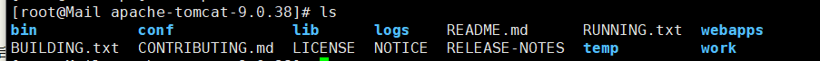
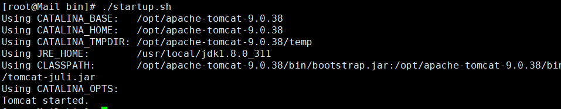
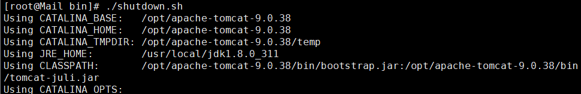

## JSP+Tomcat运行环境的部署

JSP（全称JavaServer Pages）是由Sun Microsystems公司主导创建的一种动态网页技术标准。

在linux下搭建jsp标准需要安装jdk和jre。

jdk是java开发工具，jre是java程序运行环境包含了`java`虚拟机和java基本库。

1、在网页上下载安装JDK

> JDK中包含了jre，所以只需要下载JDK即可

相关连接：https://www.oracle.com/java/technologies/downloads/#java8

下载tar.gz后缀的文件，并上传到Linux中

2、解压后，移动到自己`喜欢`的位置

解压文件    命令：tar -zxvf [文件名]

建议移动到  /usr/local/ 目录下面

命令： mv 文件夹名称 /usr/local/

3、配置环境变量

4、使环境变量生效，并测试

source /etc/profile   #使环境<mark>变量</mark>生效

测试：

5、下载tomcat.tar.gz文件

相关连接：https://archive.apache.org/dist/tomcat/

上传到linux并解压

解压命令： tar -zxvf 文件名

进入解压后的文件夹

bin中包含，开启，关闭等等命令

可以在conf文件夹中修改，默认端口

进入bin目录

开启tomcat服务

关闭tomcat服务

