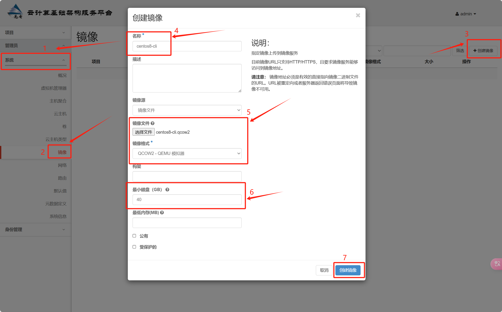

# glande

## 上传镜像

### gui




### cli

1. 设置账号环境变量

```
source /etc/keystone/admin-openrc.sh
```


2. 将文件上传到 controller Linux 系统上。

```
[root@controller ~]# ls
anaconda-ks.cfg  centos8-cli.qcow2
```


3. 将镜像文件上传

```
[root@controller ~]# openstack image create --disk-format qcow2 --container-format bare --min-disk 40 --file centos8-cli.qcow2 centos8-cli
+------------------+------------------------------------------------------+
| Field            | Value                                                |
+------------------+------------------------------------------------------+
| checksum         | ca557430ed6f8f3f480ea26430a7e0cc                     |
| container_format | bare                                                 |
| created_at       | 2024-12-30T10:27:52Z                                 |
| disk_format      | qcow2                                                |
| file             | /v2/images/bb36cb60-52b2-4696-957d-7b3cf95dd4b3/file |
| id               | bb36cb60-52b2-4696-957d-7b3cf95dd4b3                 |
| min_disk         | 40                                                   |
| min_ram          | 0                                                    |
| name             | centos8-cli                                          |
| owner            | edb3d24f0d8e40d28261d7ffd42e455e                     |
| protected        | False                                                |
| schema           | /v2/schemas/image                                    |
| size             | 896663552                                            |
| status           | active                                               |
| tags             |                                                      |
| updated_at       | 2024-12-30T10:27:55Z                                 |
| virtual_size     | None                                                 |
| visibility       | private                                              |
+------------------+------------------------------------------------------+
```

