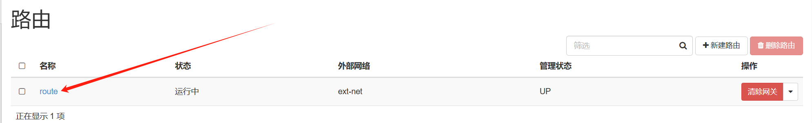

# neutron

## cli 使用

1. 创建网络

```
usage: neutron net-create [-h]
						  [--tenant-id TENANT_ID]
                          [--shared]
                          [--admin-state-down]
                          [--provider:network_type <network_type>]
                          [--provider:physical_network <physical_network_name>]
                          [--provider:segmentation_id <segmentation_id>]
                          [--router:external=True]
                          NAME
```

- `[-h]` 或 `[--help]`: 显示帮助信息并退出。
- `--tenant-id TENANT_ID`: 指定网络所属的租户（项目）ID。在较新的OpenStack版本中，这个参数可能被 `--project` 所替代。
- `--shared`: 如果指定了此选项，则创建的网络可以在所有租户之间共享。默认情况下，网络只能由创建它的租户使用。
- `--admin-state-down`: 创建网络时将其管理状态设置为“down”。默认是“up”，意味着网络处于活动状态并可以使用。通常你不需要显式地将网络设为“down”。
- `--provider:network_type <network_type>`: 指定网络类型，这取决于底层网络基础设施的支持。常见的网络类型包括：
    - `flat`: 不进行VLAN标记的网络。
    - `vlan`: 使用VLAN标签的网络。
    - `gre`/`vxlan`: 隧道网络，分别使用GRE或VXLAN封装。
    - `local`: 仅限于单个计算节点上的本地网络，不跨越多个节点。
- `--provider:physical_network <physical_network_name>`: 指定物理网络名称，它对应于提供网络连接的物理网络。对于 `flat` 和 `vlan` 类型的网络，这是必需的，因为它告诉Neutron要使用的物理网络接口。
- `--provider:segmentation_id <segmentation_id>`: 指定分段ID，例如VLAN ID或隧道ID。对于 `vlan` 网络，这是VLAN ID；对于 `gre` 或 `vxlan` 网络，这是隧道端点ID (Tunnel Endpoint Identifier, TEID)。每个分段ID必须在网络中唯一。
- `--router:external=True`: 将新创建的网络标记为外部网络，这意味着它可以作为路由器的外部网关接口。这对于需要互联网访问的私有网络来说是必要的。如果省略了这个选项，默认创建的是内部网络。
- `NAME`: 必需参数，指定新创建网络的名称，以便于识别和管理。


示例：

```
neutron net-create \
	--tenant-id edb3d24f0d8e40d28261d7ffd42e455e \
	--provider:network_type gre \
	--provider:segmentation_id 10 \
	--router:external=True \
	ext-net
```


```
neutron net-create \
	--tenant-id edb3d24f0d8e40d28261d7ffd42e455e \
	--provider:network_type gre \
	--provider:segmentation_id 20 \
	int-net
```


2. 创建子网

```
usage: neutron subnet-create [-h]
                             [--tenant-id TENANT_ID]
                             [--name NAME]
                             [--gateway GATEWAY_IP | --no-gateway]
                             [--allocation-pool start=IP_ADDR,end=IP_ADDR]
                             [--host-route destination=CIDR,nexthop=IP_ADDR]
                             [--dns-nameserver DNS_NAMESERVER]
                             [--disable-dhcp]
                             [--enable-dhcp]
                             [--ip-version {4,6}]
                             [--ipv6-ra-mode {dhcpv6-stateful,dhcpv6-stateless,slaac}]
                             [--ipv6-address-mode {dhcpv6-stateful,dhcpv6-stateless,slaac}]
                             [--subnetpool SUBNETPOOL]
                             [--use-default-subnetpool]
                             [--prefixlen PREFIX_LENGTH]
                             NETWORK [CIDR]
```

- `[-h]` 或 `[--help]`: 显示帮助信息并退出。
- `--tenant-id TENANT_ID`: 指定子网所属的租户（项目）ID。在较新的OpenStack版本中，这个参数可能被 `--project` 所替代。
- `--name NAME`: 为子网指定一个名称，以便于识别和管理。
- `--gateway GATEWAY_IP`: 指定子网的网关IP地址。如果未指定，则默认使用CIDR范围内的第一个可用IP地址作为网关。
- `--no-gateway`: 创建没有网关的子网。
- `--allocation-pool start=IP_ADDR,end=IP_ADDR`: 定义可分配给实例的IP地址池范围。可以定义多个池。
- `--host-route destination=CIDR,nexthop=IP_ADDR`: 添加一条主机路由，用于指定特定目的地的下一跳IP地址。
- `--dns-nameserver DNS_NAMESERVER`: 指定DNS服务器的IP地址，可以多次使用以添加多个DNS服务器。
- `--disable-dhcp`: 禁用DHCP服务，这意味着子网中的实例将不会自动获取IP配置。
- `--enable-dhcp`: 启用DHCP服务（默认行为），使得子网中的实例可以自动获取IP配置。
- `--ip-version {4,6}`: 指定使用的IP协议版本，4表示IPv4，6表示IPv6，默认是4。
- `--ipv6-ra-mode {dhcpv6-stateful,dhcpv6-stateless,slaac}`: 对于IPv6子网，指定路由器通告（RA）模式。
- `--ipv6-address-mode {dhcpv6-stateful,dhcpv6-stateless,slaac}`: 对于IPv6子网，指定地址分配模式。
- `--subnetpool SUBNETPOOL`: 指定用于分配CIDR的子网池。
- `--use-default-subnetpool`: 使用默认的子网池来分配CIDR。
- `--prefixlen PREFIX_LENGTH`: 如果指定了子网池，则需要指定前缀长度来确定从池中分配的网络大小。
- `NETWORK [CIDR]`: 必需参数，指定要创建子网的网络ID，并且可以指定CIDR（Classless Inter-Domain Routing）格式的IP地址块。


示例：

```
neutron subnet-create \
  --name ext-subnet \
  --gateway 192.168.200.2 \
  --allocation-pool start=192.168.200.20,end=192.168.200.40 \
  --enable-dhcp \
  --ip-version 4 \
  ext-net \
  192.168.200.0/24
```


```
neutron subnet-create \
  --name int-subnet \
  --gateway 10.10.10.254 \
  --allocation-pool start=10.10.10.100,end=10.10.10.200 \
  --dns-nameserver 223.5.5.5 \
  --dns-nameserver 223.6.6.6 \
  --enable-dhcp \
  --ip-version 4 \
  int-net \
  10.10.10.0/24
```


3. 创建路由

```
usage: neutron router-create \
	[-h] \
	[--tenant-id <TENANT_ID>] \
	[--admin-state-down] \
	[--distributed {True,False}] \
	[--ha {True,False}] \
	[--availability-zone-hint AVAILABILITY_ZONE] \
    NAME
```


```
usage: neutron router-gateway-set \
	[-h] [--request-format {json}] \
	[--disable-snat] \
	[--fixed-ip subnet_id=SUBNET,ip_address=IP_ADDR] \
	ROUTER EXTERNAL-NETWORK
```


```
usage: neutron router-gateway-clear [-h] [--request-format {json}] ROUTER
```


```
usage: neutron router-interface-add [-h] [--request-format {json}]
                                    ROUTER INTERFACE
```


```
usage: neutron router-interface-delete [-h] [--request-format {json}]
                                       ROUTER INTERFACE
```


```
usage: neutron router-update [-h] [--request-format {json}] [--name NAME]
                             [--admin-state-up {True,False}]
                             [--distributed {True,False}]
                             [--route destination=CIDR,nexthop=IP_ADDR | --no-routes]
                             ROUTER
```


示例：

```
neutron router-create \
	--tenant-id edb3d24f0d8e40d28261d7ffd42e455e \
	router
```


```
neutron router-gateway-set router ext-net
```


```
neutron router-interface-add router int-subnet
```


## 创建外部网络

### gui

#### 创建内部网络


#### 创建外部网络


#### 创建路由





#### 验证

创建一台云主机，网络选择 int-net


在云主句中尝试访问互联网，成功。


### cli

1. 创建网络

```
neutron net-create \
	--tenant-id edb3d24f0d8e40d28261d7ffd42e455e \
	--provider:network_type gre \
	--provider:segmentation_id 20 \
	int-net
```

```
neutron net-create \
	--tenant-id edb3d24f0d8e40d28261d7ffd42e455e \
	--provider:network_type gre \
	--provider:segmentation_id 10 \
	--router:external=True \
	ext-net
```


2. 创建子网

```
neutron subnet-create \
  --name int-subnet \
  --gateway 10.10.10.254 \
  --allocation-pool start=10.10.10.100,end=10.10.10.200 \
  --dns-nameserver 223.5.5.5 \
  --dns-nameserver 223.6.6.6 \
  --enable-dhcp \
  --ip-version 4 \
  int-net \
  10.10.10.0/24
```

```
neutron subnet-create \
  --name ext-subnet \
  --gateway 192.168.200.2 \
  --allocation-pool start=192.168.200.20,end=192.168.200.40 \
  --enable-dhcp \
  --ip-version 4 \
  ext-net \
  192.168.200.0/24
```


3. 创建路由器

```
neutron router-create \
	--tenant-id edb3d24f0d8e40d28261d7ffd42e455e \
	router
```

```
neutron router-gateway-set router ext-net
```

```
neutron router-interface-add router int-subnet
```

