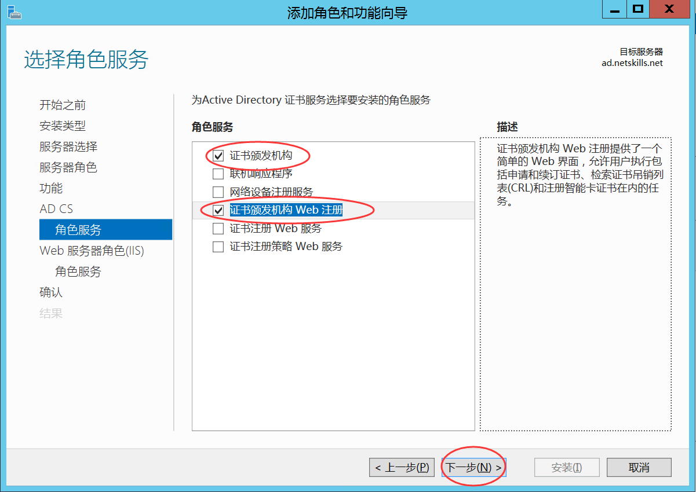

# 域控制器及CA服务器的部署

## CA服务器的部署

> CA (Certification Authority) 是认证机构的国际通称，它是对数字证书的申请者发放、管理、取消数字证书的机构。 CA的作用是检查证书持有者身份的合法性，并签发证书 (用数学方法在证书上签字)，以防证书被伪造或篡改。 网站的可以申请WEB证书，每个公司的网站都有自己的WEB证书，这样安全很多，故搭建CA服务器有利于安全性。

## 安装AD证书服务

打开**服务器管理器**，在**管理**中选择**添加角色和功能**，在角色中勾选**AD证书服务**。

在角色服务中选择**证书颁发机构**和**证书颁发机构web注册**。




单击**下一步**直至**安装**，中间的选项**默认**即可，单击**安装**按钮，等待安装完成。

**安装成功**后单击 **配置目标服务器上的AD证书服务** 超链接。

> 凭据中默认是本机服务器账户，**如果不是**域中的管理员账户，单击**更改**，登录**域管理员账户**

**选择要配置的服务角色**中勾选**证书颁发机构**和**证书颁发机构web注册**。

指定**CA的设置类型**为**企业**，单击**下一步**，指定**CA类型**为**根CA**。

> 私钥类型根据要求进行选择

**指定私钥类型**选择**创建新的私钥**，**指定加密选项**选择**SHA256**，密钥长度默认。

**CA名称**和**指定有效期**默认或者**根据要求填写**

单击**下一步**直至**安装**，中间的选项默认或者**根据要求**填写，单击**配置**，等待**配置成功**。

## 更改配置和管理证书颁发服务

打开**服务器管理器**，选择**AD CS**，右击**服务器**，在弹出的快捷菜单中选择**证书颁发机构**。即可**根据要求**进行**配置**。


# 从属CA部署

## 实验环境

Win1（根证书服务器）、Win2（从属证书服务器）

Win1配置证书颁发机构有效期20年，颁发证书有效期10年


## 配置域控制器

Win1配置为域控制器，win2以成员身份加入win1域

Win1与win2安装CA证书服务角色。（证书颁发机构，证书颁发机构web注册）

## 配置证书服务

配置win1证书服务角色，企业根CA，有效期十年

配置win2证书服务角色，企业从属CA，有效期默认

## 导出win1证书颁发机构根证书

## 将导出的证书添加到受信任的根证书颁发机构

## 为win2从属证书颁发机构申请证书


在win2中C盘下打开证书服务角色的证书申请文件，服务内容。

在win2启动浏览器访问 http://<win1 IP>/certsrv，登录域管理员账户.

申请证书->高级证书申请->使用base64编码的CMC或PKCS #10文件提交一个证书申请，或使用base64编码的PKCS#7文件续订证书申请->然后将C盘下文件的内容复制到内容框中->证书模板->从属证书颁发机构->提交->下载证书

## 启动（从属）证书颁发机构

右击服务器->所有任务->启动服务->提交证书


# 设置证书颁发机构有效期

certutil -setreg ca\ValidityPeriod "Years" 设置有效期为年
certutil -setreg ca\ValidityPeriodUnits "2" 设置有效期为2

# 复制一个新的证书模板

证书颁发机构->（右击）证书模板->管理

（右击）计算机->复制模板

常规：模板显示名称：计算机副本、有效期：5年

请求处理：允许导出私钥

安全：组或用户名 Authenticated Users 权限：读取、注册

证书模板->（空白处右击）->新建->要颁发的证书模板->（选中）计算机副本->确定

# 申请一个证书

启动cmd对话框，mmc打开控制台

文件->添加/删除管理单元

选中证书，单机添加，选择本地计算机，下一步，默认，确定

证书->个人->证书

右击->所有任务->申请新证书->下一步->勾选“计算机副本”->详细信息->属性

常规：友好名称：windows1

使用者：

公用名：skills.com

国家/地区：CN

省/市/自治区：Beijing

区域：Beijing

单位：Skills

组织单位：System

DNS：skills.com 、 *.skills.com

# 控制台添加证书

在MMC控制台中申请的证书，申请证书后会自动导入到IIS证书管理器中，无需手动导入。

 Cmd输入mmc启动控制台，文件添加或删除管理单元，选择证书，选择计算机账户。

证书 个人 证书 右击 所有任务 申请新证书

下一步 下一步

点击web服务器模板的详细信息，点击属性

设置相关信息，一定要设置DNS为域名否则https访问时会报错


勾选web服务器模板，点击注册


# 导出证书颁发机构根证书

a.	录到根证书颁发机构 Web 注册网站。

​	通常，Web 注册网站驻留在以下链接中：

​	<http:// ip_address>/certsrv 或 <http:// fqdn>/certsrv 

​	ip_address = 根证书颁发机构服务器 IP。

​	fqdn = 根证书颁发机构服务器的完全限定域名。

b.	选择 “下载 CA 证书”、“证书链”或“CRL”。

c.	选择 “下载 CA 证书”。

d.	将文件“certnew.cer”保存在本地磁盘存储中。

# 信任根CA证书

使用组策略分发受信任证书的列表

1.在具有自定sst 文件的域控制器上，打开组策略管理编辑器

2.在组策略管理控制台中，展开要修改的林、域和特定域对象。右键单击”默认域策略GPO”，然后单击“编辑”。

3.在导航窗格中的“计算机配置”下，依次展开“策略”、“Windows 设置”、安全设置和“公钥策略”。

4右键单击“受信任的根证书颁发机构”，然后单击”导入”

5.在“证书导入向导“中，单击”下一步”

6.输入复制到域控制器的文件的路径和文件名，或使用”浏览”按钮找到该文件。单击下一步。

7.通过单击”下一步”确认要将这些证书放在受信任的根证书颁发机构证书存储中。单击完成。当系统通知您证书已成功导入时，请单击”确定”。

该策略立即生效，但客户端计算机必须重新启动才能接收新设置，或者你可以从提升的命令提示符或Windows PowerShell键入`gpupdate /force`.


# IIS 使用 LinuxCA颁发证书

>   由 linux1 提供证书服务，使用 windows5 和 linux5 测试

Linux颁发web证书给Windows的IIS服务器使用

1.在Linux搭建CA证书服务器

2.建立一个私钥

3.用私钥创建证书申请

4.将证书申请提交到LinuxCA服务器

5.LinuxCA证书服务器同意申请，并颁发证书

注意：证书申请域名设置为IIS 所设置的域名，在颁发证书时引用扩展文件，扩展文件中添加DNS（设置为域名）

```
subjectAltName = @alt_names

[alt_names]
DNS.1 = xxx.skills.com
```

6.将私钥与证书组合为pfx文件，导出pfx文件和LinuxCA根证书

openssl pkcs12 -export -out xx1 -inkey xx2 -in xx3 

xx1导出的pfx证书路径和名称	xx2导入的私钥	xx3导入的证书

7.将LinuxCA根证书上传到Windows域控制器，编辑域策略组，将LinuxCA根证书添加到受信任的颁发机构（注意重启客户端计算机或使用命令更新策略组，域控制器即使服务端也是客户端，所以也需要更新）

8.将pfx证书导入到IIS的证书管理器，在绑定中的https选定该证书。