# DNS

> DNS是互联网的一项服务。它作为将域名和IP地址相互映射的一个分布式数据库，能够使人更方便地访问互联网。DNS使用UDP端口53。
>
> 当前，对于每一级域名长度的限制是63个字符，域名总长度则不能超过253个字符。

添加**角色功能和向导**安装**DNS服务器**角色。

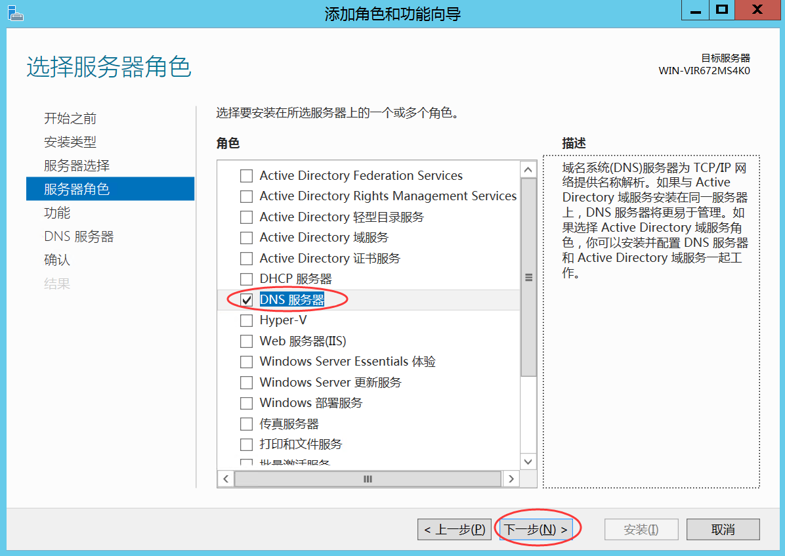

在**服务器管理器**中，选择**工具**中的**DNS**，打开**DNS管理器**。

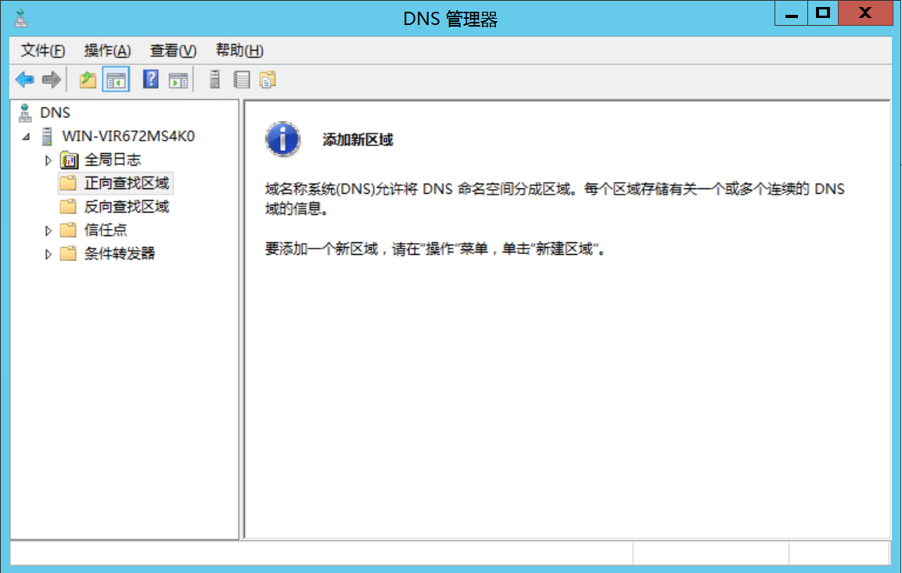

# 正向查找区域

右击**正向查找区域**，在弹出的快捷菜单中选择**新建区域**。

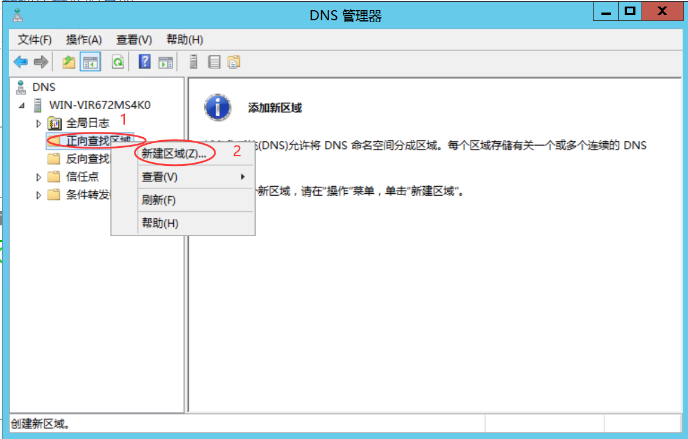

开始向导介绍中单击**下一步**，区域类型选择**主要区域**，单击**下一步**。

区域名称**根据要求**填写，例如 **wang.com** ；单击**下一步**。

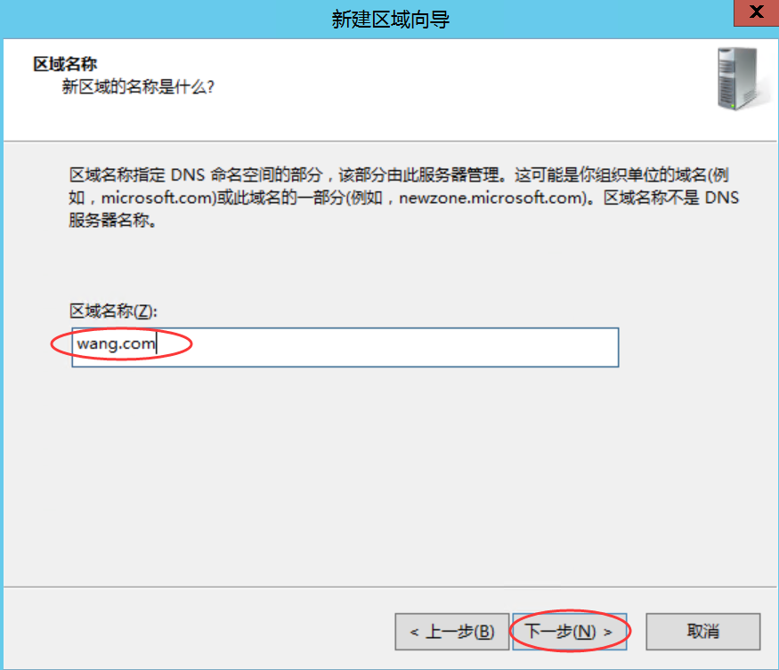

**区域文件**选择**创建新文件**，文件名**默认**；单击**下一步**。

**动态更新**选择**不允许动态更新**；单击**下一步**。

最后一步点击完成。

右击**创建的区域**（例如：**wang.com**），在弹出的快捷菜单中选择**新建主机**。

**根据要求**填写**名称和IP地址**，单击**添加主机**按钮

# 反向查找区域

右击**反向查找区域**，选择**新建区域**，选择**主要区域**，选择**IPV4反向查诈**。

根据要求填写，点击**下一步**。

选择**创建新文件**，名称默认，选择**不允许动态更新**。

右击新建的**反向查找区域**，选择**新建指针**。

更具要求填写**主机IP地址**，选择**主机名**，单击**确定**。

# 使用nslookup命令进行测试

# **Powershell**禁用**DNS**递归功能

命令样式：`dnscmd <ServerName> /Config /NoRecursion {1|0}`

例如：`dnscmd dc /Config /NoRecursion 1`

# 关闭网络掩码排序

在**DNS管理器**中右击服务器，选择**属性**，选择**高级选项卡**，取消勾选**启用网络掩码排序**

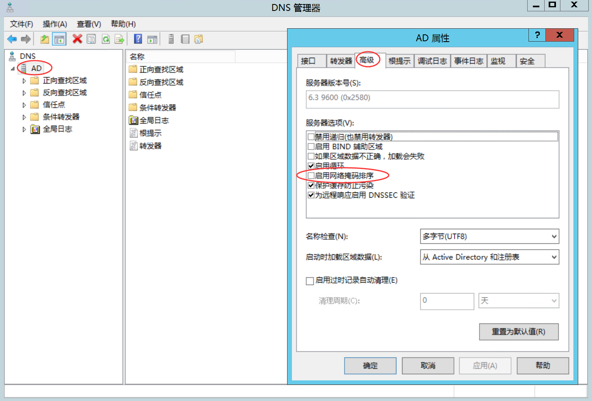

# 安全防护的部署

## 创建正反向解析

打开**DNS管理器**，创建**区域**，在区域中创建一个**主机**

勾选后会**自动创建一个PTR指针**，也就是对应的**反向查找区域**，前提是在反向查找区域中，建立了**对应的主机**的区域

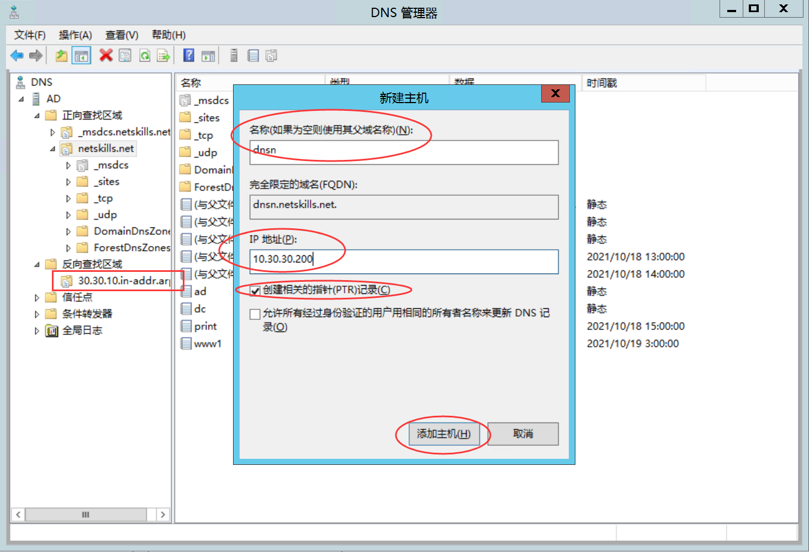

## 对区域进行签名

**右击**区域，选择**DNSSEC**中的**对区域进行签名**，使用**DNSSEC**对区域进行签名

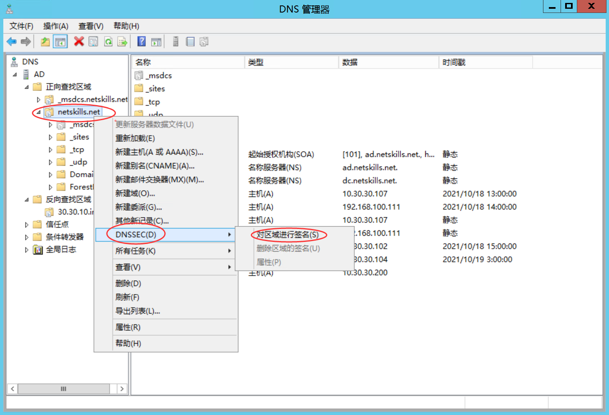

**签名选项**选择**使用默认设置对区域进行**，**一直**单击**下一步**直至**安装**，单击**安装**，等待**安装**完成。

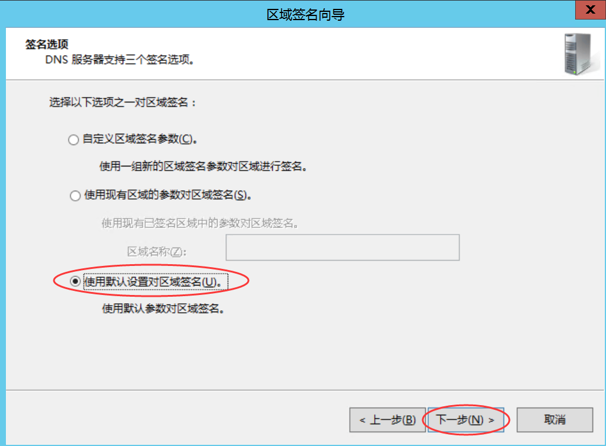

右击**区域**，选择**DNSSEC**中的**属性**查看情况。

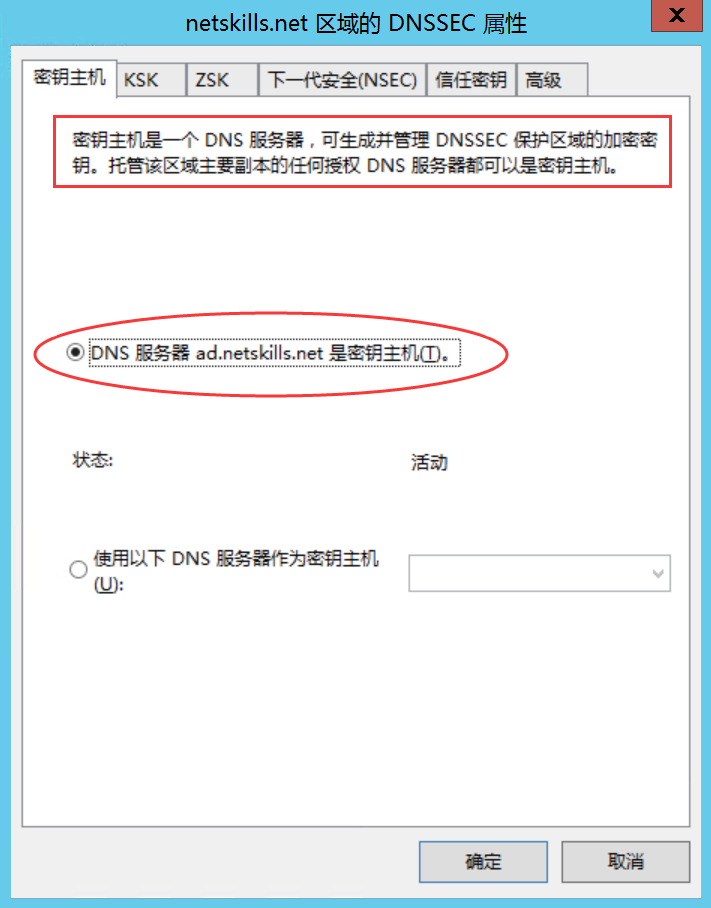

进行**签名后**，DNS服务器会**生成一个文件**，路径：C:\Windows\Sytem32\dns

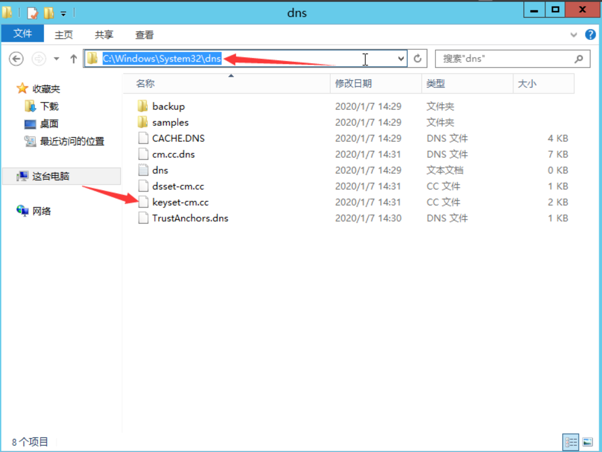

## 其他DNS服务器设置转发器

`方法:右键DNS2选框，点击高级，进入下面界面设置DNS转发器`

## 导入DNSKEY签名

导入DNSKEY签名，来保证数据来自正确的名称服务器。
`方法:右键信任点>导入>DNSKEY`

注意：此处导入的文件为DNS1服务器进行签名时生成的文件。

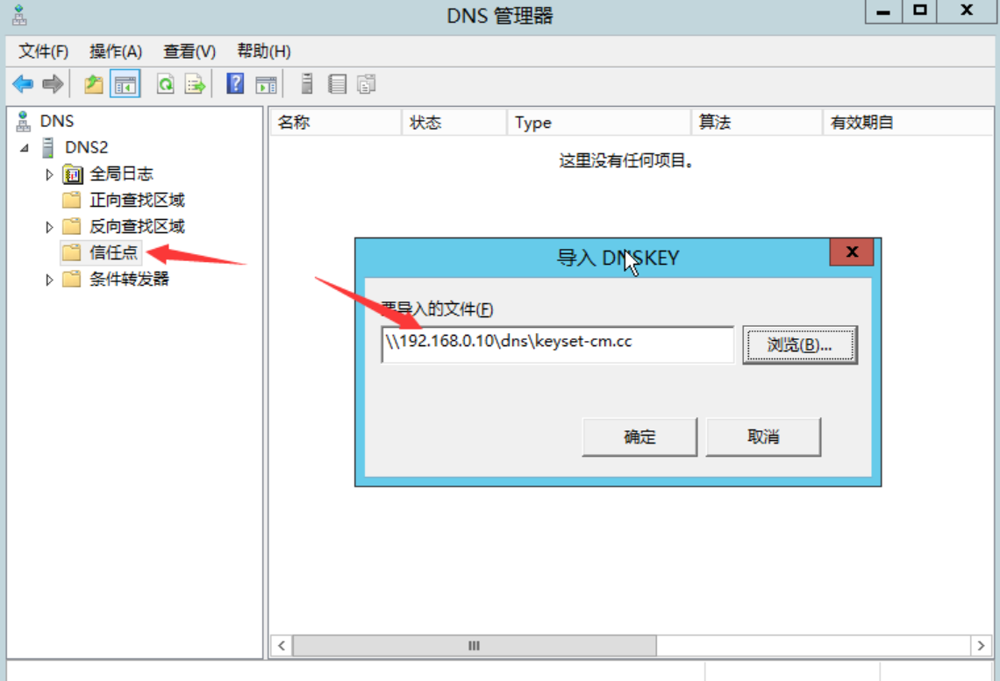

**效果如下:**
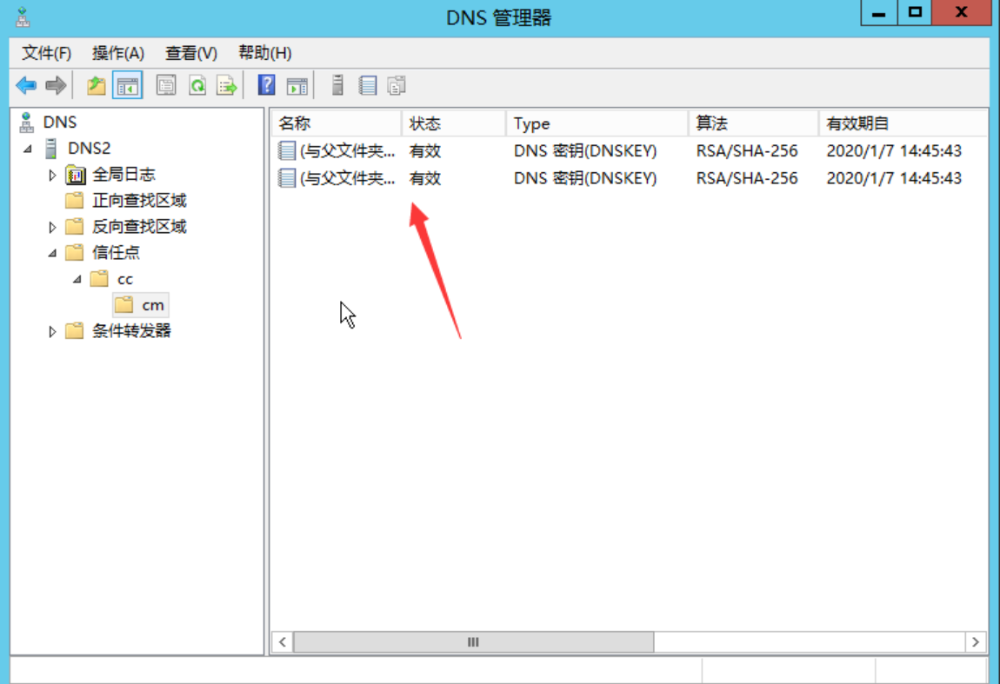

