# RSTP

rstp是在stp的基础上进行改进，兼容stp，在stp的基础上添加了三个快速收敛机制，在特定场景下可以大幅度减少收敛时间。

 

## 介绍

### 端口类型：

- 根端口：非根桥可能由多个端口与根桥通信，非根桥到根桥通信最优的端口（根端口）。
- 指定端口：向下层转发数据的端口。
- Alternet端口：学习到其它网桥发送的配置BPDU报文而阻塞的端口，提供了从指定桥到根的另一条可切换路径，作为根端口的备份端口。
- Backup端口：由于学习到自己发送的配置BPDU报文而阻塞的端口，作为指定端口的备份，提供了另一条从根桥到相应网络的备份通路


### 角色状态：

- Discarding：**不转发**用户数据帧，**不学习**MAC地址，**仅接收**STP帧。
- Learning：**不转发**用户数据帧，**学习**MAC地址，收发STP帧。
- Forwarding：**转发**用户数据帧，**学习**MAC地址，收发STP帧。


### 定时器：

转发延迟时间 (Forward Delay)：默认15s。

BPDU发送间隔（Hello Time）：默认2s。

Message Age：根桥发送所有的BPDU报文时，Message Age的值为0，然后每经过一个交换机，这个值就会增加1。

Max Age：默认20，在RSTP中Max Age的作用与STP中的不一样。

一个非根桥设备收到的BPDU报文中。

如果Message Age小于等于Max Age，则该非根桥设备继续转发配置BPDU报文。 

如果Message Age大于Max Age，则该配置BPDU报文将被老化。该非根桥设备直接丢弃该配置BPDU，可认为网络直径过大，导致根桥连接失败。


## 角色状态切换

### 1.丢弃状态

整个网络所有交换机同一时间启动，端口处于Discaring（丢弃）状态，所有端口收不到BPDU。

等待一个Forward Delay时间（默认15s），进入Learing（学习）状态。


### 2. 学习状态

端口进入Learing（学习）状态，开始收发BPDU，选举出：根桥、根端口、指定端口、Alternet端口、Backup端口。

等待一个Forward Delay时间（默认15s），进入Forwarding（转发）状态。


### 3. 转发状态

部分端口相继进入转发状态，开始转发用户数据帧的工作。


在RSTP中不使用Max Age作为BPDU老化时间，在RSTP中如果超过三个Hello Time时间没有收到BPDU，则认为与此邻居之间的协商失败。

当协商失败后，该端口会重新进入Discarding状态，并开始新一轮的协商。这个过程可能会引发拓扑变化，因此可能需要重新计算生成树


在RSTP中不一定要按照上面的流程进行收敛，RSTP中新增了几个快速收敛机制。


## 快速收敛

### 1. 边缘端口

在RSTP中，可以将交换机的端口（手动）配置为边缘端口（Edge Port），边缘端口用于连接终端设备（PC或服务器等），不参与生成树的计算，边缘端口的激活与关闭不会影响生成树的计算，当边缘端口被激活后，立刻切换到转发状态，开始转发用户数据帧。


### 2. 代替端口

代替端口可以简单理解为根端口的备份，它是非根桥收到了其他设备发送的BPDU后被阻塞的端口。

如果设备的根端口发生了故障，且代替端口所连接的对端端口处于转发状态，那么代替端口可以立刻成为新的根端口。


注：代替端口如何知道所连接的对端端口，是否处于转发状态，详看P/A机制部分的内容。


### 3. 备份端口

备份端口是只交换机收到了自己发送的BPDU从而被阻塞的端口。

假设一台交换机有两个端口（端口A、B），连接到了同一台集线器上，此时交换机从端口A发送到集线器的BPDU会被端口B接收，端口B发送的BPDU会被端口A接收，此时会依次比较端口的RPC、BID、PID，较小的端口成为指定端口，其他端口成为备份端口。

如果指定端口出现故障，则备份端口立刻转换为指定端口，并开始转发用户数据。


### 4. P/A机制

暂略


# 华为交换机 命令


## 边缘端口（含过滤）

边缘端口不接收处理配置BPDU报文，不参与RSTP运算，可以由Disable直接转到Forwarding状态，且不经历时延，就像在端口上将RSTP禁用。

但是配置为边缘端口后，**端口仍然会发送BPDU报文**，这可能导致BPDU报文发送到其他网络，引起其他网络产生震荡。因此可以配置边缘端口的BPDU报文过滤功能，使边缘端口不处理、不发送BPDU报文。


配置交换机所有端口，进入系统视图：

```
system-view
```


没有进入指定端口中，则会**影响整个交换机所有端口**

边缘端口：

```
stp edged-port default
```

BPDU报文过滤功能：

```
stp bpdu-filter default
```


**给部分端口配置**，进入参与生成树协议计算的以太接口视图：

```
interface interface-type interface-number
```

边缘端口：

```
stp edged-port default
```

BPDU报文过滤功能：

```
stp bpdu-filter default
```


# RSTP示例（华为）


## 拓扑结构

拓扑图：

SW1和SW2为核心交换机。

其中将SW1配置为根交换机，SW2为备用根交换机


SW3和SW4作为接入交换机。

SW1-SW3及SW1-SW4的链路由主链路。

SW2-SW3及SW2-SW4的链路作为备用链路。


## sw1


设置为rstp

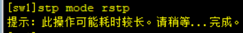


设置为根桥

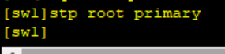


创建vlan10


将sw1连接sw2、sw3、sw4的接口设置为trunk，允许vlan10通过


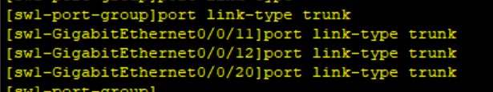


## sw2

设置为rstp

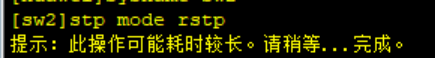


设置为备份根桥


创建vlan10


将sw2连接sw1，sw3，sw4的交换机端口，设置为trunk，允许vlan10通过


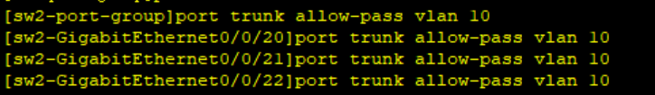


## sw3

设置为rstp


创建vlan10

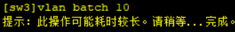


将sw3连接sw1，sw2的端口设置为trunk，允许vlan10通过


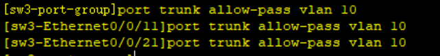


进入端口10，设置为access模式，vlan10，开启边缘端口和BPDU过滤


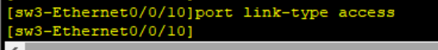


## sw4


设置为rstp


创建vlan10


将sw4连接sw1，sw2的端口设置为trunk，允许vlan10通过


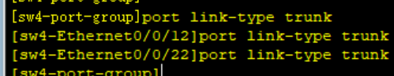


进入端口10，设置为access模式，vlan10，开启边缘端口和BPDU过滤


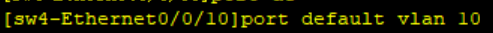


## 测试

设置pc1和pc2的ip地址和子网掩码

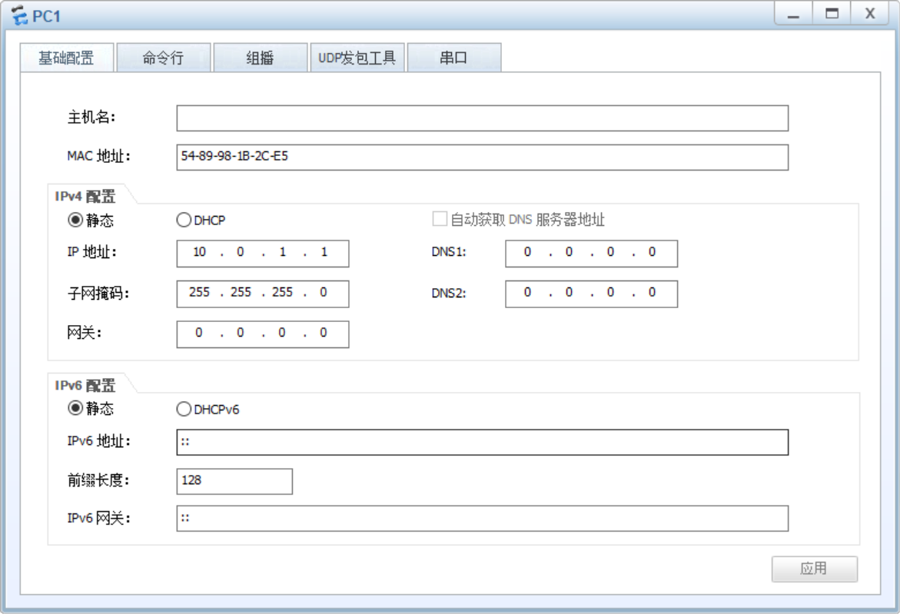

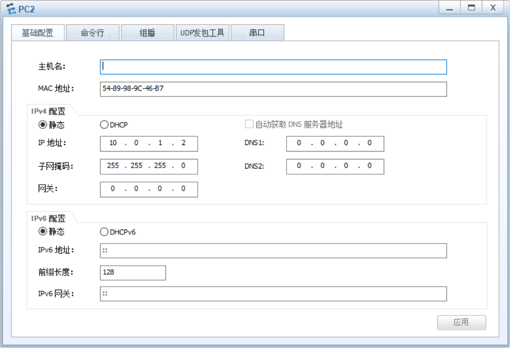


pc1 ping pc2


pc2 ping pc1


