# PPP协议


1. **标志字段（**Flag field**）** 标志开头或者结尾，它的值始终为 1 个字节，即01111110二进制值。

2. **地址字段（**Address field**）** 地址字段是广播地址。它的值为 1 字节，固定为11111111二进制值。

3. **控制领域（Control field）**在PPP中，此字段设置为1字节，取值固定为00000011（0x3）二进制值。

4. **协议字段（**Protocol field**）**Protocol字段可以有很多不同的值，每个值都代表了一种特定的协议。此字段为 1 或 2 个字节，有助于识别由 PPP 帧封装的 PDU（协议数据单元）。

    0xC021：代表LCP报文

    0xC023：代表PAP报文

    0xC223：代表CHAP报文

    0x0021：代表IP

    0x0029：代表Appletalk

    0x8021：代表IPCP 

    0xC025：代表LQR 

5. **数据字段（**Data field**）** PPP 帧封装的 PDU（协议数据单元），它通常包含上层数据报。网络层数据报特别封装在该字段中，用于常规 PPP 数据帧。此字段的长度不是恒定的，而是变化的。

6. **FCS（）**此字段通常包含校验和，仅用于识别错误。它的大小可以是 16 位或 32 位。它还在地址、控制、协议甚至信息字段上进行计算。字符被添加到框架中，用于控制和处理错误。


## 0xC021 Link Control Data

Code：长度为 1 个字节（8Bit），根据Code标识 LCP 帧的类型：

```
0x01 Configure-request
0x02 Configure-ack
0x03 Configure-nak
0x04 Configure-reject
0x05 Terminate-request
0x06 Terminate-ack
0x07 Code-reject
0x08 Protocol-reject
0x09 Echo-request
0x0a Echo-reply
0x0b Discard-request
```

Id：ID字段携带一个用于匹配相同请求和回复的标识符。

当一方发送一个请求时，它会在ID字段中包含一个唯一的标识符。当接收方回复这个请求时，它会在其回复中包含相同的ID字段。通过检查的ID字段，来确定哪个回复对应于哪个请求。

Length：长度（字节数），表示整个Link Control Data所占用的字节数。

### 0x1 Configure-request

当通信双方的两端检测到物理线路激活时，PPP链路进行LCP参数协商。协商内容包括最大接收单元MRU、认证方式、魔术字（Magic Number）等选项。

在PPP链路进行LCP参数协商时，使用Configure-request来发送请求。


### 0x02 Configure-ack

当收到Configure-request的LCP参数协商请求时，如果接受对方所发送的所有参数，则发送Configure-ack告知对方接受所有参数，ack帧中也包含对方所发送的参数信息。


注意：可以通过Identifier来判断哪个request对应哪个ack。


### 0x03 Configure-nak

PPP中主机接收到了一个Requst帧，如果接受对方的所有参数，就会发送Configure-Ack。如果只接受部分参数，或者希望对方调整某些参数，就会**发送Configure-Nak报文，并在报文中提出自己的参数建议**。


主机A收到主机B发送的Request帧，其中主机B要求协商认证方式使用PAP认证。

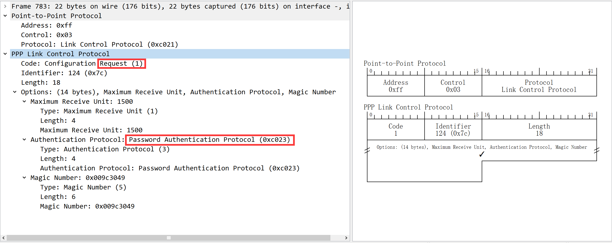


主句A发送Nak帧，其中表示主机A不支持PAP认证方式，只支持CHAP认证方式。

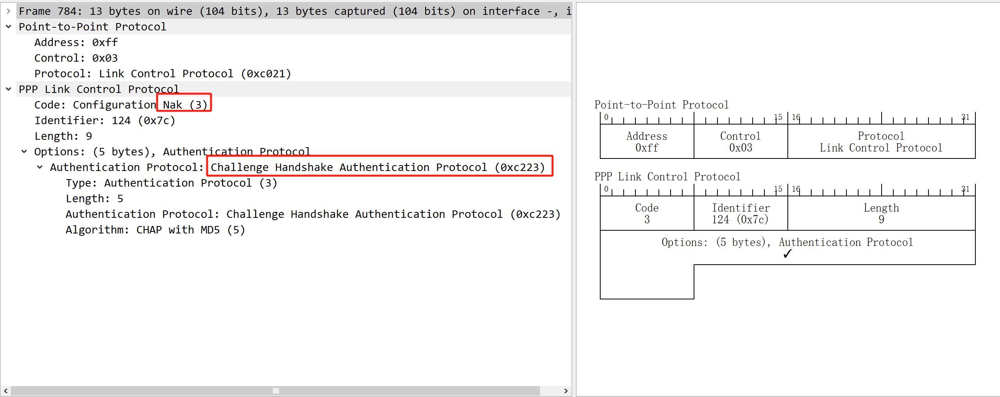


### 0x04 Configure-reject

当收到一个Request帧，如果无法接受对方的某些参数，就会发送Configure-Reject报文。在其中列出无法接受的参数。


主机B在Request帧中表示需要PAP身份认证。

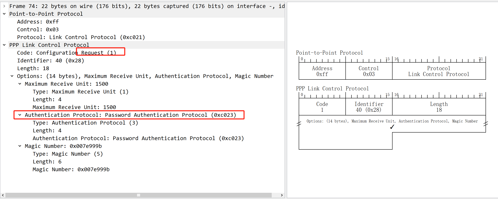


主机A收到主机B发送的Request帧，但是主机A不支持PAP认证，所以发送reject帧。


注意：

LCP参数协商不是单项的，而是双向的，即两个通信端点都会发送Configure-Request报文，并携带各自希望协商的配置参数。当一方收到对方的Configure-Request报文后，会根据自身的配置和需求来决定是否接受对方的参数。

主机A会发送Request帧，主机B接收参数后会发送Ack帧。

主机B会发送Request帧，主机A接收参数后会发送Ack帧。

主机A的Request中可以要求主机B使用PAP验证自己身份。

主机B的Request中可以要求主机A使用CHAP验证自己的身份。

PPP中支持双向身份验证，默认情况下不进行任何身份验证。


### Terminater- request(0x05)  and ack(0x06)

0x05 Terminate-Request：这是一种用于请求终止链路的帧类型。当一端想要关闭链路时，会持续发送 Terminate-Request 帧，直到收到有效的响应（或者到达预设的未回复次数）。

0x06 Terminate-Ack：这是一种用于响应 Terminate-Request 的帧类型。当一端收到 Terminate-Request 帧后，必须回应一个 Terminate-Ack 帧，确认收到关闭链路请求，并且断开连接关闭链路。


### 0x07  and 0x08 | Protocol-reject and Code-reject

0x07 Code-Reject：当收到无法识别的 LCP 帧时，会发送 Code-Reject 帧。表示对方发送了一个不被支持的 LCP 帧类型。

0x08 Protocol-Reject：当收到无法识别的通信协议时，会发送Protocol-Reject 帧来通知对方，表示对方使用一个本机不支持的协议。


### 0x09 and 0x0a | Echo-request and Echo-reply

0x09 Echo-Request：这是一种用于请求回显的帧类型。Echo-Request 帧用于检测网络连通性，例如，Ping 就是通过发送 ICMP Echo 消息实现的。

0x0a Echo-Reply：这是一种用于响应 Echo-Request 的帧类型。当一端收到 Echo-Request 帧后，必须回应一个 Echo-Reply 帧。


### 0x0b Discard-request

这是一种用于请求丢弃的帧类型。当一端收到 Discard-Request 帧后，必须丢弃该帧。有什么作用暂时不讨论。


## Authenticate - 身份认证


### Pap ppp protocol 0xc023

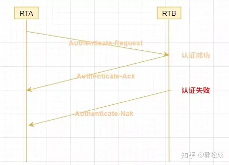

1、**被认证方**将配置的**用户名和密码信息**使用**Authenticate-Request报文**以**明文方式**发送给认证方。

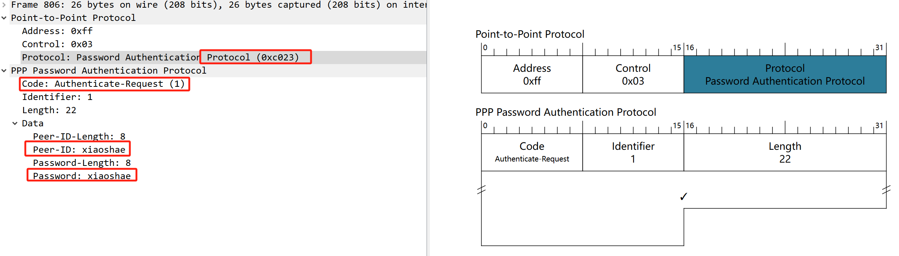


**认证方**收到被认证方发送的用户名和密码信息之后，根据本地配置的用户名和密码数据库检查用户名和密码信息是否**匹配**。


3、认证成功，**Authenticate-Ack报文**。


4、认证失败，**Authenticate-Nak报文**。然后再次通过Authenticate-Request向**认证方**发送认证请求。

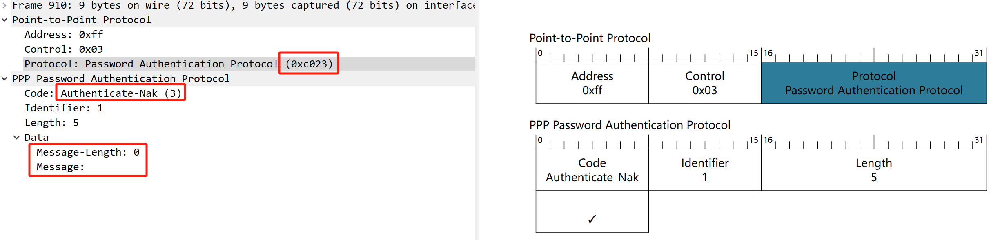


###  Chap ppp protocol 0xc223


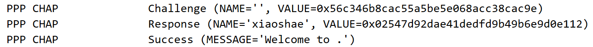


1、LCP协商完成后，**认证方**发送一个**Challenge报文**给被认证方，报文中含有Identifier信息和一个随机产生的Challenge字符串，此Identifier即为后续报文所使用的Identifier。


2、**被认证方**收到此Challenge报文之后，进行一次加密运算，运算公式为MD5{ Identifier＋密码＋Challenge }，意思是将Identifier、密码和Challenge三部分连成一个字符串，然后对此字符串做MD5运算，得到一个16字节长的摘要信息，然后将此摘要信息和端口上配置的CHAP用户名一起封装在**Response报文**中发回认证方。


3、认证方接收到被认证方发送的Response报文之后，按照其中的用户名在本地查找相应的密码信息，得到密码信息之后，进行一次加密运算，运算方式和被认证方的加密运算方式相同，然后将加密运算得到的摘要信息和Response报文中封装的摘要信息做比较，**相同则认证成功，不相同则认证失败**。


4、认证失败，如果被认证方提供了错误的密码，则认证方会发送错误信息。然后再次通过Challenge向**被认证方**发送认证请求。


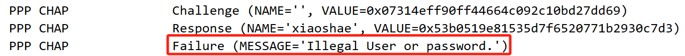

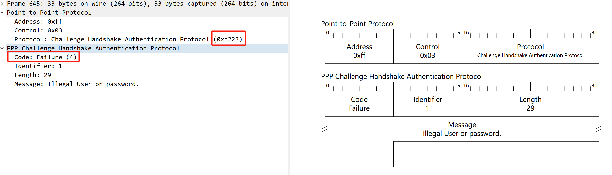

使用PAP方式，由被认证方发起的身份验证，且认证方式是明文的，只有两次交互。

使用CHAP认证方式时，由认证方发起身份证验证，被认证方的密码是被加密后才进行传输的，有三次数据交互。

不论是PAP还是CHAP验证失败，都会多次进行验证，但是验证失败的次数达到了预设的值， 则会发送Termination Request帧来中断连接，重新建立连接。


## NCP地址协商 - 0x8021


PPP定义了**一组网络层控制协议NCP**，每一个NCP对应了一种网络层协议，用于协商网络层地址等参数，例如**IPCP用于协商控制IP协议，IPXCP用于协商控制IPX协议**等。


IP地址协商包括两种方式：**静态配置协商**和**动态配置协商**。


### IPCP静态地址协商


1. 每一端都要发送**Configure-Request报文**，在此报文中包含本地配置的IP地址；


2. 每一端接收到此Configure-Request报文之后，检查其中的IP地址，如果IP地址是一个合法的单播IP地址，而且和本地配置的IP地址不同（没有IP冲突），则认为对端可以使用该地址，回应一个**Configure-Ack报文**。


上面是A->B的NCP协商，同时B->A也有NCP协商


### IPCP动态地址协商

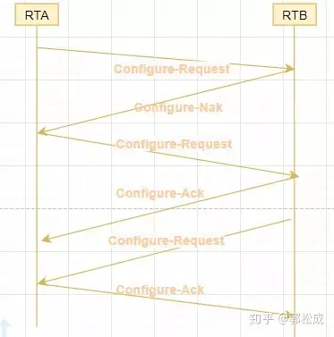

#### 单向动态地址协商

在ppp链路中，A端手动配置IP地址（并为B端指定一个IP地址），B端使用从A端获取到的IP地址。

```
#A config
[V200R003C00]
#
interface Serial4/0/0
 link-protocol ppp
 ppp authentication-mode pap 
 remote address 172.18.255.254 　　 #指定要为主机B分配的IP地址
 ip address 172.18.0.1 255.255.0.0 #指定主机A的IP地址
#

#B config
[V200R003C00]
#
interface Serial4/0/0
 link-protocol ppp
 remote address 172.18.0.1 
 ppp pap local-user xiaoshae password cipher %$%$+#acPOLs\5!c%^~5IJm6,.G5%$%$
 ip address ppp-negotiate #主机B的IP地址从主机A中获取
#
```


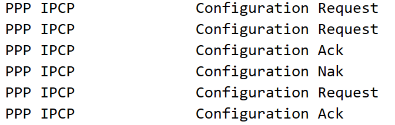


1、主机A发送Configuration Request，告诉主机B自己的IP地址。


2、主机B接收到主机A发送的Request帧，IP地址没有和本机IP地址冲突，主机B发送Configuration Ack表示没有冲突。


3、由于主机B设置的是从主机A中获取IP地址，所以主机B发送的Configuration Request中将IP地址设置为0.0.0.0（不可用IP）


4、主机A收到主机B发送的Request，其中IP地址为不可用IP，所以主机A发送Configuration Nak，告知主机B将IP修改为Nak帧中的IP地址。

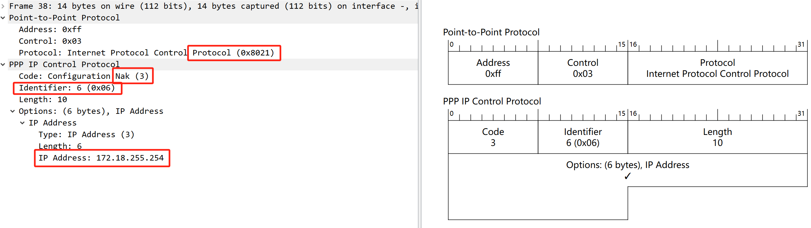

5、主机B修改IP地址后，重新发送Configuration Request，将Request帧中的IP设置为修改后的IP地址。

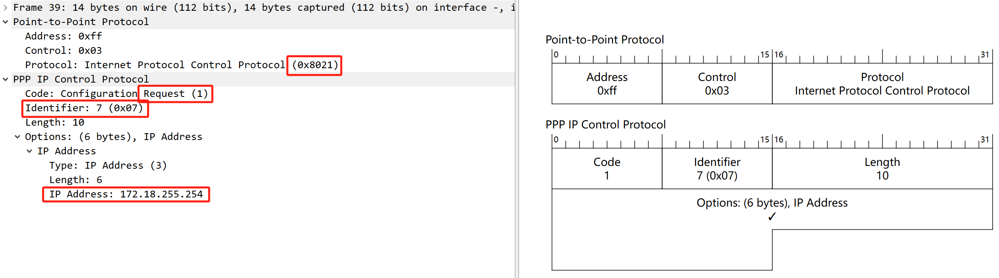

6、主机A收到主机B重新发送的Request帧后，检查其Request帧的IP地址不与本机IP冲突后，发送Ack帧告知主机B没有冲突。

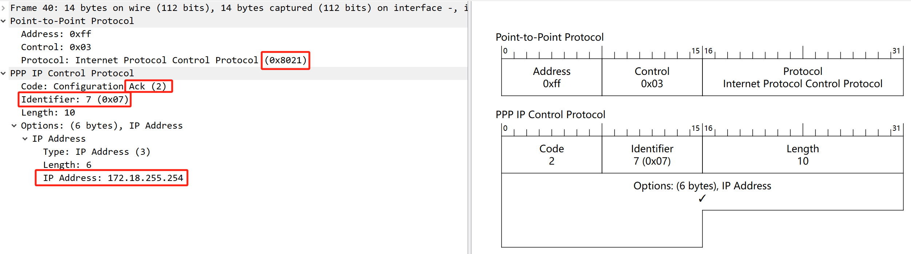


#### 双向动态地址协商

在ppp链路中，主机A从主机B处获取IP地址，主机B从主机A获取IP地址，即是双向动态地址协商。

```
# A config
[V200R003C00]
#
interface Serial4/0/0
 link-protocol ppp
 ppp authentication-mode pap 
 remote address 172.18.255.254 
 ip address ppp-negotiate
#

# B config
[V200R003C00]
#
interface Serial4/0/0
 link-protocol ppp
 remote address 172.18.0.1 
 ppp pap local-user xiaoshae password cipher %$%$+#acPOLs\5!c%^~5IJm6,.G5%$%$
 ip address ppp-negotiate
#
```

双向动态地址协商即是，主机A 和 主机B 分别进行一次单向动态地址协商中的3、4、5、6步骤。


在华为 ensp 路由器中remove address 可以指定一个pool地址池（动态使用dhcp分配IP地址）


## 数据交互

PPP建立成功，此时会互发Echo Request 和 Echo Reply 确认对方存活。也可以进行数据通讯。

通过数据包可以发现，如果数据链路层使用PPP协议，则是没有MAC地址这个概念的，MAC地址是以太网协议中的内容。


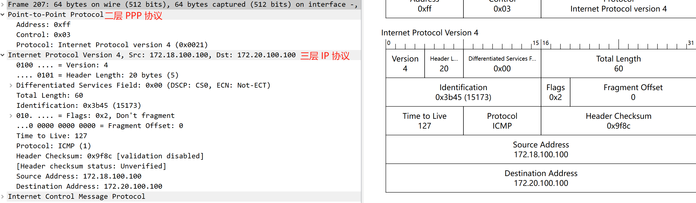


ppp链路中是没有mac地址这么一个概念的，不同网段间的IP地址可以直接数据交互。

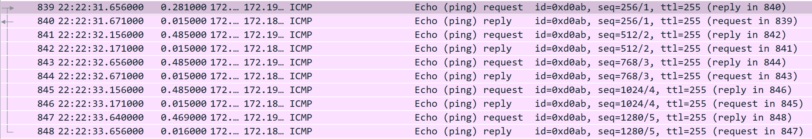

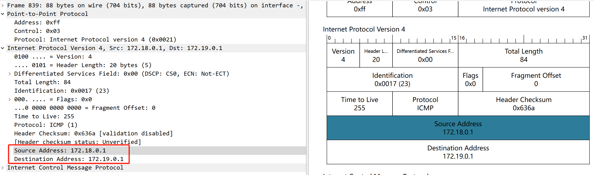


