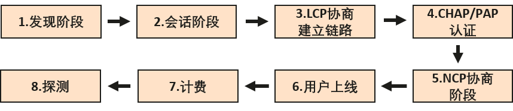
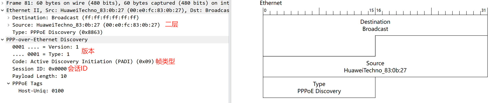
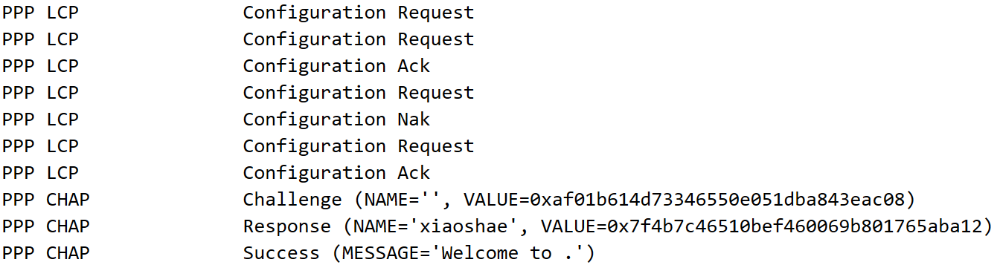
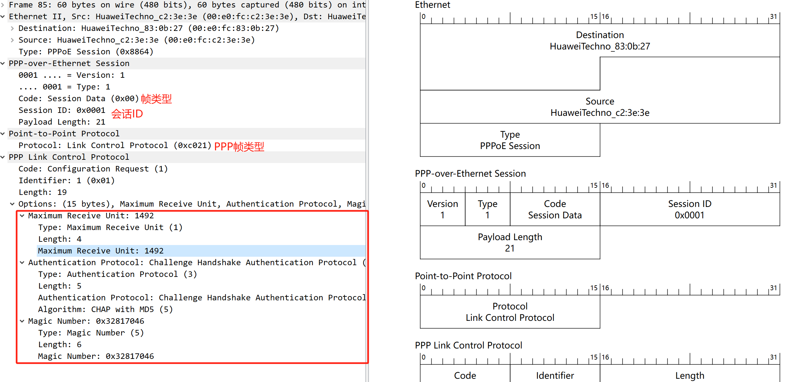

# PPPOE

PPPOE是在以太网中使用PPP协议，与PPP不同的是，PPPOE采用的是C/S的架构。

| 字段         | 值                                                           |
| ------------ | ------------------------------------------------------------ |
| Ver域        | 4bits，PPPoE版本号，值为0x1。                                |
| Type域       | 4bits，PPPoE类型，值为0x1。                                  |
| Code域       | 8bits，PPPoE报文类型。Code域为0x00，表示会话数据。Code域为0x09，表示PADI报文；Code域为0x07，表示PADO或PADT报文；Code域为0x19，表示PADR报文；Code域为0x65，表示PADS报文。 |
| Session_ID域 | 16bits，对于一个给定的PPP会话，该值是一个固定值，并且与以太网Source_address和Destination_address一起实际地定义了一个PPP会话。值0xffff为将来的使用保留，不允许使用。 |
| Length域     | 16bits，定义PPPoE的Payload域长度。不包括以太网头部和PPPoE头部的长度。 |

PPPoE用户上线需要经过两个阶段，发现阶段和PPP会话阶段。发现阶段主要是选择PPPoE服务器，并确定索要建立的会话标识符Session ID。PPP会话阶段即执行标准的PPP过程，包括LCP协商、PAP/CHAP认证、NCP协商等阶段。

**发现阶段**

发现阶段是指设备为用户分配接入的Session ID，用来标识一条用户与设备之间的PPPoE虚拟链路。

1、PPPoE Client广播一个PADI（PPPoE Active Discovery Initiation，PPPoE激活发现起始）报文，在此报文中包含用户想要得到的服务类型信息。

2、以太网内的所有PPPoE Server在收到这个初始化报文后，将其中请求的服务与自己能提供的服务进行比较，其中可以为PPPoE Client提供此服务的PPPoE Server会回应PADO（PPPoE Active Discovery Offer，PPPoE激活发现服务）报文。

3、PPPoE Client可能会收到多个PPPoE Server回应的PADO报文。PPPoE Client会根据一定的条件从返回PADO报文的PPPoE Server中选定符合条件的PPPoE Server，并向它返回一个会话请求报文PADR（非广播）（PPPoE Active Discovery Request，PPPoE激活发现请求），在PADR报文中封装所需的服务信息。

4、被选定的PPPoE Server在收到PADR报文后，PPPoE Server会产生一个唯一的会话标识以标识它和PPPoE Client的这段PPPoE会话。并把这个特定的会话标识包含在会话确认报文PADS（PPPoE Active Discovery Session-confirmation，PPPoE激活发现会话确认）中回应给PPPoE Client，如果没有错误发生就进入到PPP会话阶段，而PPPoE Client在收到会话确认报文后如果没有错误发生也进入到PPP会话阶段。

5、PPP会话阶段，此时就会按照PPP的方式来建立连接

