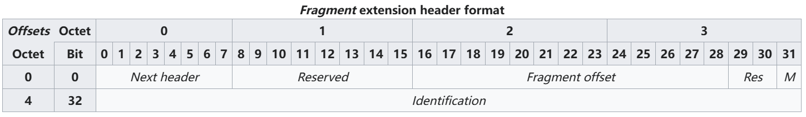

# IPv6

## 基础格式

IPv6二进位制下为128位长度，以16位为一组，每组以冒号“:”隔开，可以分为8组，每组以4位十六进制方式表示。

例如：2001:0db8:86a3:08d3:1319:8a2e:0370:7344 是一个合法的IPv6地址。类似于IPv4的点分十进制。

同样也存在点分十六进制的写法，将8组16位十六进制地址的冒号去除后，每位以点号“.”分组，例如：

2001:0db8:85a3:08d3:1319:8a2e:0370:7344则记为2.0.0.1.0.d.b.8.8.5.a.3.0.8.d.3.1.3.1.9.8.a.2.e.0.3.7.0.7.3.4.4，其倒序写法用于ip6.arpa子域名记录IPv6地址与域名的映射。


同时IPv6在某些条件下可以省略：

每项数字前导的0可以省略，省略后前导数字仍是0则继续，例如下组IPv6是等价的。

2001:**0**db8:**0**2de:**0000**:**0000**:**0000**:**0000**:**0**e13

2001:db8:2de:**0000**:**0000**:**0000**:**0000**:e13

2001:db8:2de:**000**:**000**:**000**:**000**:e13

2001:db8:2de:**00**:**00**:**00**:**00**:e13

2001:db8:2de:**0**:**0**:**0**:**0**:e13


可以用双冒号“::”表示一组0或多组连续的0，但只能出现一次：

如果四组数字都是零，可以被省略。遵照以上省略规则，下面这两组IPv6都是相等的。

```
2001:db8:2de:0:0:0:0:e13
2001:db8:2de::e13
```

```
2001:0db8:0000:0000:0000:0000:1428:57ab
2001:0db8:0000:0000:0000::1428:57ab
2001:0db8:0:0:0:0:1428:57ab
2001:0db8:0::0:1428:57ab
2001:0db8::1428:57ab
```


## IPv4地址映射

另外，::ffff:1.2.3.4 格式叫做**IPv4映射地址**。

IPv4位址可以很容易的转化为IPv6格式。

举例来说，如果IPv4的一个地址为`135.75.43.52`（十六进制为0x874B2B34），它可以被转化为`0000:0000:0000:0000:0000:FFFF:874B:2B34` 或者`::FFFF:874B:2B34`。

同时，还可以使用混合符号（IPv4-compatible address），则地址可以为::ffff:135.75.43.52。


## 未指定地址

`::/128`－所有比特皆为零的地址称作未指定地址。这个地址不可指定给某个网络接口，并且只有在主机尚未知道其来源IP时，才会用于软件中。路由器不可转送包含未指定地址的数据包。

## 链路本地地址

`::1/128`－是一种单播绕回地址。如果一个应用程序将数据包送到此地址，IPv6堆栈会转送这些数据包绕回到同样的虚拟接口（相当于IPv4中的127.0.0.1/8）。

fe80::/10－这些链路本地地址指明，这些地址只在区域连线中是合法的，这有点类似于IPv4中的169.254.0.0/16。

## 唯一区域地址（私有地址）

fc00::/7－唯一区域地址（ULA，unique local address）只可用于本地通信，类似于IPv4的专用网络地址10.0.0.0/8、172.16.0.0/12和192.168.0.0/16。这定义在RFC 4193中，是用来取代站点本地位域。这地址包含一个40比特的伪随机数，以减少当网站合并或数据包误传到网络时碰撞的风险。


# IPv6报文


**Version版本（4位）**：表示Internet协议的版本，包含位序列0110。

**Traffic Class流量类别（8位）**：流量类别字段表示IPv6数据包的类别或优先级，类似于IPv4数据包中的服务字段。

它帮助路由器根据数据包的优先级处理流量。如果路由器上发生拥塞，那么优先级最低的数据包将被丢弃。

目前，只有4位正在使用（其余的位正在研究中），其中0到7被分配给拥塞控制流量，8到15被分配给非控制流量。

非控制数据流量主要用于音频/视频数据。所以我们给非控制数据流量更高的优先级。

源节点被允许设置优先级，但在路由的过程中，路由器可以改变它。

**Flow Lable流标签（20位）**：流标签字段被源节点用来标记属于同一流的数据包，以便请求由中间的IPv6路由器进行特殊处理，如非默认的服务质量或实时服务。为了区分流，中间路由器可以使用数据包的源地址、目的地址和流标签。在源和目的地之间，可能存在多个流，因为可能有许多进程在同时运行。不支持流标签字段功能的路由器或主机以及默认的路由器处理，流标签字段被设置为0。在设置流标签时，源节点也应该指定流的生命周期。  --- **暂不理解**

**Payload Length有效载荷长度（16位）**：“有效载荷长度”（Payload Length）是一个16位的字段，用于表示除去IPv6报头（固定为40字节）之外的部分的长度。

它包括了扩展头（如果有的话）和上层协议数据单元。由于"有效载荷长度"字段是16位的，所以它的最大值为2^16 - 1，即65,535字节123。这意味着，IPv6数据报的有效载荷的最大长度可以达到65,535字节。

如果有效载荷的长度超过了65,535字，那么"有效载荷长度"字段会被设置为0，然后添加一个**扩展头部**（超大有效载荷头部，**这个扩展头部还要去了解**），而有效载荷的长度在超大有效载荷头部中表示。

"超大有效载荷"选项是一种特殊的IPv6扩展头，它可以用来表示长度超过65,535字节的有效载荷。

**Next Header下一个头部（8位）**：如果存在扩展头部，那么“下一个头部”字段就会表示后面第一个扩展头部的类型。如果没有扩展头部，那么“下一个头部”字段就会表示上层协议的类型，比如TCP或UDP。

**Hop Limit跳限制（8位）** ：跳限制字段与IPv4数据包中的TTL相同。它表示IPv6数据包被允许旅行的中间节点的最大数量。每个转发数据包的节点都会使其值减少一，如果值减少到0，数据包将被丢弃。

**Source Address 源地址（128位）**：源地址是数据包原始源的128位IPv6地址。

**Destination Address目的地址（128位）**：目的地址字段表示最终目的地的IPv6地址（在大多数情况下，**暂不理解**）。所有的中间节点都可以使用这个信息来正确地路由数据包。

**Extension Headers扩展头部(......)**：为了纠正IPv4选项字段的限制，扩展头部在IP版本6中被引入。扩展头部机制是IPv6架构的一个非常重要的部分。IPv6固定头部的**下一个头部字段**（**Next Header**）指向第一个扩展头部，这个第一个扩展头部指向第二个扩展头部，依此类推。


# IPv6分片

**Fragment extension header format**(分片扩展头部格式)



**Next Header下一个头部（8位）**：如果在此扩展头部后，还存在扩展头部，那么“下一个头部”字段就会表示后面第一个扩展头部的类型。如果没有扩展头部，那么“下一个头部”字段就会表示上层协议的类型，比如TCP或UDP。

**Reserved(保留字段)**：，传输时初始化为零; 接收时忽略。

**Fragment Offset(片段偏移)** ： 表示分片数据包在原始数据包中字节数位置。以8字节的数量指定，最大值为65,528字节。字段的值是以8字节为单位来计量的。

**Res(保留位)**：，传输时初始化为零; 接收时忽略。

**M flag(更多分片标志)**：是否还有更多的片段需要发送。当一个IP数据报被分片时，除了最后一个片段外，其余的片段都会设置这个"更多片段标志"。

**Identification(标识)**：用于识别单个IP数据报片段组的唯一数据包ID（32位）。


IPv6分片与IPv4分片基本一致，但是有几点区别：

1、IPv6不支持在路由过程中进行二次分片，如果中间路由器的MTU小于数据包有效载荷，则发送给源端发送ICMPv6的Packet Too Big消息来告知其MTU。

2、IPv6的头部是固定的，不包含分段所需要的字段（如：Fragment Offset、M Flag、Identification），如果需要IP分片，在需要分片扩展头部格式。

3、IPv6的分片包括和**不可分片部分**和**可分片部分**。除了IPv6固定头部外，还有扩展头部和有效载荷部分。需要**被中间路由器处理的**扩展头部是**不可分片**的（如：分片扩展头部格式、路由扩展头部）**，只需要被目的路由器处理**的扩展头部是**可分片的**（如：认证扩展报头、封装安全净载报头）。有效载荷的所有内容都是可分片的。

