# TCP

## 报文格式

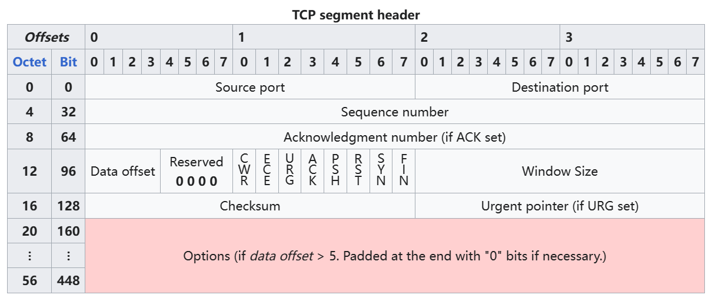

**Source Port(源端口)**：标识发送端口。

**Destination Port(目的端口)**：标识接收端口。

**Sequence number(序列号）**：

- SYN flags == 1：初始序列号（一个随机数）。

- SYN flags == 0：序列号标识本次TCP连接中传递了多少字节（SYN）的数据（Data字段）。

    个人理解：用于表示发送了多少字节的数据。

**Acknowledgment number(确认号)**：用于表示确认收到了多少字节的数据。

**Data offset(数据偏移)**：标识TCP头部的大小，以4字节为单位。Data offset的值最小是5，最大是15，TCP头部最小为20字节，最大为60字节。0+TCP头部大小(Data offset × 8)字节为数据(Data)部分第一个字节。

**Reserved(保留位)**：暂不使用

**Flags(标志)**：

包含8个1位标志（控制位）

- CWR

    拥塞窗口减小（CWR）标志由发送主机设置，以指示它收到了一个设置了ECE标志的TCP段，并且已经在拥塞控制机制中做出了响应。

- ECE

    ECN-Echo具有双重角色，取决于SYN标志的值。

    - SYN标志被设置（1），TCP对等方是ECN能力。

    - SYN标志未设置（0），在正常传输过程中收到了一个在其IP头部设置了拥塞标志（ECN=11）的数据包。TCP发送者来说是已经发送网络拥塞（或即将发生的拥塞）的指示。

- URG

    表示紧急指针字段是需要处理的。

- ACK

    表示确认字段是需要处理的。客户端发送的初始SYN数据包后，所有的TCP数据包flags中的ACK字段都要被设置为1。

- PSH

    推送功能。要求将缓冲数据推送到接收应用程序。在TCP中，发送数据中如果只将flags中的ACK置1(PSH为0)，对方接收到数据后，会放在缓冲区中，并不会直接将数据推送给应用程序，直到收到的数据包中PSH被置1，就会把缓冲区中的所有数据推送给应用程序。

- RST

    表示要重置连接。

- SYN

    同步序列号。每一端发送的第一个数据包都应该设置此标志。

- FIN

    表示这是当前发送方，发送的最后一个数据包。等对方发送了最后一个数据包后，就可以开始关闭连接了。

**Window size(窗口大小)**：接收窗口的大小，表示当前最多可以接收多少字节的数据。

**CheckSum(校验和)**：用于对TCP头部、有效载荷和IP伪头部进行错误检查。

**Urgent(紧急指针)**：如果URG标志被设置，那么这个16位字段就是一个偏移，从序列号指示最后一个紧急数据字节。

## 三次握手

### 传统说法

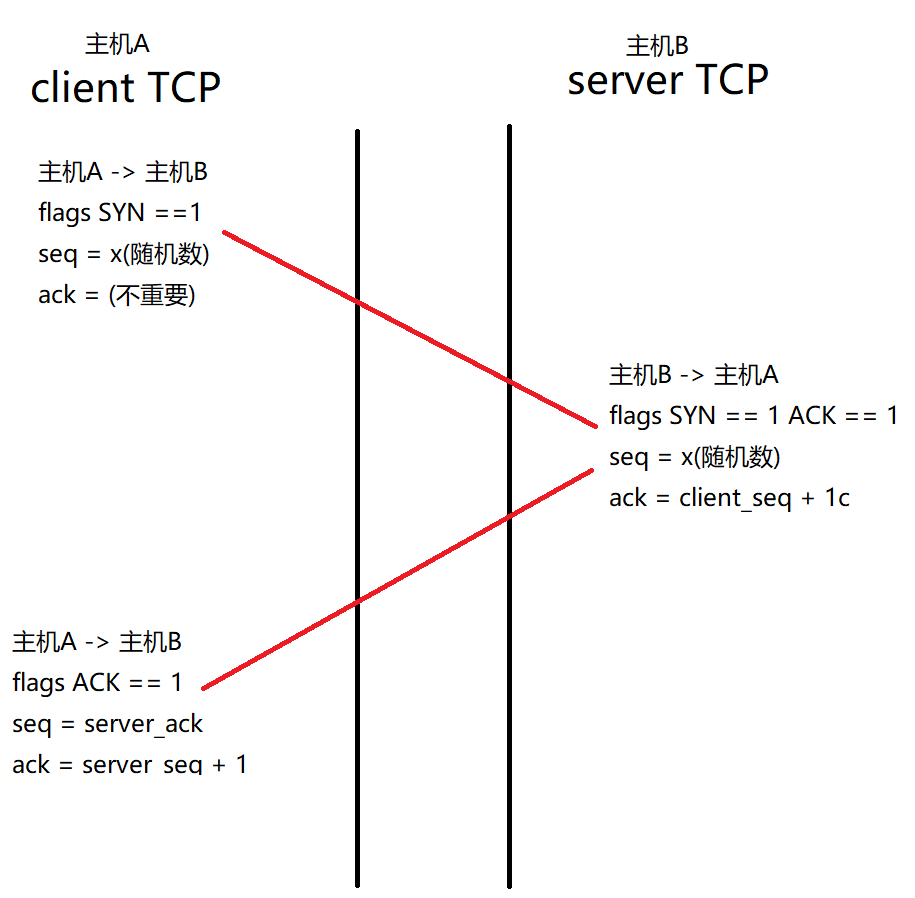

1、client 发送 TCP SYN 给 server

TCP flags： SYN 字段为1

SeqNum = x(一个随机数)

AckNum = (任意值,不会检查)

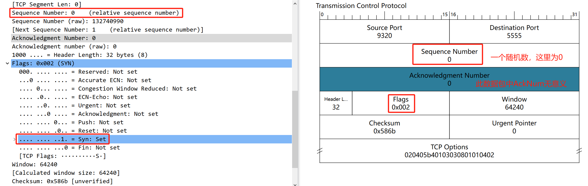

2、server 发送 TCP(SYN＆ACK)给client

TCP flags：SYN字段为1、ACK字段为1

SeqNum = x(一个随机数)

AckNum = client_SeqNum + 1 (client SYN中的SeqNum字段的值加1)

3、client 发送TCP(ACK)给server

TCP flags：ACK字段为1

SeqNum = server_AckNum

AckNum = server_SeqNum + 1 (server (SYN&ACK)中的SeqNum字段的值加1)

总结：三次握手数据包中的flags分别为SYN、SYN&ACK、ACK

第一次和第二次数据包，SeqNum都是x(随机数)，第三次数据包的SeqNum = server_AckNum。

第二次和第三次数据包，AckNum都是接收到的数据包中的SeqNum + 1，第一次数据包中AckNum无意义。

### 个人理解

在TCP格式字段中，SeqNum表示发送数据的字节数，AckNum表示接收数据的字节数，即我总共发送了N个字节，或我总共接收了N个字节。

**主动发起**的数据包（SYN PSH FIN等），是**需要计算**在双发发送或接收的**字节数**中

在接收到数据包后，**被动回复**的确认数据包，是**不需要计算**在双方发送或接收的**字节数**中的。

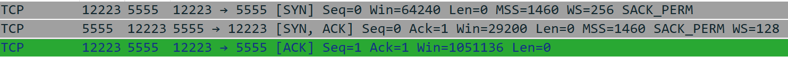

假设存在主机A和主机B两台计算机。

1、主机A向主机B发送SYN数据包，表示TCP建立请求，但由于双方此前没有进行过任何数据传输。

Flags(SYN)

SeqNum(发送字节)=0

AckNum(接收字节)=0

2、主机B收到主机A发送的SYN数据包，为告诉主机A同意建立连接，并向主机A发送TCP建立请求。主机B此前没有向主机B发送过数据（主机B发送字节为0），主机B此前收到主机A的SYN建立请求（主机B接收字节为1）。

Flags(SYN&ACK)

SeqNum(发送字节)=0

AckNum(接收字节)=1

3、**主机A收到主机B**发送的(SYN&ACK)**数据包**，已知晓主机B同意主机A的TCP建立请求，为了告知主机B（主机A也同意主机B的TCP建立请求）向主机B发送(ACK)数据包。主机A此前**发送过**一个SYN数据包（主机A**发送字节数为1**），主机A此前**接收到**主机B发送的(SYN&ACK)数据包（主机A**接收字节数为1**）。

Flags(ACK)

SeqNum(发送字节)=1

AckNum(接收字节)=1

## 数据传输

在TCP三次握手完成后，成功建立TCP连接， 开始交互数据。

假设在数据交互时SeqNum和AckNum字段为1。

在**数据传输**时，SeqNum表示我已经成功**发送了多少字节**的数据，**AckNum**表示我成功**接收了多少字节**的数据。

1、TCP三次握手完成，TCP建立成功。初始值双方的SeqNum和AckNum都为1。

主机A：Server Port 5555

主机B：Client  Port12223

2、主机A -> 主机B 发送数据。

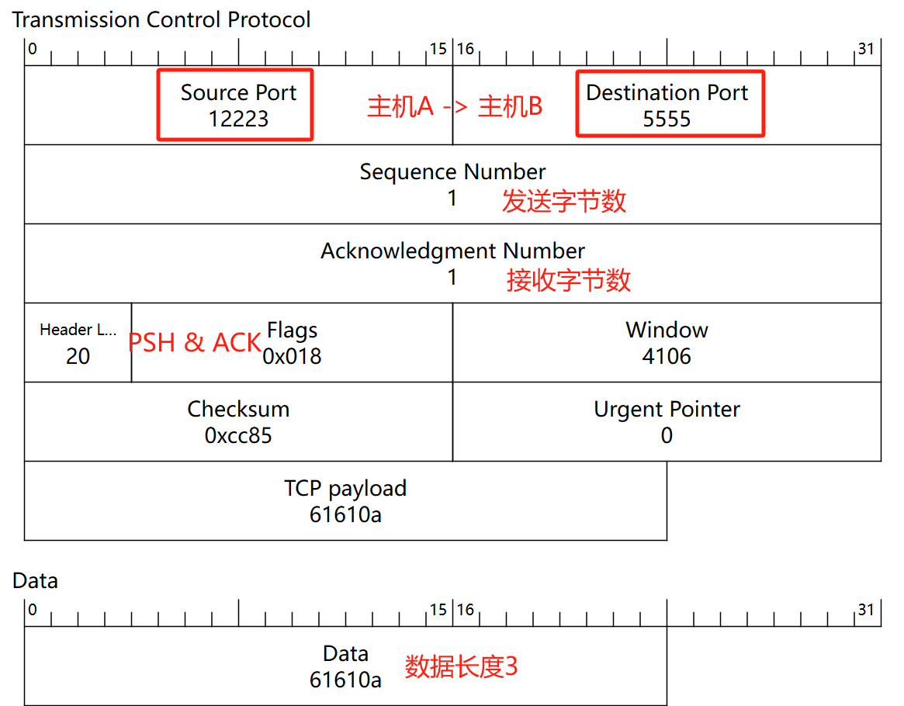

3、主机B -> 主机A 确认接收到数据。

4、主机A -> 主机B 发送数据。

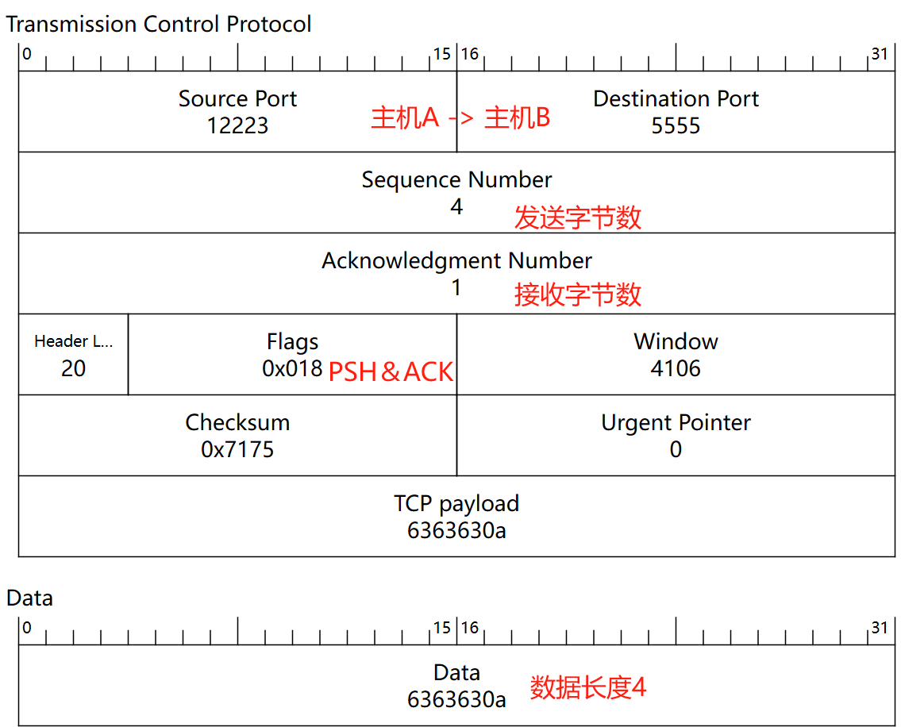

5、主机B -> 主机A 确认接收到数据。

6、主机B -> 主机A 发送数据。

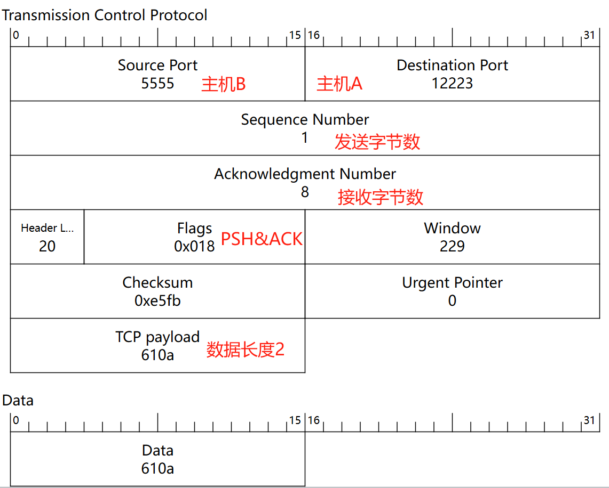

7、主机A -> 主机B 确认接收数据。

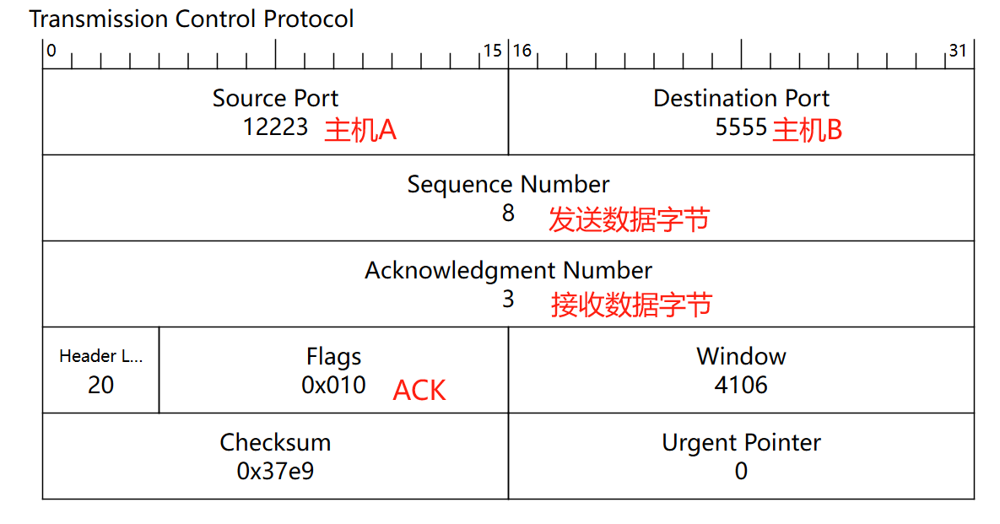

8、主机A -> 主机B 发送数据。

9、主机B -> 主机A 确认接收数据。

## 四次挥手

在TCP断开连接的过程中，双方都可以主动断开连接。

假设存在主机A和主机B在进行TCP通讯。

主机A发送请求断开连接，主机B收到后，向主机A发送断开确认，主机A就不能在向主机B发送数据了。

主机B还可以向主机A发送数据，（主机B发送完剩余数据后）直到主机B向主机A发送请求断开连接，主机A回复断开确认后，TCP连接正式关闭。

1、**主机B发送断开请求**（flags **FIN&ACK**），SeqNum为（主机B）**发送数据**字节（3），AckNum为（主机B）**接收数据**字节（10）。

主机A，最后的发送数据数为10，接收数据数为4。

2、**主机A发送确认断开请求**（flags **ACK**），SeqNum为（主机A）**发送数据**字节（10），AckNum为（主机A）**接收数据**字节（4）。

注意：

主机B发送过来的**FIN断开连接请求数据包**算**一个字节**，所以主机A的接收字节数为4。

不论是**回复**的**确认接收数据**，还是**确认断开请求**，对双方都**不属于发送**或**接收**数据字节。

或者说(SYN | PSH | FIN)等**主动发送**的TCP数据包，**需要计算发送或接收字节数**，接收到TCP数据包后**被动回复**的确认数据包**不计算发送或接收的字节数**

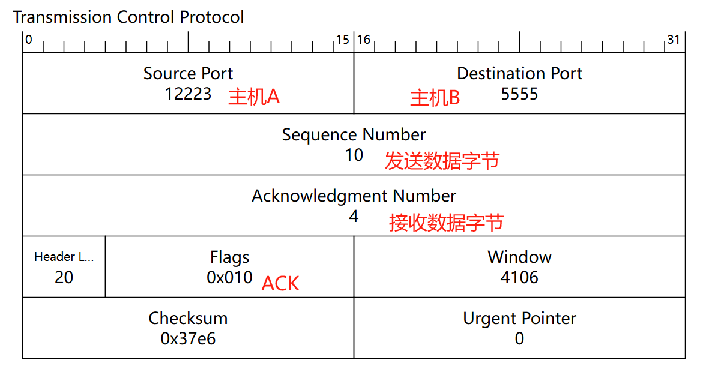

3、**主机A发送断开请求**（flags **FIN&ACK**），SeqNum为（主机A）**发送数据**字节（10），AckNum为（主机A）**接收数据**字节（4）。

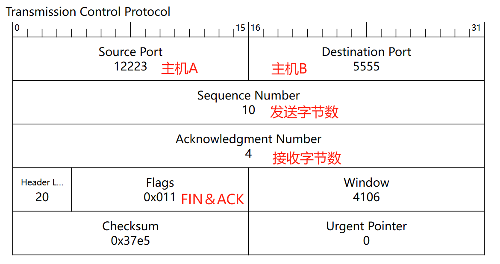

4、**主机B发送确认断开请求**（flags **ACK**），SeqNum为（主机B）**发送数据**字节（4），AckNum为（主机Ｂ）**接收数据**字节（11）。

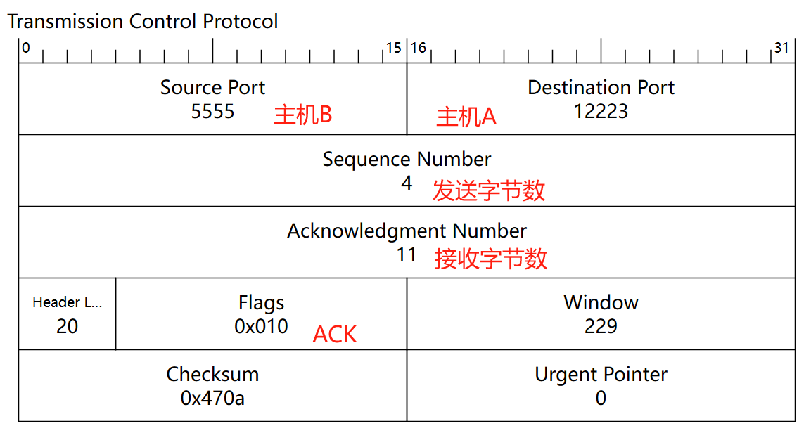

扩展：

​	前面提到了主机B发送断开请求，主机A回复确认断开请求后，主机A还可以继续发送数据。如果此时，主机A在主机B断开后，继续发送了两个数据包，一个数据包中含4个字节，一个数据包中7个字节。

​	那么在最后的主机A断开请求时发送的TCP数据包的SeqNum和AckNum应该为：

​	主机A请求断开：		SeqNum(发送) = 21  	AckNum(接收) = 4

​	主机B回复断开确认：	SeqNum(发送) = 4    	AckNum(接收) = 22

个人理解：

​	TCP连接的关闭可以是单向的，即主机A可以不完全关闭与主机B的连接，主机A单向不完全关闭后，无法再次单向重新建立起连接，如果想重新建立起连接，必须等待主机B也进行单向（不完全）关闭连接。双方都（不完全）关闭连接后连接正式关闭，双方可以重新三次握手建立TCP连接。

​	主机A单向不完全关闭后，无法主动向主机B发送数据，主机B可以继续向主机A发送数据，主机A收到主机B的数据后，可以（也必须）被动回复确认收到的数据包。

总结：

​	我方关闭连接后，另一方可以继续发送数据，我方收到数据后可以（也必须）被动回复确认收到，另一方也关闭连接后，TCP连接正式关闭。

## IP分片和TCP分段

TCP报文段如果很长的话，会在发送时发生**分段(Segmentation)**，在接收时进行重组，同样IP数据报在长度超过一定值时也会发生**分片(Fragmentation)**。

- **分段**特指发生在使用**TCP协议**的**传输层**中的数据切分行为
- **分片**特指发生在使用**IPv4协议**的**网络IP层**中的数据切分行为
- 

### 最大传输单元(MTU)

数据链路层的最大载荷上限，每段链路的MTU可能都不相同，一条端到端路径的MTU由这条路径上MTU最小的那段链路的MTU决定。

在太网为中，MTU通常为1500字节。所谓的MTU，是二层协议的一个限制，对不同的二层协议可能有不同的值，只有二层协议为以太网(**Ethernet**)时，MTU一般才取1500字节，注意它不是物理链路介质的限制。、

一个IP数据报在以太网中传输，那么IP数据包的最大长度不能大于当前链路的MTU值，如果它的长度大于当前链路MTU值，就要进行**分片传输(这里指IP层分片)**，使得每片数据报的长度都不超过MTU。

分片传输的IP数据报不一定按序到达，但IP首部中的信息能让这些数据报片按序组装。IP数据报的分片与重组是在网络IP层完成的。

### 最大报文段长度(MSS)

TCP传输层的最大载荷上限(即应用层数据最大长度)。以太网中(网络层以IPv4为例)：

`MSS = 以太网MTU - TCP首部长度 - IPv4首部长度 = 1500 - 20 - 20 = 1460字节`

应用程序如果要发送超过MSS大小的数据，就要进行**分段传输(这里指TCP分段)**，使得每个报文段长度都不超过MSS。

分片传输的TCP报文段不一定按序到达，但实现可靠传输的TCP协议中有处理乱序的机制，即利用报文段序列号在接收缓冲区进行数据重排以实现重组。TCP分段的重组是在TCP传输层完成的。

### TCP分段的意义

首先，来看IP分片。IP分片主要是为了适应不同的物理网络环境。因为不同的物理网络，比如以太网、Wi-Fi等，它们能够承载的最大数据包大小（MTU，最大传输单元）是不同的。当一个IP数据包的大小超过了路径上MTU的大小时，就需要进行分片处理，以确保数据包能够在网络中正常传输。

TCP分段主要是为了提高数据传输的效率和可靠性。

假设有一份很大的数据，超过了MSS（最后加上IP头部也超过MTU）如果没有进行TCP分段，那就必须进行IP分片，IP层本身没有超时重传的机制，IP数据报的某个分片丢失，那么需要重传整个IP数据报，如果在传输的过程中丢失了任意一个IP分片，那么就需要重新传输整个TCP数据段。

没有进行TCP分段，只进行了IP分片

进行了TCP分段，无需进行IP分片。

按照上面的MSS计算公式，如果TCP进行了分段，每一个TCP分段都小于MSS，那么也肯定小于MTU。每个TCP分段都可以被IP数据包容纳，不需要在进行IP分片（对于IP层来说，每一个TCP分段都是一个独立的数据包，互相没有任何联系）。由于TCP有重新传输的机制，即使丢失了一个TCP分段，那么只需要重新传输这一个TCP分段就可以了，而不需要重新传输整个TCP数据段。

发送端进行TCP分段后就一定不会在IP层进行分片，因为MSS本身就是基于MTU推导而来，TCP层分段满足了MSS限制，也就满足了MTU的物理限制。但在TCP分段发生后仍然可能发生IP分片，这是因为TCP分段仅满足了通信两端的MTU要求，传输路径上如经过MTU值比该MTU值更小的链路，那么在转发分片到该条链路的设备中仍会以更小的MTU值作为依据再次分片。

### Flags(PSH) TCP分片的实现

还记得**Flags**中的**PSH**位的作用吗？在TCP中，发送数据中如果只将flags中的ACK置1(PSH为0)，对方接收到数据后，会放在缓冲区中，并不会直接将数据推送给应用程序，直到收到的数据包中PSH被置1，就会把缓冲区中的所有数据推送给应用程序。

假设主机A要给主机B发送数据，数据大小为4095，MSS为1460，需要进行TCP分段发送。

主机A与主机BTCP三次握手，建立TCP连接，初始SeqNum=1，AckNum=1

1、主机A -> 主机B，flags(ACK)，数据大小1460，SeqNum=1，AckNum=1

此时虽然主机B收到了主机A发送过来的数据，但是由于Flags字段中，PSH位未被置1，所以TCP将收到的数据存在缓冲区中，而不是直接推送给应用程序。

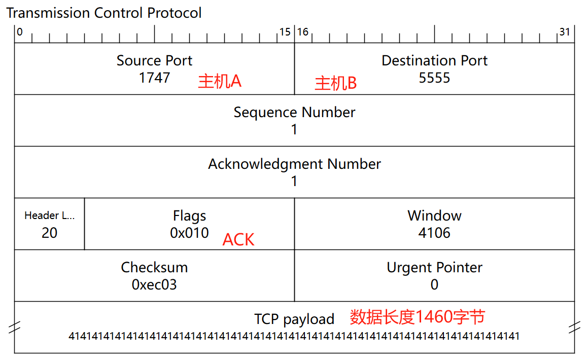

2、主机A -> 主机B，flags(ACK)，数据大小1460，SeqNum=1461，AckNum=1

Flags字段中，PSH位未被置1，TCP将收到的数据存储在缓冲区中。

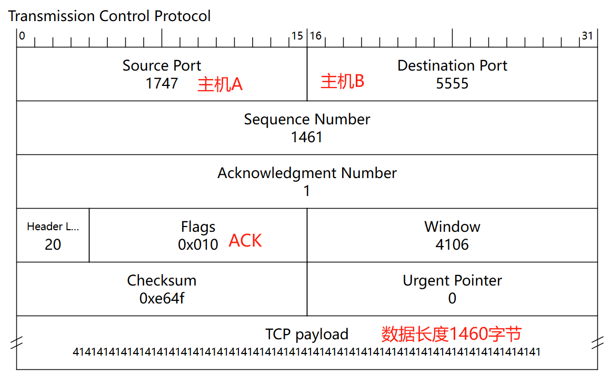

3、主机A -> 主机B，flags(PSH&ACK)，数据大小1175，SeqNum=2921，AckNum=1

Flags字段中，PSH位被置1，TCP将收到的数据和此前暂存在缓冲区的数据，一次性推送给应用程序。

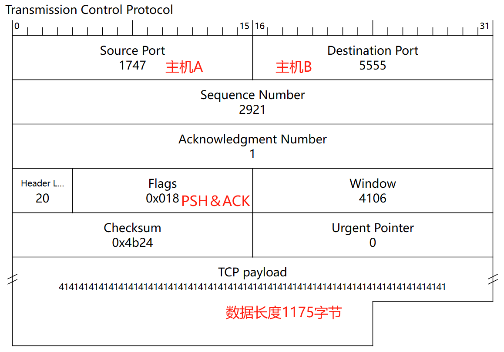

4、主机B -> 主机A，发送ACK确认，确认收到所有数据。

