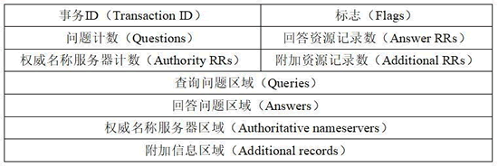
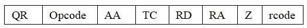
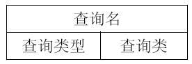

# DNS

## 基础格式

**事务 ID**：DNS 报文的 ID 标识。对于请求报文和其对应的应答报文，该字段的值是相同的。通过它可以区分 DNS 应答报文是对哪个请求进行响应的。

**标志**：DNS 报文中的标志字段。

**问题计数**：DNS 查询请求的数目。

**回答资源记录数**：DNS 响应的数目。

**权威名称服务器计数**：权威名称服务器的数目。

**附加资源记录数**：额外的记录数目（权威名称服务器对应 IP 地址的数目）。

## Flags

**QR（Response）**：查询请求/响应的标志信息。查询值为 0；响应值为 1。

**Opcode**：操作码。其中，0 表示标准查询；1 表示反向查询；2 表示服务器状态请求。

**AA（Authoritative）**：授权应答，该字段在响应报文中有效。服务器，是权威服务器值为 1，不是权威服务器值为0。

**TC（Truncated）**：表示是否被截断。值为 1 时，表示响应已超过 512 字节并已被截断，只返回前 512 个字节。

**RD（Recursion Desired）**：期望递归。该字段能在一个查询中设置，并在响应中返回。

该标志告诉名称服务器必须处理这个查询，这种方式被称为一个递归查询。

如果该位为 0，且被请求的名称服务器没有一个授权回答，它将返回一个能解答该查询的其他名称服务器列表。这种方式被称为迭代查询。

**RA（Recursion Available）**：可用递归。该字段只出现在响应报文中。当值为 1 时，表示服务器支持递归查询。

**Z**：保留字段，在所有的（请求和应答）报文中，它的值必须为 0。

**rcode（Reply code）**：返回码字段，表示响应的差错状态。

当值为 0 时，表示没有错误；

当值为 1 时，表示报文格式错误（Format error），服务器不能理解请求的报文；

当值为 2 时，表示域名服务器失败（Server failure），因为服务器的原因导致没办法处理这个请求；

当值为 3 时，表示名字错误（Name Error），只有对授权域名解析服务器有意义，指出解析的域名不存在；

当值为 4 时，表示查询类型不支持（Not Implemented），即域名服务器不支持查询类型；

当值为 5 时，表示拒绝（Refused），一般是服务器由于设置的策略拒绝给出应答，如服务器不希望对某些请求者给出应答。

## 请求部分格式

### 查询问题区域

- 查询名：一般为要查询的域名，有时也会是 IP 地址，用于反向查询。
- 查询类型：DNS 查询请求的资源类型。通常查询类型为 A 类型，表示由域名获取对应的 IP 地址。
- 查询类：地址类型，通常为互联网地址，值为 1。

## 响应部分格式

响应格式有三个部分，这三个部分可以同时存在，有不同的作用，三个部分的格式是相同的。

**域名**：DNS 请求的域名。

**类型**：资源记录的类型，与问题部分中的查询类型值是一样的。

**类**：地址类型，与问题部分中的查询类值是一样的。

**生存时间**：以秒为单位，表示资源记录的生命周期，一般用于当地址解析程序取出资源记录后决定保存及使用缓存数据的时间。它同时也可以表明该资源记录的稳定程度，稳定的信息会被分配一个很大的值。

**资源数据长度**：资源数据的长度。

**资源数据**：表示按查询段要求返回的相关资源记录的数据。

### 回答问题区域

这个区域包含了请求域名的资源记录。一个域名可以指向多个值，所以一个回答报文的回答区域可以包含多条记录。

### 权威名称服务器区域

权威性DNS 服务器是**实际持有并负责DNS 资源记录的服务器**。 这是位于DNS 查找链底部的服务器。

### 附加信息区域

这个区域包含其他一些"有帮助"的记录。例如，对于一个MX (邮件交换)请求的回答报文中，回答区域包含一条记录 (该记录提供邮件服务器的规范主机名)，附加区域可以包含一条类型A记录 (该记录提供了该邮件服务器的规范主机名的IP地址)。这样就可以减少一些查询次数。