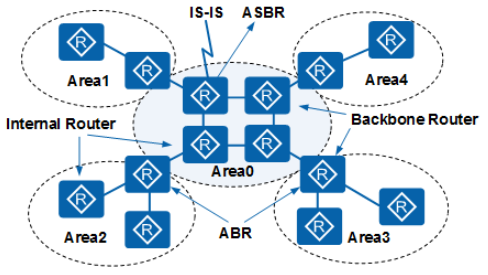

# OSPF

## 基础

#### Router ID

如果要运行OSPF协议，必须存在Router ID。Router ID是一个32比特无符号整数，是一台路由器在自治系统中的唯一标识。

Router ID的设定有两种方式：

- 通过命令行手动配置，在实际网络部署中，建议手工配置OSPF的Router ID，因为这关系到协议的稳定。

- 通过协议自动选取。

  如果没有手动配置Router ID，设备会从当前接口的IP地址中自动选取一个作为Router ID。其选取顺序是：

  1. 优先从Loopback地址中选择最大的IP地址作为Router ID。
  2. 如果没有配置Loopback接口，则在接口地址中选取最大的IP地址作为Router ID。

在路由器运行了OSPF并确定了Router ID后，如果该Router ID对应的接口Down或者接口消失（例如执行了**undo interface loopback** *loopback-number*）或者出现更大的IP地址，OSPF将仍然保持原Router ID。只有重新配置系统的Router ID或者OSPF的Router ID，并且重新启动OSPF进程后，才会进行Router ID的重新选取。

#### 链路状态

OSPF是一种链路状态协议。可以将链路视为路由器的接口。链路状态是对接口及接口与相邻路由器的关系的描述。例如接口的信息包括接口的IP地址、掩码、所连接的网络的类型、连接的邻居等。所有这些链路状态的集合形成链路状态数据库。

#### COST

- OSPF使用cost“开销”作为路由度量值。
- 每一个激活OSPF的接口都有一个cost值。OSPF接口cost=100M/接口带宽，其中100M为OSPF的参考带宽（reference-bandwidth）。
- 一条OSPF路由的cost由该路由从路由的起源一路到达本地的所有入接口cost值的总和。

## 报文

| 报文类型                                      | 报文作用                                                     |
| --------------------------------------------- | ------------------------------------------------------------ |
| Hello报文                                     | 周期性发送，用来发现和维持OSPF邻居关系。                     |
| DD报文（Database Description packet）         | 描述本地LSDB（Link State Database）的摘要信息，用于两台设备进行数据库同步。 |
| LSR报文（Link State Request packet）          | 用于向对方请求所需的LSA。设备只有在OSPF邻居双方成功交换DD报文后才会向对方发出LSR报文。 |
| LSU报文（Link State Update packet）           | 用于向对方发送其所需要的LSA。                                |
| LSAck报文（Link State Acknowledgment packet） | 用来对收到的LSA进行确认。                                    |

在OSPF协议中，LSU报文用于在网络中的路由器之间交换链路状态信息，LSU（Link State Update）报文中携带各种类型的LSA（Link State Advertisement）

| LSA类型                           | LSA作用                                                      |
| --------------------------------- | ------------------------------------------------------------ |
| Router-LSA（Type1）               | 每个设备都会产生，描述了设备的链路状态和开销，在所属的区域内传播。 |
| Network-LSA（Type2）              | 由DR（Designated Router）产生，描述本网段的链路状态，在所属的区域内传播。 |
| Network-summary-LSA（Type3）      | 由ABR产生，描述区域内某个网段的路由，并通告给发布或接收此LSA的非Totally STUB或NSSA区域。例如：ABR同时属于Area0和Area1，Area0内存在网段10.1.1.0，Area1内存在网段11.1.1.0，ABR为Area0生成到网段11.1.1.0的Type3 LSA；ABR为Area1生成到网段10.1.1.0的Type3 LSA，并通告给发布或接收此LSA的非Totally Stub或NSSA区域。 |
| ASBR-summary-LSA（Type4）         | 由ABR产生，描述到ASBR的路由，通告给除ASBR所在区域的其他相关区域。 |
| AS-external-LSA（Type5）          | 由ASBR产生，描述到AS外部的路由，通告到所有的区域（除了STUB区域和NSSA区域）。 |
| NSSA LSA（Type7）                 | 由ASBR产生，描述到AS外部的路由，仅在NSSA区域内传播。         |
| Opaque LSA（Type9/Type10/Type11） | Opaque LSA提供用于OSPF的扩展的通用机制。其中：Type9 LSA仅在接口所在网段范围内传播。用于支持GR的Grace LSA就是Type9 LSA的一种。Type10 LSA在区域内传播。用于支持TE的LSA就是Type10 LSA的一种。Type11 LSA在自治域内传播，目前还没有实际应用的例子。 |

LSA在各区域中传播的支持情况

| 区域类型                           | Router-LSA（Type1） | Network-LSA（Type2） | Network-summary-LSA（Type3） | ASBR-summary-LSA（Type4） | AS-external-LSA（Type5） | NSSA LSA（Type7） |
| ---------------------------------- | ------------------- | -------------------- | ---------------------------- | ------------------------- | ------------------------ | ----------------- |
| 普通区域（包括标准区域和骨干区域） | 是                  | 是                   | 是                           | 是                        | 是                       | 否                |
| Stub区域                           | 是                  | 是                   | 是                           | 否                        | 否                       | 否                |
| Totally Stub区域                   | 是                  | 是                   | 否                           | 否                        | 否                       | 否                |
| NSSA区域                           | 是                  | 是                   | 是                           | 否                        | 否                       | 是                |
| Totally NSSA区域                   | 是                  | 是                   | 否                           | 否                        | 否                       | 是                |

## 路由器类型

OSPF协议中常用到的路由器类型如图1-1所示。

**表1-4** 路由器类型

| 路由器类型                                   | 含义                                                         |
| -------------------------------------------- | ------------------------------------------------------------ |
| 区域内路由器（Internal Router）              | 该类设备的所有接口都属于同一个OSPF区域。                     |
| 区域边界路由器ABR（Area Border Router）      | 该类设备可以同时属于两个以上的区域，但其中一个必须是骨干区域。ABR用来连接骨干区域和非骨干区域，它与骨干区域之间既可以是物理连接，也可以是逻辑上的连接。 |
| 骨干路由器（Backbone Router）                | 该类设备至少有一个接口属于骨干区域。所有的ABR和位于Area0的内部设备都是骨干路由器。 |
| 自治系统边界路由器ASBR（AS Boundary Router） | 与其他AS交换路由信息的设备称为ASBR。ASBR并不一定位于AS的边界，它可能是区域内设备，也可能是ABR。只要一台OSPF设备引入了外部路由的信息，它就成为ASBR。 |

#### 路由类型

AS区域内和区域间路由描述的是AS内部的网络结构，AS外部路由则描述了应该如何选择到AS以外目的地址的路由。OSPF将引入的AS外部路由分为Type1和Type2两类。

表1-5中按优先级从高到低顺序列出了路由类型。

**表1-5** 路由类型

| 路由类型                         | 含义                                                         |
| -------------------------------- | ------------------------------------------------------------ |
| Intra Area                       | 区域内路由。                                                 |
| Inter Area                       | 区域间路由。                                                 |
| 第一类外部路由（Type1 External） | 这类路由的可信程度高一些，所以计算出的外部路由的开销与自治系统内部的路由开销是相当的，并且和OSPF自身路由的开销具有可比性。到第一类外部路由的开销=本设备到相应的ASBR的开销+ASBR到该路由目的地址的开销。 |
| 第二类外部路由（Type2 External） | 这类路由的可信度比较低，所以OSPF协议认为从ASBR到自治系统之外的开销远远大于在自治系统之内到达ASBR的开销。所以，OSPF计算路由开销时只考虑ASBR到自治系统之外的开销，即到第二类外部路由的开销=ASBR到该路由目的地址的开销。 |

#### 区域类型

**表1-6** 区域类型

| 区域类型         | 作用                                                         |
| ---------------- | ------------------------------------------------------------ |
| 普通区域         | 缺省情况下，OSPF区域被定义为普通区域。普通区域包括标准区域和骨干区域。标准区域是最通用的区域，它传输区域内路由，区域间路由和外部路由。骨干区域是连接所有其他OSPF区域的中央区域。骨干区域通常用Area 0表示。 |
| STUB区域         | 不允许发布自治系统外部路由，只允许发布区域内路由和区域间的路由。在STUB区域中，路由器的路由表规模和路由信息传递的数量都会大大减少。为了保证到自治系统外的路由可达，由该区域的ABR发布Type3缺省路由传播到区域内，所有到自治系统外部的路由都必须通过ABR才能发布。 |
| Totally STUB区域 | 不允许发布自治系统外部路由和区域间的路由，只允许发布区域内路由。在Totally STUB区域中，路由器的路由表规模和路由信息传递的数量都会大大减少。为了保证到自治系统外和其他区域的路由可达，由该区域的ABR发布Type3缺省路由传播到区域内，所有到自治系统外部和其他区域的路由都必须通过ABR才能发布。 |
| NSSA区域         | NSSA区域允许引入自治系统外部路由，由ASBR发布Type7 LSA通告给本区域，这些Type7 LSA在ABR上转换成Type5 LSA，并且泛洪到整个OSPF域中。NSSA区域同时保留自治系统内的STUB区域的特征。该区域的ABR发布Type7缺省路由传播到区域内，所有域间路由都必须通过ABR才能发布。 |
| Totally NSSA区域 | Totally NSSA区域允许引入自治系统外部路由，由ASBR发布Type7 LSA通告给本区域，这些Type7 LSA在ABR上转换成Type5 LSA，并且泛洪到整个OSPF域中。Totally NSSA区域同时保留自治系统内的Totally STUB Area区域的特征。该区域的ABR发布Type3和Type7缺省路由传播到区域内，所有域间路由都必须通过ABR才能发布。 |

# ospf 人话版

Router id 一台路由器在自治系统中的唯一标识。

Area ID（区域ID）用于标识不同的OSPF区域。

普通区域

**骨干区域**：根据OSPF的标准，骨干区域的Area ID 必须是0（即0.0.0.0）。

**标准区域**；非骨干区域，非其他四种特殊区域。、

区分：如果一个**区域直接或间接地连接到其他所有非骨干区域**，则这个区域就是骨干区域。

**Stub区域（Stub Area）**末梢区域

区域内**不允许**传播**外部AS（Autonomous System）的路由信息（Type 5 LSA）**。

区域内的路由器通过ABR将**外部路由信息**（Type 5 LSA）转换为**默认路由（特殊 Type 3 LSA）**。

- 不允许传播Type 5 LSA（外部AS的路由信息）。
- ABR会向区域内路由器发布一条 Type 3 LSA （特殊）默认路由，以便于访问外部网络。

**Totally Stub区域（Totally Stub Area）**完全末梢区域

区域内**不允许**传播**外部AS（Autonomous System）的路由信息（Type 5 LSA）**。

区域内**不允许**传播**其他区域间的路由信息（Type 3 LSA）**。

区域内的路由器通过ABR将**外部路由信息**（Type 5 LSA）和**其他区域间的路由信息（Type 3 LSA）**转换为**默认路由（特殊 Type 3 LSA）**。

- 不允许传播Type 3 LSA（常规，除了默认路由之外的其他区域间的汇总路由信息）。
- 不允许传播Type 5 LSA（外部AS的路由信息）。
- ABR会向区域内路由器发布一条 Type 3 LSA （特殊）默认路由，以便于访问外部网络。

NSSA区域（Not-So-Stubby Area）

Totally NSSA区域（Totally Not-So-Stubby Area）

Router-LSA（Type1）

每个设备都会产生，描述了设备的链路状态和开销，在所属的区域内传播。

Network-LSA（Type2）

由DR（Designated Router）产生，描述本网段的链路状态，在所属的区域内传播。

Network-summary-LSA（Type3）

由ABR产生，描述到达其他区域网段的路由。（域间路由）

ASBR-summary-LSA（Type4）

由ABR产生，描述到ASBR的路由，通告给除ASBR所在区域的其他相关区域。

AS-external-LSA（Type5）

由ASBR产生，描述到AS外部的路由，通告到所有的区域（除了STUB区域和NSSA区域）。

NSSA LSA（Type7）

由ASBR产生，描述到AS外部的路由，仅在NSSA区域内传播。

有ASBR产生，在 NSSA 区域中传播，告诉NSSA区域内的其他路由器，到AS外部的路由。

Type 5 和 Type 7 的区别：

Type 7 仅在本NSSA区域内传播，仅传播本区域内的ASBR引入外部路由信息。

Type 5 在普通区域内传播，包含所有区域引入的ASBR引入的外部路由信息。

位于骨干路由器和NSSA区域的路由器对于两个类型LSA的处理方式。

1. 将 Type 7 转换为 Type 5 发送给 骨干区域。

2. 收到 Type 5 转换为 