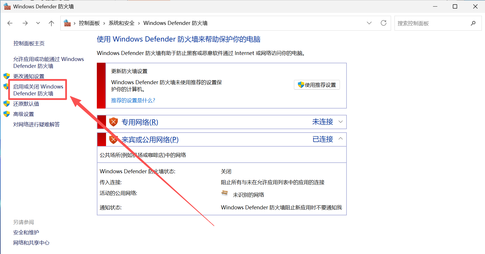
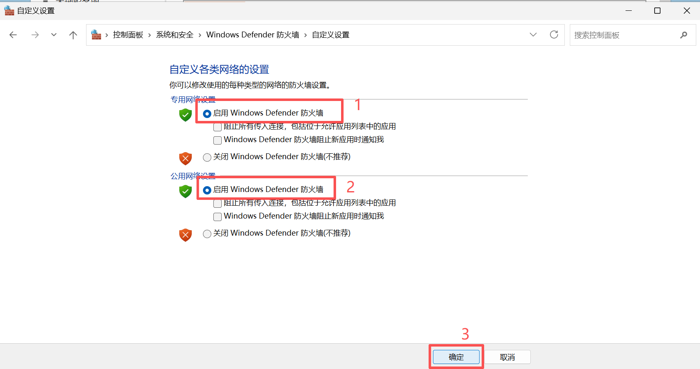
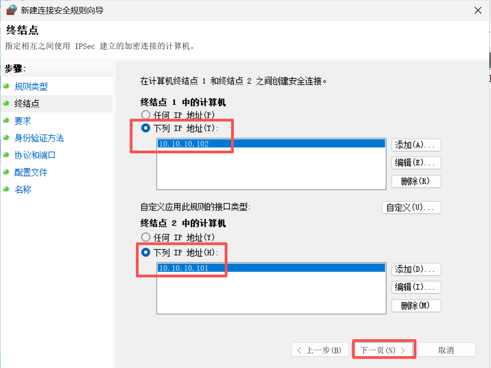
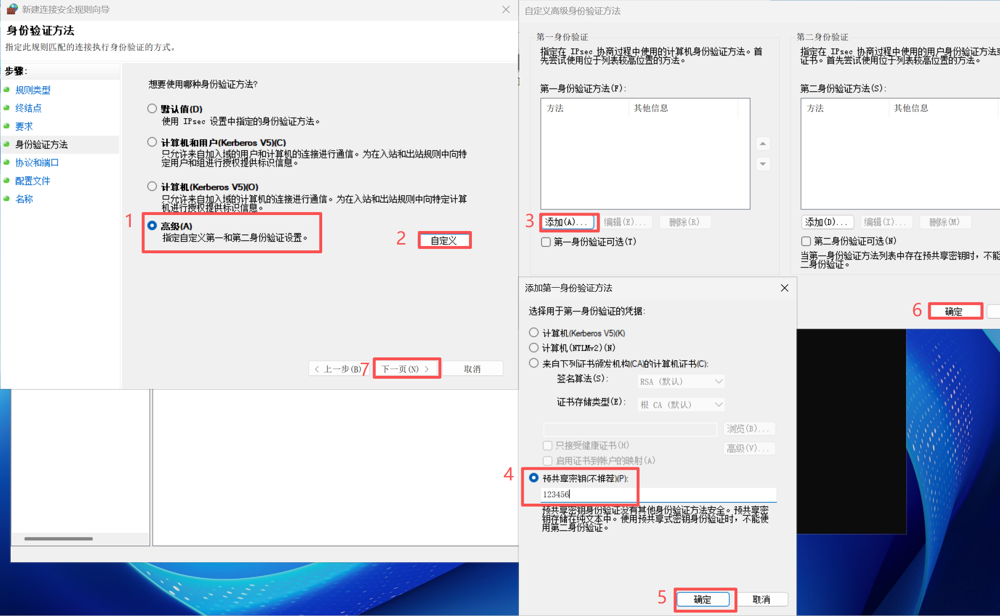

# VPN

**VPN**（Virtual Private Network，虚拟私人网络）是一种用于在公共网络上（例如互联网）建立加密和安全连接的技术。它的核心功能是为用户的数据流量创建一个私密的“隧道”，使其在传输过程中免受监控、窃听或篡改。

VPN 本质上通过**封装**的方式，将原始的数据包作为新的数据包的**载荷**进行传输。这一过程可以发生在 TCP/IP 协议栈的不同层次。


**1. 网络层协议封装**

在网络层协议封装模式下，VPN 在 IP 层工作。它的工作方式是将原始的 IP 数据包视为需要保护的有效数据，并为其添加一个新的头部和加密层。经过这一处理的数据包，成为一个新数据包的有效载荷，并通过公共网络上的一个传输协议（如 TCP 或 UDP）或网络协议（如 IP）进行传输。这意味着最终在互联网上传输的数据包，其外部头部可能是 TCP、UDP 或 IP，而内部则封装了原始的 IP 数据包。由于原始数据包被完整封装，这种方式可以透明地承载所有基于 IP 协议的上层应用数据，例如 TCP、UDP、ICMP 等。


**2. 数据链路层协议封装**

在数据链路层协议封装模式下，VPN 在以太网层工作。其原理是直接将原始的以太网帧作为有效载荷进行封装和加密。经过处理后，这个加密的以太网帧将作为载荷，通过公共网络上的网络协议（如 IP）或传输协议（如 TCP 或 UDP）进行传输。这种方法允许在广域网上延伸一个私有的二层网络，因此它能够承载各种以太网帧，不仅限于 IP 协议，这使其特别适用于连接远程局域网的场景。


## PPTP

PPTP（点对点隧道协议）是一种早期用于创建虚拟专用网络（VPN）的协议。它通过在公共网络上建立一个“隧道”，让用户可以安全地远程访问私有网络。PPTP 的主要优势在于其广泛的兼容性，几乎所有主流操作系统都内置了对它的支持，因此配置起来相对简单。

PPTP 协议的协议栈是固定的，**IP over PPP over GRE over IP**。这指的是数据在传输过程中被层层封装的过程。首先，用户的数据（IP 包）被 PPP（点对点协议）封装；接着，这个 PPP 包被 PPTP 封装到 GRE（通用路由封装）包中；最后，这个 GRE 包被封装成标准的 IP 包，以便在互联网上进行路由和传输。


PPTP 的工作原理

PPTP 协议通过 PPP 来完成身份认证。它支持多种认证方式，包括：

- **PAP（Password Authentication Protocol）**：这是一种安全性很低的认证方式，因为它以明文传输用户名和密码，很容易被窃听。
- **CHAP（Challenge Handshake Authentication Protocol）**：这是一种更安全的认证方式，它使用“挑战-响应”机制来验证用户，避免了在网络上传输明文密码。
- **MS-CHAPv2（Microsoft Challenge Handshake Authentication Protocol, Version 2）**：这是目前 PPTP 最常用且更安全的认证方式。它在 CHAP 的基础上加入了双向认证，能够防止中间人攻击。

PPTP 的数据封装过程严格遵循其协议栈：用户原始数据首先被 PPP 协议封装，然后这个 PPP 包被放入一个 GRE 数据包中，最后这个 GRE 数据包被封装成一个标准的 IP 数据包，以便在互联网上进行传输。当数据包到达 VPN 服务器后，这个过程则反向进行，数据被逐层解封装，最终还原成原始数据。


安全性与未来发展

MS-CHAPv2 和 MPPE 是 PPTP 安全方案中两个紧密相关的协议。**MS-CHAPv2 负责身份认证**，确保只有合法的用户才能连接；而 **MPPE 负责数据加密**，保护数据在隧道传输过程中的机密性。MS-CHAPv2 认证过程中生成的数据，会作为 MPPE 加密的密钥来源。

然而，PPTP 协议现在被认为是不安全的。其主要原因在于它依赖的 MPPE 加密协议。MPPE 基于 RC4 流加密算法，该算法存在已知的漏洞，攻击者通过分析大量的加密数据包，可以破解其加密密钥，从而解密通信内容。

由于 PPTP 协议本身设计上的局限性，它无法支持除 MPPE 之外的更现代、更强大的加密协议，例如 AES-256。此外，PPTP 的设计已经过时，修补其安全漏洞的成本极高，社区和行业普遍认为，与其试图改造一个基础架构存在缺陷的旧协议，不如直接采用从设计之初就考虑了安全性的全新协议，例如 IKEv2/IPsec 和 OpenVPN。因此，现在几乎所有主流操作系统都默认推荐使用更安全的协议来代替 PPTP。


### 示例

#### Linux 服务端

操作系统：ubuntu 22.04 server

IP 地址：10.14.0.104


**安装 PPTPD 软件包**

首先，更新软件包列表并安装 `pptpd` 服务：

```
apt update
apt install pptpd
```


修改 **/etc/pptpd.conf** 配置文件，指定本地 IP 地址和分配给客户端的 IP 地址范围。

在文件末尾添加以下两行，其中 `localip` 是你的服务器 IP，`remoteip` 是客户端连接后获得的 IP 地址池。

```
localip 192.168.0.1
remoteip 192.168.130.100-200,192.168.140.100-200
```


编辑 **/etc/ppp/pptpd-options** 配置文件，用于配置 PPP 的选项，例如分配给客户端的 DNS 服务器地址

```
ms-dns 8.8.8.8
ms-dns 8.8.4.4
```


**`/etc/ppp/chap-secrets`**: 这个文件用来创建连接用户的用户名和密码。每行代表一个用户。

```
# Secrets for authentication using CHAP
# client	server	secret			IP addresses

user1	pptpd	123456	*
user2	pptpd	123456	192.168.150.100
```


**启用 IPv4 转发**

要让客户端能够访问互联网，你需要启用服务器的 IP 转发功能。

打开 `/etc/sysctl.conf` 文件，找到并取消注释 (`#`) 下面这行，或者新增以下内容：

```
net.ipv4.ip_forward=1
```

保存文件后，运行以下命令使其立即生效：

```
sysctl -p
```


**配置 NAT 规则**

配置 NAT 规则，确保能正确的转发客户端的数据包。

```
iptables -t nat -A POSTROUTING -s 192.168.130.0/24 -o ens33 -j MASQUERADE
iptables -t nat -A POSTROUTING -s 192.168.140.0/24 -o ens33 -j MASQUERADE
iptables -t nat -A POSTROUTING -s 192.168.150.0/24 -o ens33 -j MASQUERADE
```


**重启 PPTPD 服务**

完成所有配置后，重启 PPTPD 服务：

```
systemctl restart pptpd
```


Windows 客户端连接

在 Windows 客户端上添加两个 VPN 连接，目标服务器为同一个，使用不同的用户


打开连个 VPN 的连接


连接完成后，Windows 系统中多了两张虚拟网卡。


user1 用户为未指定 IP 地址，为 PPTPD 服务器在 IP 池内随机分配的 IP 地址


user2 指定了特定的 IP 地址，其 IP 地址固定。


## L2TP

**L2TP（Layer 2 Tunneling Protocol）** 是一种由 IETF 定义的隧道协议，其主要作用是在 IP 网络上建立安全的隧道，用于承载第二层（Layer 2）数据帧，最典型的就是 **PPP（Point-to-Point Protocol）** 帧。L2TP 协议本身不提供加密或数据完整性保护，因此它通常会与 **IPsec** 协议配合使用，形成一个强大的 **L2TP/IPsec** 组合，以确保传输数据的安全性。


### 核心工作机制

L2TP 的协议栈是固定的，它将 PPP（Point-to-Point Protocol）帧封装在 L2TP 隧道中，并通过 UDP 协议进行传输。整个过程涉及两个主要角色：

- **LAC（L2TP Access Concentrator）**：作为隧道的发起端，它接收来自客户端的 PPP 会话，并将其封装成 L2TP 数据包。
- **LNS（L2TP Network Server）**：作为隧道的终点，它接收 L2TP 数据包并进行解封装，将 PPP 会话连接到目标网络。


### 身份认证机制

L2TP 协议本身不提供用户身份认证功能，它依赖于其所承载的 **PPP 协议**来完成认证。当 L2TP 隧道建立后，每个会话都是一个独立的 PPP 会话。因此，认证过程是在 PPP 协议层级上完成的，而不是 L2TP 层。

PPP 协议支持多种认证类型，其中最常见的两种是：

- **PAP（Password Authentication Protocol）**：这是一种简单的认证方式，但由于它以明文形式传输用户名和密码，因此安全性较低。
- **CHAP（Challenge Handshake Authentication Protocol）**：这是一种更安全的认证方式。服务器发送“挑战”值，客户端使用该值和共享密钥计算哈希值并返回，从而避免了密码的明文传输。

L2TP 的作用是将用户的 PPP 认证请求从 **LAC（L2TP Access Concentrator）** 传输到 **LNS（L2TP Network Server）**，由 LNS 解封装并执行具体的认证过程，通常是通过后端认证服务器（如 RADIUS）来完成验证。


### L2TP 协议栈

L2TP 的数据封装过程是一个固定的、分层的过程。它将网络层数据（如 IPv4/IPv6 包）逐步封装起来，以便通过 L2TP 隧道进行传输。这个过程的层级可以描述如下：

1. **原始数据（Payload）**：最底层是原始的网络数据包，例如一个用户的网页浏览请求（IPv4、IPv6 数据包等）。
2. **PPP 帧头**：这个 IP 包首先被封装到一个 PPP 帧中。
3. **L2TP 头**：PPP 帧被封装在 L2TP 协议头中，其中包含隧道 ID 和会话 ID 等信息。
4. **UDP 头**：L2TP 报文使用 **UDP 协议**进行传输，默认使用的端口号是 **1701**。
5. **IP 头**：UDP 数据包被封装在 IP 数据包中，源地址是 LAC，目的地址是 LNS。


### L2TP/IPsec

当 L2TP 与 IPsec 结合使用时，IPsec 会作为额外的安全层，在 UDP 报头之外再增加自己的安全报头。这种组合通常被称为 L2TP over IPsec，因为 L2TP 的流量被完整地封装在 IPsec 提供的安全保护之内。完整的协议栈顺序是：

1. **原始数据**（例如，一个 IP 包）
2. **PPP 报头**
3. **L2TP 报头**
4. **UDP 报头**（端口 1701）
5. **IPsec 报头**（如 ESP 或 AH）
6. **IP 报头**


IPsec 协议的主要作用是保护 UDP 报文的安全。它提供以下两种主要的安全服务：

- **认证头（AH）**：AH 协议提供数据完整性和认证，确保数据包在传输过程中未被篡改，并验证发送方的身份。它不对数据进行加密。
- **封装安全载荷（ESP）**：ESP 协议提供更全面的安全服务。它不仅能进行数据完整性验证和认证，还可以对数据包的载荷进行加密，从而确保数据的机密性。在 L2TP/IPsec 场景中，ESP 通常是首选的协议，因为它能加密整个 L2TP 报文，防止数据泄露。


### 示例

#### Linux

LInux L2TP/IPsec 


安装 `strongswan`（用于 IPsec）和 `xl2tpd`（用于 L2TP）。

```
apt update
apt install -y strongswan xl2tpd
```


打开 `/etc/ipsec.conf` 文件并进行编辑。这个文件定义了 IPsec 连接的类型和参数。

```
vim /etc/ipsec.conf
```

将以下内容添加到文件中:

```
config setup
  charondebug="ike 1, knl 1, cfg 0"
  uniqueids=yes

conn L2TP-PSK
  keyexchange=ikev1
  left=%defaultroute
  leftid=10.13.0.101
  right=%any
  authby=secret
  type=transport
  ikelifetime=8h
  keylife=1h
  forceencaps=yes
  dpdaction=clear
  dpdtimeout=15s
  rekey=no
  ike=aes128-sha256-modp2048
  esp=aes128-sha256
  auto=add
```


**设置预共享密钥（PSK）**

打开 `/etc/ipsec.secrets` 文件，设置预共享密钥。

```
vim /etc/ipsec.secrets
```

将以下内容添加到文件中：

```
10.13.0.101 10.13.0.105 : PSK "123456"
```


**配置 L2TP（xl2tpd）**

打开 `/etc/xl2tpd/xl2tpd.conf` 文件。

```
vim /etc/xl2tpd/xl2tpd.conf
```

在文件中添加以下内容：

```
[global]
; debug tunnel = yes

[lns default]
ip range = 192.168.130.100-192.168.130.200
local ip = 10.13.0.101
require chap = yes
refuse pap = yes
require authentication = yes
name = l2tp-server
ppp debug = yes
pppoptfile = /etc/ppp/options.xl2tpd
```


**配置 L2TP 客户端的用户名和密码**

打开 `/etc/ppp/chap-secrets` 文件，添加客户端的用户名和密码。

```
vim /etc/ppp/chap-secrets	
```

添加一行，格式为 `用户名 * 密码 *`。例如：

```
# Secrets for authentication using CHAP
# client        server  secret                  IP addresses

user1   *       123456  * 
```


**配置 PPP 选项**

创建并编辑 `/etc/ppp/options.xl2tpd` 文件。

```
vim /etc/ppp/options.xl2tpd
```

添加以下内容：

```
ms-dns 8.8.8.8
ms-dns 8.8.4.4
auth
crtscts
idle 1800
mtu 1400
mru 1400
nodefaultroute
proxyarp
debug
lock
```


**启用 IPv4 转发**

编辑 `/etc/sysctl.conf` 文件，启用 IPv4 转发。

```
vim /etc/sysctl.conf
```

添加以下行：

```
net.ipv4.ip_forward=1
```

然后应用更改：

```
sysctl -p
```


**配置 NAT 规则**

配置 NAT 规则，确保能正确的转发客户端的数据包。

```
iptables -t nat -A POSTROUTING -s 192.168.130.0/24 -o ens33 -j MASQUERADE
```


**重启 xl2tpd 和 ipsec **

完成所有配置后，重启 PPTPD 服务：

```
systemctl restart xl2tpd
ipsec restart
```


**Windows 连接到 VPN**


## IPsec

IPsec（Internet Protocol Security）协议族是一套用于在 IP 网络层提供安全服务的协议。

**IPsec**（Internet Protocol Security）是一套用于保护 IP 网络通信安全的协议集合。它不是一个单一的协议，而是一系列协议、服务和算法的集合，主要用于在 IP 层（网络层）为数据提供加密和认证服务。

**IPsec** 是**无虚拟网卡**的 VPN 协议栈。它工作方式是直接在操作系统的网络协议栈（L3，网络层）中对 IP 数据包进行处理。它通过修改路由规则，将需要加密的流量直接送入 IPsec 模块，进行加密、封装后再发送出去。这个过程不需要一个独立的虚拟网络接口来捕获和转发流量。

与此相反，像 **OpenVPN** 这类协议则被归类为**需要虚拟网卡**的 VPN 协议，它们通常是在应用层（L7）或传输层（L4）工作。它们必须创建虚拟网卡（TAP 或 TUN）来建立一个独立的网络通道。所有需要通过 VPN 发送的流量都必须先进入这个虚拟网卡，然后由 VPN 客户端软件接收、加密，再通过物理网卡发送出去。


### 核心组件	

IPsec 协议栈是一个复杂但高度模块化的系统，它由多个协议和组件协同工作，以实现网络通信的加密和认证。以下是 IPsec 协议栈中的核心组成部分：


1. 互联网密钥交换（IKE）

**IKE (Internet Key Exchange)** 是 IPsec 协议栈的“大脑”。它的主要职责是自动化地在通信双方之间建立和管理**安全关联 (Security Association, SA)**。在 IKE 出现之前，建立 IPsec 连接需要手动配置密钥，这既不安全也不方便。IKE 的出现极大地简化了 IPsec 的部署。

IKE 协议分为两个主要阶段：

- **第一阶段（Phase 1）：** 建立一个安全的、双向的、用于后续通信的“主隧道”。IKE 在这一阶段对通信双方进行身份认证，并协商加密和认证算法。这一阶段的结果是建立一个安全的 IKE SA。
- **第二阶段（Phase 2）：** 在第一阶段建立的 IKE SA 保护下，协商用于实际数据传输的 IPsec SA。这些 SA 包含了 ESP 或 AH 协议所需的具体参数，如密钥、加密算法等。


2. 认证头（AH）

**AH (Authentication Header)** 协议主要提供**数据完整性**和**数据源认证**。它的核心功能是确保数据在传输过程中没有被篡改，并验证发送方的身份。

AH 的工作方式是在原始 IP 数据包的头部后面插入一个 AH 头。这个头部包含了对整个数据包（包括部分可变字段）计算出的一个**哈希值（完整性校验值）**。当接收方收到数据包时，它会重新计算哈希值，并与 AH 头中的值进行比对。如果两者不匹配，则说明数据被篡改。

**重要提示：** AH 仅提供认证和完整性保护，**不提供数据加密**。


3. 封装安全负载（ESP）

**ESP (Encapsulating Security Payload)** 是 IPsec 协议栈中最常用的协议，因为它同时提供了**数据加密**、**数据完整性**和**数据源认证**。

ESP 的工作方式是在原始 IP 数据包的头部后插入一个 ESP 头，并在数据包末尾添加一个 ESP 尾部。它会对原始数据包的**负载**进行加密，并对加密后的数据以及 ESP 头进行认证。

**ESP 与 AH 的主要区别在于：**

- **ESP 提供加密，AH 不提供。** 这使得 ESP 能够隐藏数据内容，提供更高的机密性。
- **ESP 不会保护整个 IP 头部**，而 AH 会。这使得 ESP 在网络地址转换（NAT）环境中更具优势，因为它不会修改那些经常被 NAT 设备改变的 IP 头部字段。


### 工作模式

IPsec 的两种主要工作模式——**传输模式（Transport Mode）和隧道模式（Tunnel Mode）**——决定了它如何保护数据包。它们的核心区别在于：是只保护原始数据包的**负载部分**，还是保护**整个原始数据包**。


1. 传输模式

在传输模式下，IPsec 协议（AH 或 ESP）**仅对原始 IP 数据包的负载（Payload）进行加密和/或认证**。IP 头部保持不变。

AH 或 ESP 头会插入到原始 IP 头部和传输层头部（如 TCP/UDP）之间。整个数据包的 IP 头、AH/ESP 头和原始负载构成一个新的数据包。

通常用于**主机到主机（End-to-End）**的通信，例如两台服务器之间需要建立安全连接，或者一台主机需要安全地连接到一台特定服务器。这种模式提供了直接的端到端安全，但不能用于建立 VPN 隧道，因为它不改变数据包的源和目的地址。


2. 隧道模式（Tunnel Mode）

隧道模式是建立 IPsec VPN 的主要方式，它提供了更高级别的安全性。在这种模式下，**整个原始 IP 数据包被加密和/或认证，然后封装在一个新的 IP 数据包内部**。

在隧道模式下，IPsec 首先对整个原始 IP 数据包（包括其 IP 头部）进行加密和/或认证。然后，它给这个加密后的数据包添加一个新的 IP 头部。这个新的 IP 头部的源和目的地址通常是 IPsec 网关的地址。

这是**站点到站点（Site-to-Site）VPN 和远程访问（Remote Access）**VPN 的首选模式。例如，连接公司总部和分支机构的两个网关，或者让一个远程用户通过 VPN 客户端安全地访问公司内网。


**内层 IP 地址**指的是**原始数据包**的 IP 地址。在数据包进入 IPsec 隧道之前，它携带的源 IP 和目的 IP 就是内层 IP 地址。

- **源地址：** 原始数据包的发送方 IP 地址。例如，如果是远程用户访问公司内网，这个地址就是用户的计算机在公司内网中获得的 IP 地址。如果是两个分支机构互联，这个地址就是某个客户端在分支机构局域网中的 IP 地址。
- **目的地址：** 原始数据包的目标服务器或设备的 IP 地址。例如，公司内网中提供服务的服务器 IP 地址。


**外层 IP 地址**指的是**新封装数据包**的 IP 地址。这个新数据包是 IPsec 隧道模式在封装原始数据包后创建的。外层 IP 地址决定了数据包在公共网络上的路由路径。

- **源地址：** 发送 IPsec 隧道的**入口网关**的公网 IP 地址。这个网关可能是远程用户的 VPN 客户端，或者是分支机构的 VPN 网关设备。
- **目的地址：** 接收 IPsec 隧道的**出口网关**的公网 IP 地址。这个网关通常是公司总部的 VPN 网关设备。


**隧道模式（Tunnel Mode）** 的主要应用场景就是你所说的“作为网络的网关来转发其他用户的 IP 数据包”。它最常用于**站点到站点（Site-to-Site）**VPN，连接两个不同的局域网（比如公司总部和分支机构）。在这种模式下，一个 IPsec 网关会接收来自内部局域网的数据包，对它们进行隧道封装，然后通过公共网络发送到另一个网关，再由另一个网关解封后转发给目标主机。它确实是在为整个网络提供安全连接，而不是为单个主机。

**传输模式（Transport Mode）** 则通常用于**加密本机的 IP 流量**。它的应用场景是两台主机之间建立端到端的安全通信，比如一台服务器与另一台服务器之间的通信，或者一台工作站与特定服务器的通信。数据包在离开本机前会被加密，并在到达目的主机后被解密，中间的路由过程不涉及隧道封装。


### 示例

#### Windows 传输模式

操作系统：Windows Server 2025

主机 A：10.10.10.101

主机 B：10.10.10.102


IPsec 使用预共享密钥，密钥为：123456


##### 开启防火墙

1. 开启主机 A 和主机 B 的所有防火墙（此处仅演示一台）






##### 设置防火墙规则

2. 设置主机 A 和主机 B 允许 ICMP 协议通过（两者步骤相同）

使用 Win + R 打开运行对话框，输入 wf.msc，单击确定，打开高级安全 Windows Defender 防火墙。


右击入站规则，单击新建规则


选择自定义后，单机下一步


选择所有程序（默认）后，单机下一步


选择协议类型位ICMPv4后单击下一步


选择作用于“任何 IP 地址”，单击下一步


选择允许连接，单击下一步


勾选所有，单击下一步


输入一个自定义名称后，单击完成


##### 验证主机A和主机B的连通性

3. 验证主机 A 和主机 B 的连通性


使用 Wireguard 抓包查看数据包类型，此时数据包为 ICMP 协议。


##### 设置 IPsec 连接

4. 设置 IPsec 连接

主机 A 和主机 B 中都要执行以下步骤。

在“高级安全 Windows Defender 防火墙”中的“连接安全规则”中右击，选择“新建规则”。


选择自定义，单击下一步


此界面需要特别注意。

在主机 A 中，终结点 1 中的计算机添加 IP 地址 10.10.10.101，终结点 2 中的计算机添加 IP 地址 10.10.10.102


在主机 B 中，终结点 1 中的计算机添加 IP 地址 10.10.10.102，终结点 2 中的计算机添加 IP 地址 10.10.10.101




选择“入站和出站连接要求身份验证”，单击下一步


在”身份验证方法”中选择“高级”，单击自定义按钮。

单击“自定义高级身份验证”中的“第一身份验证方法”下面的“添加”按钮。

在“添加第一身份验证方法”中选择“预共享密钥”，键盘输入密钥（123456）后单击确定。最后单击下一步。




协议类型选择“任何”（默认），单击下一步。


勾选所有，单击下一步


输入自定义名称后单击完成。


##### 验证主机A和主机B的连通性


使用 Wireshark 抓包查看 ping 数据包

使用 IPsec 后无法查看明文信息，数据包已被使用 ESP 进行加密。


#### Linux 传输模式

在两台 Ubuntu 24.04 服务器（IP 地址分别为 **10.13.0.101** 和 **10.13.0.102**）之间，可以使用 IPsec 保护 IP 流量。该配置采用**传输模式**和 **AH (Authentication Header)** 协议，仅对 IP 数据包的**有效载荷**进行数据完整性验证，而**不进行加密**。共享密钥为 **123456**。


##### 通用配置（在两台服务器上执行）

在系统上安装 StrongSwan 软件包。

```
sudo apt update
sudo apt install strongswan -y
```


启用 IP 转发

为了让 StrongSwan 能够正确处理网络流量，你需要启用内核的 IP 转发功能。编辑 `/etc/sysctl.conf` 文件并添加以下两行：

```
sudo vim /etc/sysctl.conf
```

在文件末尾添加：

```
net.ipv4.ip_forward = 1
net.ipv6.conf.all.forwarding = 1
```

保存并关闭文件后，运行以下命令来使配置立即生效：

```
sudo sysctl -p
```


##### 服务器 A (10.13.0.101)

1. **配置预共享密钥**

编辑 `/etc/ipsec.secrets` 文件来存储预共享密钥：

```
vim /etc/ipsec.secrets
```

添加以下行：

```
10.13.0.101 10.13.0.102 : PSK "123456"
```

保存并关闭文件。为保护密钥安全，请确保其权限为 `600`。

```
sudo chmod 600 /etc/ipsec.secrets
```


2. **配置 IPsec 连接**

编辑 `/etc/ipsec.conf` 文件，清空原有内容并添加以下配置。此配置定义了一个名为 `serverA-to-serverB` 的连接。

```
sudo vim /etc/ipsec.conf
```

```
config setup
    uniqueids=yes

conn serverA-to-serverB
    authby=secret
    keyexchange=ikev2
    type=transport
    auto=start
    left=10.13.0.101
    right=10.13.0.102
    ah=sha256
    esp=
```

`type=transport`: 指定使用传输模式，只保护数据载荷。

`ah=sha256`: 启用 AH 协议，并使用 SHA256 算法进行数据完整性校验。

`esp=`: 禁用 ESP 协议，即不进行加密。


##### 服务器 B (10.13.0.102) 

1. **配置预共享密钥**

编辑 `/etc/ipsec.secrets` 文件来存储预共享密钥：

```
vim /etc/ipsec.secrets
```

添加以下行：

```
10.13.0.101 10.13.0.102 : PSK "123456"
```

保存并关闭文件。为保护密钥安全，请确保其权限为 `600`。

```
sudo chmod 600 /etc/ipsec.secrets
```


2. **配置 IPsec 连接**

编辑 `/etc/ipsec.conf` 文件，清空原有内容并添加以下配置。请注意，这里的 `left` 和 `right` IP 地址与服务器 A 的配置正好相反。

```
sudo vim /etc/ipsec.conf
```

```
config setup
    uniqueids=yes

conn serverB-to-serverA
    authby=secret
    keyexchange=ikev2
    type=transport
    auto=start
    left=10.13.0.102
    right=10.13.0.101
    ah=sha256
    esp=
```


##### 启动和验证 IPsec

1. 重启 StrongSwan 服务

在两台服务器上执行以下命令，以加载新配置并启动 IPsec 隧道：

```
sudo ipsec restart
```


2. 检查连接状态

在任意一台服务器上运行以下命令，验证 IPsec 隧道是否已成功建立。

```
sudo ipsec statusall
```

如果连接成功，您会看到一个类似于 `ESTABLISHED` 的状态，这表明两台服务器之间的 IPsec 隧道已正常工作。


##### Wireshark 抓包分析


#### Linux 隧道模式

两台运行 Ubuntu 24.04 Server 的网关服务器，外部 IP 地址分别是 192.168.10.10 和 192.168.20.20，内部 IP 地址分别是 10.10.0.254 和 10.14.0.254。这两台服务器通过 StrongSwan 建立了 IPsec 隧道，使用预共享密钥 123456 对彼此的 IP 流量进行加密，并以隧道模式保护整个 IP 数据包。


##### 通用配置（在两台服务器上执行）

在系统上安装 StrongSwan 软件包。

```
sudo apt update
sudo apt install strongswan -y
```


启用 IP 转发

为了让 StrongSwan 能够正确处理网络流量，你需要启用内核的 IP 转发功能。编辑 `/etc/sysctl.conf` 文件并添加以下两行：

```
sudo vim /etc/sysctl.conf
```

在文件末尾添加：

```
net.ipv4.ip_forward = 1
net.ipv6.conf.all.forwarding = 1
```

保存并关闭文件后，运行以下命令来使配置立即生效：

```
sudo sysctl -p
```


##### 服务器 A (10.13.0.101)

1. **配置预共享密钥**

编辑 `/etc/ipsec.secrets` 文件来存储预共享密钥：

```
vim /etc/ipsec.secrets
```

添加以下行：

```
192.168.10.10 192.168.20.20 : PSK "123456"
```

保存并关闭文件。为保护密钥安全，请确保其权限为 `600`。

```
sudo chmod 600 /etc/ipsec.secrets
```


2. **配置 IPsec 连接**

编辑 `/etc/ipsec.conf` 文件，清空原有内容并添加以下配置。此配置定义了一个名为 `serverA-to-serverB` 的连接。

```
sudo vim /etc/ipsec.conf
```

```
config setup
  uniqueids=yes

conn mytunnel
  auto=start
  type=tunnel
  left=192.168.10.10
  leftsubnet=10.10.0.0/24
  right=192.168.20.20
  rightsubnet=10.14.0.0/24
  ikelifetime=60m
  keyexchange=ikev2
  authby=secret
  esp=aes128-sha256!
  dpddelay=30s
  dpdtimeout=120s
  dpdaction=restart
```

`type=transport`: 指定使用传输模式，只保护数据载荷。

`ah=sha256`: 启用 AH 协议，并使用 SHA256 算法进行数据完整性校验。

`esp=`: 禁用 ESP 协议，即不进行加密。


##### 服务器 B (10.13.0.102) 

1. **配置预共享密钥**

编辑 `/etc/ipsec.secrets` 文件来存储预共享密钥：

```
vim /etc/ipsec.secrets
```

添加以下行：

```
192.168.10.10 192.168.20.20 : PSK "123456"
```

保存并关闭文件。为保护密钥安全，请确保其权限为 `600`。

```
sudo chmod 600 /etc/ipsec.secrets
```


2. **配置 IPsec 连接**

编辑 `/etc/ipsec.conf` 文件，清空原有内容并添加以下配置。请注意，这里的 `left` 和 `right` IP 地址与服务器 A 的配置正好相反。

```
sudo vim /etc/ipsec.conf
```

```
config setup
  uniqueids=yes

conn mytunnel
  auto=start
  type=tunnel
  left=192.168.20.20
  leftsubnet=10.14.0.0/24
  right=192.168.10.10
  rightsubnet=10.10.0.0/24
  ikelifetime=60m
  keyexchange=ikev2
  authby=secret
  esp=aes128-sha256!
  dpddelay=30s
  dpdtimeout=120s
  dpdaction=restart
```


##### 启动和验证 IPsec

1. 重启 StrongSwan 服务

在两台服务器上执行以下命令，以加载新配置并启动 IPsec 隧道：

```
sudo ipsec restart
```


2. 检查连接状态

在任意一台服务器上运行以下命令，验证 IPsec 隧道是否已成功建立。

```
sudo ipsec statusall
```

如果连接成功，您会看到一个类似于 `ESTABLISHED` 的状态，这表明两台服务器之间的 IPsec 隧道已正常工作。


## SSLVPN

**SSL VPN**（Secure Sockets Layer Virtual Private Network）是一种使用 **SSL/TLS** 协议来提供远程访问的网络技术。它允许用户通过一个安全的、加密的连接，从任何地方访问企业内部网络资源。

虽然 SSL VPN 广泛使用，但它并没有像 **IPSec** 那样，由 IETF（互联网工程任务组）发布一个统一的、官方的协议标准。

SSL VPN 的工作方式是利用已有的、标准化的 **SSL/TLS 协议**来建立安全的加密连接。不同的 SSL VPN 厂商（如 Cisco AnyConnect, FortiClient SSL-VPN, Pulse Secure 等）都会根据自己的产品设计，在 SSL/TLS 协议之上构建自己的实现方式。这些实现虽然都基于 SSL/TLS 协议进行数据加密和身份验证，但它们在数据封装、路由配置以及客户端软件等方面各有不同，彼此之间通常不兼容。

有很多开源的 SSL VPN 项目。最著名、最广泛使用的就是 **OpenVPN**。


## OpenVPN


## WireGuard

WireGuard 是一种开源的现代 VPN 协议， 通过 UDP 安全封装 IP 数据包，可以承载 **所有基于 IP 协议的流量**（IPv4/IPv6），其核心特点有**简洁高效**（**代码量仅约4000行**，更易审计漏洞和维护）、**高性能**（Linux内核实现）、**强加密**（基于现代密码学 Curve25519椭圆曲线、ChaCha20加密、BLAKE2哈希）、**跨平台**（Linux、Windows、macOS、iOS、Android 等）。

**相较于传统 VPN（如 OpenVPN/IPsec）**，其代码规模仅为 OpenVPN 的 **1/50**（4000行 vs 20万+行），服务端配置从 IPsec 的 **500+行** 缩减至 **单文件6 - 20行**，且密钥轮换、隧道维护等操作均可通过修改 **3-4个参数** 实时生效。


### 示例

以下是**两台 Linux 搭建 VPN 隧道**的示例：

| 主机   | 物理IP                     | VPN IP   |
| ------ | -------------------------- | -------- |
| Linux1 | 10.12.0.201                | 10.0.0.1 |
| Linux2 | 10.12.0.202<br>10.13.0.201 | 10.0.0.2 |
| Linux3 | 10.13.0.202                | NULL     |

Linux1 与 Linux2 可直接通信，Linux2 与 Linux3 也可互通，但 **Linux1 无法直连 Linux3**。为此在 **Linux1 和 Linux2 之间建立 WireGuard 加密隧道**，将 Linux1 访问 Linux3 的流量定向至该隧道传输至 Linux2，再由 Linux2 通过 **NAT 地址转换**将流量转发至 Linux3。


自 Linux 5.6 起，内核已原生**集成 WireGuard 协议栈**，可通过标准 `ip link` 命令直接创建 WireGuard 虚拟接口；对于 5.6 之前的内核版本，需通过用户空间实现工具 `wireguard-go` 创建兼容接口。

配置WireGuard接口需使用wg工具，较新系统可通过包管理器直接安装wireguard-tools，而老旧系统可以通过源码编译安装。

- [【wireguard-go】](https://github.com/WireGuard/wireguard-go)：WireGuard 的用户空间实现，适用于内核未原生支持 WireGuard 的环境（**仅源代码**）。
- [【wireguard-go-builder】](https://github.com/P3TERX/wireguard-go-builder)：提供不同平台（如 ARM、MIPS 等）构建静态链接的 `wireguard-go` **二进制文件**。
- [【wireguard-tools】](https://github.com/WireGuard/wireguard-tools)：WireGuard 命令行工具集，包含 `wg` 和 `wg-quick`等工具（**仅源代码**）。


#### 通用准备（在所有节点执行）

```
# 生成密钥对（所有节点执行）
# [N]为节点编号占位符（例：linux1/linux2），需替换为实际数字
wg genkey | tee private_key_linux[N] | wg pubkey > public_key_linux[N]

# 创建WireGuard接口（根据内核版本选择）
# Linux 5.6+ 内核原生支持
ip link add dev wg0 type wireguard

# 旧版内核（<5.6）需要wireguard-go
wireguard-go wg0
```


#### Linux 1

配置虚拟接口

```
ip addr add 10.0.0.1/24 dev wg0
ip link set wg0 up
```


创建配置文件 /etc/wireguard/wg0.conf

```
[Interface]
ListenPort = 51820
PrivateKey = ULgCzX94OpIxbuSfqw57YfoTd+55lkwAEX6BC1PKfWw=

[Peer]
PublicKey = MbS80tQ9RiHPfTocgAoHFEeaZqVT25ws9ZF+zGueS3g=
AllowedIPs = 10.0.0.2/32
```

- **PrivateKey：Linux 1 私钥文件内容**
- **PublicKey：Linux 2 公钥文件内容**


应用配置文件

```
wg setconf wg0 wg0.conf
```


#### Linux 2

```
ip addr add 10.0.0.2/24 dev wg0
ip link set wg0 up
```


创建配置文件 /etc/wireguard/wg0.conf

```
[Interface]
ListenPort = 51820
PrivateKey = ENv2cywBG2rEVPyucbcGwJVvWms9GeCfhEcQi9SkSEE=

[Peer]
PublicKey = jG+QjJAyc3SfG8b8Mbg60FmN0mgONqsdDzUHjNg7vg4=
AllowedIPs = 10.0.0.1/32
Endpoint = 10.12.0.201:51820
PersistentKeepalive = 25
```

- **PrivateKey：Linux 2 私钥文件内容**
- **PublicKey：Linux 1 公钥文件内容**


应用配置文件

```
wg setconf wg0 wg0.conf
```


#### 查看状态

```bash
[root@linux1 ~]# wg 
interface: wg0
  public key: jG+QjJAyc3SfG8b8Mbg60FmN0mgONqsdDzUHjNg7vg4=
  private key: (hidden)
  listening port: 51820

peer: MbS80tQ9RiHPfTocgAoHFEeaZqVT25ws9ZF+zGueS3g=
  endpoint: 10.12.0.202:51820
  allowed ips: 10.0.0.2/32
  latest handshake: 1 minute, 1 second ago
  transfer: 4.97 KiB received, 1.98 KiB sent

[root@linux2 ~]# wg 
interface: wg0
  public key: MbS80tQ9RiHPfTocgAoHFEeaZqVT25ws9ZF+zGueS3g=
  private key: (hidden)
  listening port: 51820

peer: jG+QjJAyc3SfG8b8Mbg60FmN0mgONqsdDzUHjNg7vg4=
  endpoint: 10.12.0.201:51820
  allowed ips: 10.0.0.1/32
  latest handshake: 1 minute, 10 seconds ago
  transfer: 9.91 KiB received, 32.68 KiB sent
  persistent keepalive: every 25 seconds
```


#### WireGuard 隧道连通性测试

```
[root@linux2 ~]# ping 10.0.0.2 -c 4
PING 10.0.0.2 (10.0.0.2) 56(84) bytes of data.
64 bytes from 10.0.0.2: icmp_seq=1 ttl=64 time=0.014 ms
64 bytes from 10.0.0.2: icmp_seq=2 ttl=64 time=0.032 ms
64 bytes from 10.0.0.2: icmp_seq=3 ttl=64 time=0.028 ms
64 bytes from 10.0.0.2: icmp_seq=4 ttl=64 time=0.029 ms

--- 10.0.0.2 ping statistics ---
4 packets transmitted, 4 received, 0% packet loss, time 3111ms
rtt min/avg/max/mdev = 0.014/0.025/0.032/0.009 ms


[root@linux1 ~]# ssh root@10.0.0.2 
root@10.0.0.2's password: 
Last login: Sat Feb 15 03:44:29 2025 from 10.0.0.1
[root@linux2 ~]# 
```


#### 配置 NAT 转发

**Linux 2** 启用 **net.ipv4.ip_forward（永久生效）**

```
# 编辑配置文件
vim /etc/sysctl.conf

# 添加或取消注释以下行（IPv4）
net.ipv4.ip_forward = 1

# 加载配置使其生效
sysctl -p
```


**Linux 2** 配置 **VPN网关流量转发与NAT规则（重启后失效）** 

```
# NAT地址伪装：将来自10.0.0.0/16网段的流量通过ens224接口做源地址转换（内网访问外网）
iptables -t nat -A POSTROUTING -s 10.0.0.0/16 -o ens224 -j MASQUERADE

# 转发规则：允许从VPN接口(wg0)到外网接口(ens224)的流量（出站方向）
iptables -A FORWARD -i wg0 -o ens224 -j ACCEPT

# 转发规则：仅允许外网接口(ens224)到VPN的回程流量（已建立连接和相关连接）
iptables -A FORWARD -i ens224 -o wg0 -m state --state RELATED,ESTABLISHED -j ACCEPT
```


**Linux 1** 添加**路由表（重启后失效）**

```
# 添加静态路由：将10.13.0.0/16网段流量通过VPN网关10.0.0.2路由
ip route add 10.13.0.0/16 via 10.0.0.2 dev wg0
```


#### Linux 1 和 3 连通性测试

```
[root@linux1 ~]# ping 10.13.0.202 -c 4 
PING 10.13.0.202 (10.13.0.202) 56(84) bytes of data.
64 bytes from 10.13.0.202: icmp_seq=1 ttl=63 time=2.15 ms
64 bytes from 10.13.0.202: icmp_seq=2 ttl=63 time=0.892 ms
64 bytes from 10.13.0.202: icmp_seq=3 ttl=63 time=1.49 ms
64 bytes from 10.13.0.202: icmp_seq=4 ttl=63 time=0.996 ms

--- 10.13.0.202 ping statistics ---
4 packets transmitted, 4 received, 0% packet loss, time 3019ms
rtt min/avg/max/mdev = 0.892/1.381/2.151/0.497 ms


[root@linux1 ~]# ssh root@10.13.0.202 
root@10.13.0.202's password: 
Last login: Sat Feb 15 22:40:33 2025 from 10.13.0.1
[root@linux3 ~]# 
```


使用 **nmap** 扫描 **10.13.0.0/16** 网段

```
[root@linux1 ~]# nmap -sn -PE  10.13.0.0/16
Starting Nmap 7.70 ( https://nmap.org ) at 2025-02-15 22:53 CST
Nmap scan report for 10.13.0.1
Host is up (0.012s latency).
Nmap scan report for 10.13.0.162
Host is up (0.0030s latency).
Nmap scan report for 10.13.0.201
Host is up (0.00094s latency).
Nmap scan report for 10.13.0.202
Host is up (0.0030s latency).
Nmap done: 256 IP addresses (4 hosts up) scanned in 3.72 seconds
```


### 配置文件

配置文件格式基于 *INI* 文件。其中包含两个顶级部分——*Interface*（接口）和 *Peer*（对等体）。可以指定多个 *Peer* 部分，但只能有一个 *Interface* 部分。


*Interface* 部分可能包含以下字段：

- ***Address*** — 要分配给接口的逗号分隔的 IP（v4 或 v6）地址列表（可选带 CIDR 掩码）。可以多次指定。
- ***DNS*** — 要设置为接口的 DNS 服务器的逗号分隔的 IP（v4 或 v6）地址列表，或要设置为接口的 DNS 搜索域的非 IP 主机名。可以多次指定。
- ***MTU*** — 如果未指定，MTU 将从端点地址或系统默认路由自动确定，这通常是一个明智的选择。然而，要手动指定一个 MTU 以覆盖这种自动发现，可以显式指定此值。
- ***Table*** — 控制向其添加路由的路由表。有两个特殊值：`off` 完全禁用路由的创建，`auto`（默认值）将路由添加到默认表并启用默认路由的特殊处理。
- ***PreUp, PostUp, PreDown, PostDown*** — 在设置/拆除接口之前/之后由 **bash** 执行的脚本片段，最常用于配置自定义 DNS 选项或防火墙规则。特殊字符串 `%i' 会被扩展为 *INTERFACE*。每个键可以多次指定，在这种情况下，命令按顺序执行。
- ***SaveConfig*** — 如果设置为 `true'，则在关闭时从接口的当前状态保存配置。因此，在删除接口之前对配置文件所做的任何更改都将被覆盖。

- **PrivateKey** — 由 *wg genkey* 生成的 base64 编码私钥。必填。
- **ListenPort** — 用于监听的 16 位端口号。可选；如果未指定，则随机选择。
- **FwMark** — 用于标记传出数据包的 32 位防火墙标记（fwmark）。如果设置为 0 或 "off"，则此选项被禁用。可以通过添加前缀 "0x" 来以十六进制形式指定。可选。

*Peer* 部分可能包含以下字段：

- ***PublicKey*** — 通过 *wg pubkey* 根据私钥计算出的 base64 编码公钥，通常通过带外方式传输给配置文件的作者。必填。
- ***PresharedKey*** — 由 *wg genpsk* 生成的 base64 编码预共享密钥。可选，也可以省略。该选项增加了一层额外的对称密钥加密，与现有的公钥加密结合使用，以提供抗量子计算的能力。
- ***AllowedIPs*** — 使用 CIDR 掩码表示的 IP 地址（IPv4 或 IPv6）列表，用逗号分隔。用于指定允许来自该对等体的入站流量来源，以及出站流量的目标地址。可以使用通配符 *0.0.0.0/0* 匹配所有 IPv4 地址，或使用 *::/0* 匹配所有 IPv6 地址。此字段可以多次指定。
- ***Endpoint*** — 一个 IP 地址或主机名，后面跟一个冒号和端口号。该端点会根据从对等体接收到的正确验证的数据包的最新源 IP 地址和端口自动更新。可选。
- ***PersistentKeepalive*** — 指定发送经过认证的空数据包到对等体的时间间隔（秒），范围为 1 到 65535（含）。其目的是持续保持状态防火墙或 NAT 映射的有效性。例如，如果接口很少发送流量，但可能会随时接收来自对等体的流量，并且位于 NAT 后面，则设置 25 秒的持久化保活间隔可能是有益的。如果设置为 0 或 "off"，此选项将被禁用。默认情况下或未指定时，此选项关闭。大多数用户不需要此功能。可选。


### 转发机制

假设我们有如下场景：

- **本机 (Client A)**: wg0 IP 10.0.0.1，公网 IP 1.1.1.1，监听端口 51820。
- **对端 (Server B)**: wg0 IP 10.0.0.2，公网 IP 2.2.2.2，Endpoint 为 2.2.2.2:51820。
- 在 Client A 的 WireGuard 配置中，Server B 这个 Peer 的 AllowedIPs 设置为 10.0.0.2/32。

现在，Client A 上的一个应用程序想要访问 Server B，执行了 ping 10.0.0.2。

下面是数据包的完整生命周期：

```
[应用层: ping 10.0.0.2]
       ↓
[Linux 内核 TCP/IP 协议栈]
       ↓ (1. 路由决策)
[wg0 虚拟网卡]
       ↓ (2. WireGuard 模块接管)
[WireGuard 内核模块]
       ↓ (3. 查找 Peer 并加密)
       ↓ (4. UDP 封装)
[Linux 内核 TCP/IP 协议栈 (再次)]
       ↓ (5. 再次路由决策)
[eth0 物理网卡]
       ↓
[互联网] → [2.2.2.2:51820]
```


**查找 Peer 并加密（核心步骤）**

- WireGuard 模块查看传入的 IP 包的目的地址 10.0.0.2。
- 它遍历其内部维护的 **Peer 列表（加密密钥路由表）**。
- 它发现 10.0.0.2 包含在 Server B 这个 Peer 的 AllowedIPs (10.0.0.2/32) 范围内。
- 匹配成功！WireGuard 模块现在知道：
  - 应该使用与 Server B 关联的会话密钥（通过公钥握手协商好的）来加密这个包。
  - 加密后的数据包应该发往 Server B 的 Endpoint 地址 2.2.2.2:51820。
- 模块使用 ChaCha20Poly1305 算法对整个 IP 包（{ SRC: 10.0.0.1, DST: 10.0.0.2, ... }）进行加密和认证。


**一个目标 IP 地址理论上可能匹配多个 Peer 的** **AllowedIPs** **规则**，当这种情况发生时，WireGuard 会遵循路由协议中一个非常经典的规则：**最长前缀匹配 (Longest Prefix Match)**。WireGuard 会选择那个 AllowedIPs 规则中，与目标 IP 地址匹配的子网掩码最长（即网络范围最小、最具体）的那个 Peer。


假设在本机 (Client A) 上有如下 Peer 配置：

1. **Peer 1 (Remote Office Gateway):**
   - PublicKey = ...
   - AllowedIPs = 192.168.0.0/16 (允许访问整个 192.168.x.x 大网段)
   - Endpoint = 3.3.3.3:51820
2. **Peer 2 (Specific Server):**
   - PublicKey = ...
   - AllowedIPs = 192.168.10.5/32 (只允许访问 192.168.10.5 这个特定主机)
   - Endpoint = 4.4.4.4:51820


现在，本机上的一个应用尝试访问 192.168.10.5。

**Peer 匹配流程如下：**

1. WireGuard 模块接管数据包，开始查找应该将包发给哪个 Peer。
2. 它将目标地址 192.168.10.5 与所有 Peer 的 AllowedIPs 进行比较。
   - **匹配 Peer 1?** 192.168.10.5 确实在 192.168.0.0/16 的范围内。这是一个可能的匹配。
   - **匹配 Peer 2?** 192.168.10.5 也完全匹配 192.168.10.5/32。这是另一个可能的匹配。
3. **决策时刻：** 现在有两个匹配项。WireGuard 比较它们的子网前缀长度。
   - Peer 1 的前缀长度是 /16。
   - Peer 2 的前缀长度是 /32。
4. 因为 32 > 16，所以 Peer 2 的规则**更具体**。
5. **最终选择：** WireGuard **选择 Peer 2**。


在同一个 WireGuard 接口的配置中，不能为两个不同的 Peer 分配完全相同的 AllowedIPs。

- 在一个标准的路由表中，对于一个具体的目标网络（例如 192.168.10.0/24），只能有一个生效的下一跳地址（Next Hop）。你不能同时告诉路由器“去往 192.168.10.0/24 的包，既要发给网关 A，也要发给网关 B”。这会造成路由冲突和不确定性。
- 在 WireGuard 中，AllowedIPs 就是**目标网络**，而 Peer（它的公钥和 Endpoint）就是**下一跳**。


